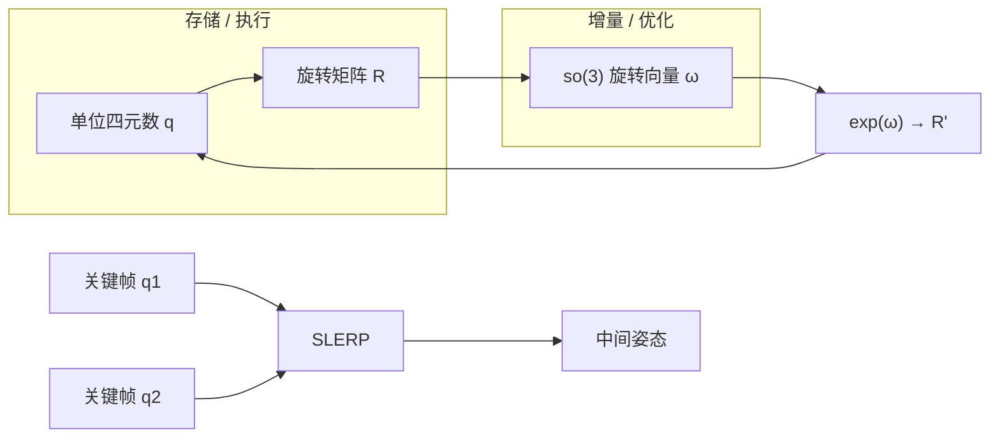

# 单位四元数与 SO(3)

**一句话：** **单位四元数** $q \in S^3 \subset \mathbb{H}$ 用 4 个数紧凑表示三维旋转：无万向锁、复合为 Hamilton 积、平滑插值用 **SLERP**；但 $q$ 与 $-q$ 同一旋转（双覆盖），且 $\|q\|=1$ 约束使 **不宜** 当作神经网络的无约束回归目标——工程上常与 so(3) 增量或 6D 连续表示分工。

## 英文缩写速查

| 缩写 | 英文全称 | 简要说明 |
|------|----------|----------|
| SO(3) | Special Orthogonal Group in 3D | 三维旋转群 |
| SLERP | Spherical Linear Interpolation | 单位四元数球面上的测地线插值 |
| MoCap | Motion Capture | 动作捕捉；关节姿态序列常存四元数 |
| FK | Forward Kinematics | 由关节角/四元数链求末端位姿 |
| IMU | Inertial Measurement Unit | 惯性测量单元；姿态输出多为四元数或 RPY |

## 为什么重要

四元数是机器人栈里 **最常见的旋转存储格式** 之一：

- **仿真 / 控制：** Pinocchio、MuJoCo、Isaac、DeepMimic motion JSON 等在浮动基或 spherical joint 上用四元数（或等价 exp map）。
- **动画 / MoCap：** 关键帧姿态插值若用欧拉角分通道 lerp 会 **不保持刚体旋转**；SLERP 是标准解（Shoemake SIGGRAPH 1985）。
- **估计：** IMU 融合、EKF 状态常含四元数或对其误差在 so(3) 上定义。

读代码前必须先确认 **scalar 顺序** 与 **左乘/右乘** 约定，否则 FK、奖励、观测会对不上。

## 核心原理

### 定义与 Hamilton 积

Diebel / 经典记法 **scalar-first**：$q=[q_0, q_1, q_2, q_3]^\top$，$\|q\|=1$。Hamilton 积（非交换）：

$$
q \cdot p =
\begin{bmatrix}
q_0 p_0 - q_{1:3}^\top p_{1:3} \\
q_0 p_{1:3} + p_0 q_{1:3} - q_{1:3} \times p_{1:3}
\end{bmatrix}
$$

旋转复合：$R_q(q\cdot p)=R_q(q)\,R_q(p)$。

### 轴角 ↔ 单位四元数

绕单位轴 $n$ 转 $\alpha$ 弧度：

$$
q = \left[\cos\frac{\alpha}{2},\; \sin\frac{\alpha}{2}\, n^\top\right]^\top
$$

Shoemake / Diebel 与上式一致；$w=\cos(\theta/2)$ 时 $\theta$ 为 **全旋转角**。

### 双覆盖 $q \equiv -q$

同一旋转对应 $S^3$ 上 **对径两点**。后果：

| 场景 | 处理 |
|------|------|
| SLERP | 若 $q_1\cdot q_2<0$，令 $q_2\leftarrow -q_2$ 走短弧 |
| 观测 / 损失 | 直接 L2 四元数会惩罚符号翻转；常用 $\min(\|q-\hat q\|,\|q+\hat q\|)$ 或改 6D/tan_norm |
| 连续积分 | 选与上一帧 **同半球** 的 $q$ 避免跳变 |

拓扑上 SO(3) 局部像球面，但 **全局** 上对径等同（Shoemake：从矩阵 lift 时要构造 **相邻** 四元数链）。

### 常见 scalar 顺序（易错）

| 生态 | 顺序 | 示例 |
|------|------|------|
| Diebel、DeepMimic README | **$(w,x,y,z)$** scalar-first | `w,x,y,z` |
| Pinocchio 浮动基 `q[3:7]` | **$(x,y,z,w)$** scalar-last | `xyzw` |
| MimicKit `torch_util` | **$(x,y,z,w)$** | `quat_to_matrix` 解包 `i,j,k,w` |
| scipy `Rotation.from_quat` | **$(x,y,z,w)$** | 文档明确 `scalar_last` |

**规则：** 永远查 README / 注释，不要凭直觉。

### SLERP

设 $\cos\theta = q_1\cdot q_2$，$u\in[0,1]$：

$$
\mathrm{Slerp}(q_1,q_2;u)= \frac{\sin((1-u)\theta)}{\sin\theta}q_1 + \frac{\sin(u\theta)}{\sin\theta}q_2
$$

沿 $S^3$ 大圆弧，**恒定角速度**；优于欧拉角分通道插值（Shoemake 1985）。

## 工程实践

1. **存储 vs 优化（Modern Robotics / Diebel 共识）**
   - **存：** 四元数或 $T\in\mathrm{SE(3)}$。
   - **优化：** $R=\exp([\omega]_\times)$ 或在 se(3) twist 上更新；每步映回 $q$ 并 **normalize**。
2. **浮动基 $n_q \neq n_v$**
   - 平移 3 + 四元数 4 → $n_q=7$；广义速度仍 6（3 线 + 3 角）。角速度 **不是** $\dot q_{3:7}$。
3. **DeepMimic / MimicKit 栈**
   - DeepMimic motion：**$(w,x,y,z)$** 存 spherical joint。
   - MimicKit `.pkl`：**exp map** 存盘；策略观测可用四元数或 6D tan_norm——三层勿混。
4. **神经网络**
   - 四元数直接回归：模长漂移 + $q\sim -q$；见 [SE(3) 表示](./se3-representation.md) 的 6D 连续族。
5. **实现检查清单**
   - [ ] scalar 顺序与框架一致
   - [ ] 乘法左/右乘与父链约定一致
   - [ ] SLERP 前 `dot<0` 翻转
   - [ ] 积分后 `q /= ||q||`

## 局限与风险

- **单位约束二次型**：直接 NLP / 无约束 Adam 优化四元数需 renormalize 或惩罚（Diebel Sec. 6.16）。
- **不是全局唯一坐标**：$q$ 与 $-q$；大范围姿态 **回归** 不连续（Zhou et al. CVPR 2019，见 se3-representation 页）。
- **scalar 顺序混用** 是静默 bug 高发区（仿真 ↔ 真机 ↔ 数据集）。
- **误把 $\dot q$ 当角速度** 会导致浮动基动力学与 IMU 融合错误。

## 关联页面

- [李群、李代数与刚体旋转](./lie-group-rigid-body-motions.md) — SO(3)/SE(3) 与 exp/log 链路
- [SE(3) 位姿表示](./se3-representation.md) — 欧拉 / 四元数 / 6D 对比
- [Modern Robotics 教材](../entities/modern-robotics-book.md) — Ch 3 系统推导
- [DeepMimic](../methods/deepmimic.md) — 四元数 motion 格式与 pose reward
- [MimicKit](../entities/mimickit.md) — 观测编码与 exp map 存储
- [Floating Base Dynamics](../concepts/floating-base-dynamics.md) — $n_q$ / $n_v$
- [Pinocchio 快速上手](../queries/pinocchio-quick-start.md) — 基座四元数在 `q` 中的布局

## 参考来源

- [Diebel 2006 姿态参数化统一参考](../../sources/papers/diebel_2006_representing_attitude_quaternions.md)
- [Shoemake 1985 四元数曲线与 SLERP](../../sources/papers/shoemake_1985_quaternion_curves_siggraph.md)
- [Modern Robotics Ch 3 四元数摘录](../../sources/papers/modern_robotics_ch3_unit_quaternion.md)
- [Modern Robotics 教材归档](../../sources/papers/modern_robotics_textbook.md)

## 推荐继续阅读

- [Diebel attitude PDF](https://www.astro.rug.nl/software/kapteyn-beta/_downloads/attitude.pdf) — 完整转换表与 12 组欧拉角 catalog
- [Shoemake SIGGRAPH 1985 PDF](http://graphics.cs.cmu.edu/nsp/course/15-464/Fall05/assignments/p245-shoemake.pdf) — 球面 Bézier 与动画管线
- [Modern Robotics Ch 3 PDF](https://hades.mech.northwestern.edu/images/7/7f/MR.pdf) — 与 PoE / twist 统一的群论语言
