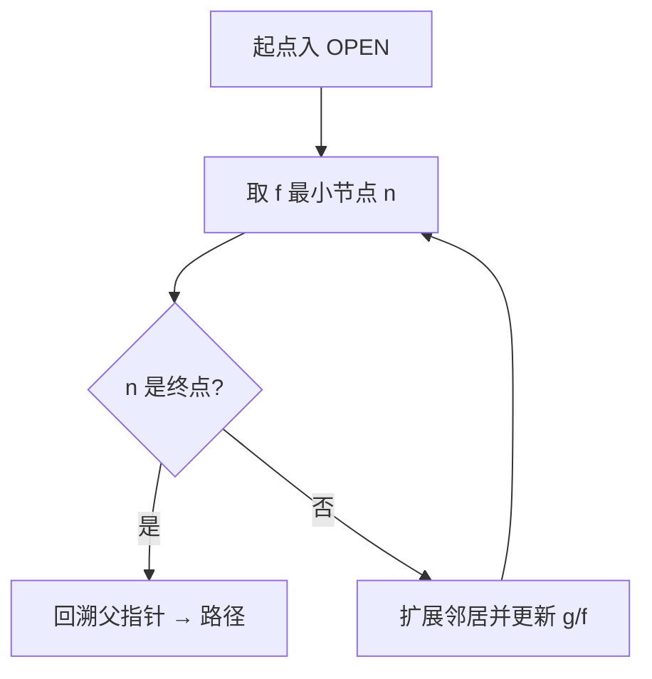

# A\* 全局路径规划

## 一句话定义

**A\*** 在离散图（常见为占据栅格邻接图）上搜索从起点到终点的路径，用代价函数 \(f(n)=g(n)+h(n)\)（起点累计代价 + 启发估计）在 **可采纳启发** 下保证最优——深蓝学院人形系统课第 4.2 节的全局规划核心算法。

## 英文缩写速查

| 缩写 | 英文全称 | 简要说明 |
|------|----------|----------|
| A\* | A-star | 带启发的最优图搜索 |
| Dijkstra | Dijkstra's Algorithm | \(h=0\) 时的特例，无启发引导 |
| Heuristic | Heuristic Function | 常用欧氏/曼哈顿/对角距离 |
| Grid Map | Occupancy Grid Map | 二维导航常用离散化 |
| NavFn / Smac | Nav2 global planners | 工程中封装 A\* / 混合 A\* 变体 |
| OPEN / CLOSED | Search node sets | 待扩展集 / 已扩展集 |

## 为什么重要

- **全局层职责清晰**：给出拓扑可行折线路径；动力学与瞬态障碍交给 [DWA](./dwa.md) 等局部器。把两层混成「一步搜到可执行轨迹」会同时失去可解释性与实时性。
- **教学与工程双入口**：[PythonRobotics](../entities/python-robotics.md) 用动画建立 \(f=g+h\) 直觉；[Navigation2](../entities/navigation2.md) 的 `planner_server`（NavFn / Smac 等）是部署默认。
- **地图质量决定上界**：若建图未做 [动态障碍滤波](../concepts/dynamic-obstacle-filtering.md)，A\* 会绕「幽灵墙」或直接失败——课程 4.1→4.2 的衔接点。

## 主要技术路线

| 路线 | 状态空间 | 典型场景 |
|------|----------|----------|
| 栅格 A\* | 四/八连通格点 | 课程 2D 导航、NavFn |
| 带转向代价 A\* | 格点 + 航向惩罚 | 差速/Ackermann 全局层 |
| 混合 A\* / Smac | 运动学可行原语 | Nav2 Smac Planner |
| 任意时刻 / D\* 族 | 增量重规划 | 环境频繁变化 |
| 可见图对照 | 多边形顶点图 | [FAR Planner](../entities/far-planner.md) 长距离路由 |

## 核心原理

### 搜索循环

1. 将起点放入 OPEN，\(g(s)=0\)，\(f(s)=h(s)\)。
2. 反复取出 OPEN 中 \(f\) 最小节点 \(n\)：
   - 若 \(n\) 是终点 → 回溯父指针得路径；
   - 否则移入 CLOSED，扩展邻居 \(m\)。
3. 对邻居：若经 \(n\) 的新 \(g\) 更优，则更新父指针与 \(f\)，并加入/更新 OPEN。

### 代价与启发

\[
g(m)=g(n)+c(n,m),\quad f(m)=g(m)+h(m)
\]

- \(c(n,m)\)：边代价（格距、对角 \(\sqrt{2}\)、可选转向惩罚）。
- \(h\)：**可采纳**（从不高估）且最好 **一致**（三角不等式），常用欧氏距离；栅格八连通可用对角启发。
- 障碍格与 [膨胀层](../entities/navigation2.md) 内格子不可扩展。

### 与 Dijkstra / 贪心的关系

| 算法 | \(h\) | 行为 |
|------|-------|------|
| Dijkstra | \(0\) | 均匀扩展，最优但慢 |
| 贪心最佳优先 | 只用 \(h\) | 快但不保证最优 |
| A\* | \(g+h\) | 在可采纳 \(h\) 下最优且更少扩展 |

## 工程实践

### 课程 / 仿真实验清单

1. 用 [动态障碍滤波](../concepts/dynamic-obstacle-filtering.md) 得到干净 2D 占据图（或空场建图）。
2. 在 PythonRobotics 或自写栅格上跑 A\*，对比曼哈顿 vs 欧氏启发的扩展节点数。
3. 将折线交给 [DWA](./dwa.md) 跟踪；观察「全局穿墙」是否因未膨胀 footprint。
4. Nav2：`planner_server` + `controller_server` 联调，确认 `global_costmap` 分辨率与机器人半径一致。

### 调试指标

| 指标 | 健康信号 | 异常含义 |
|------|----------|----------|
| 扩展节点数 / 地图格数 | 远小于全图 | \(h\) 失效或障碍过多 |
| 规划耗时 | 十～百毫秒级（小图） | 分辨率过高或未限 OPEN |
| 路径曲折度 | 平滑后可跟踪 | 需接 [路径平滑](./smooth-navigation-path-generation.md) |
| 与局部器冲突次数 | 低 | 全局穿膨胀层或动态未更新 |

### 关键参数（实践量级）

| 参数 | 建议起点 | 说明 |
|------|----------|------|
| 地图分辨率 | 0.05–0.1 m | 过细则内存/时间爆炸 |
| 膨胀半径 | ≥ 机器人外接圆半径 | 防止贴墙 |
| 启发权重 \(\epsilon\) | 1.0（可加权 A\* >1） | \(>1\) 换速度丢最优 |

## 局限与风险

- **忽略动力学**：A\* 路径对差速/人形不可直接执行，必须分层。
- **动态环境**：静态图上的最优在行人走动后失效 → 重规划或 D\* / 局部层兜底。
- **维数灾难**：三维或高维状态（\(x,y,\theta,v\)）需混合 A\* / 采样法，纯栅格不够。
- **误区**：「全局规划失败 = A\* 坏了」——更常见是代价地图脏、坐标系错、终点落在膨胀区。

## 关联页面

- [DWA 局部规划](./dwa.md)
- [动态障碍物滤波](../concepts/dynamic-obstacle-filtering.md)
- [PythonRobotics](../entities/python-robotics.md)
- [Navigation2](../entities/navigation2.md)
- [FAR Planner](../entities/far-planner.md) — 长距离可见图对照
- [人形系统课程策展](../entities/humanoid-system-curriculum.md)

## 参考来源

- [深蓝学院人形系统课程大纲](../../sources/courses/shenlan_humanoid_system_theory_practice.md)
- [PythonRobotics 归档](../../sources/repos/python_robotics.md)
- [深蓝AI：规划与控制篇](../../sources/blogs/wechat_shenlan_ai_ad_planning_control.md)

## 推荐继续阅读

- Hart, Nilsson, Raphael, *A Formal Basis for the Heuristic Determination of Minimum Cost Paths*, IEEE TSSC 1968
- [Nav2 Smac Planner 文档](https://docs.nav2.org/)
