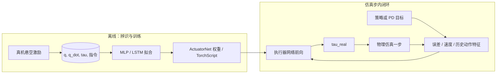

# Actuator Network (执行器网络)

**执行器网络 (Actuator Network)** 是一种在机器人仿真中用于模拟物理驱动器（如电控伺服电机、SEA 驱动器）真实物理行为的深度学习模型。它是解决**足式机器人 Sim2Real 鸿沟**中“动力学不匹配”问题的利器。

## 英文缩写速查

| 缩写 | 英文全称 | 简要说明 |
|------|----------|----------|
| Sim2Real | Simulation to Real | 把仿真中学到的策略迁移落地真机的工程主线 |
| SEA | Series Elastic Actuator | 串联弹性执行器，提供柔顺与力控 |
| MuJoCo | Multi-Joint dynamics with Contact | 接触丰富的刚体物理仿真引擎 |
| Isaac Gym | NVIDIA Isaac Gym | GPU 并行刚体仿真训练环境 |
| PD | Proportional–Derivative | 关节位置/阻抗底层控制，策略输出常为其 setpoint |
| ANYmal | ANYbotics Quadruped | ANYbotics 的四足机器人研究平台 |
| MLP | Multi-Layer Perceptron | 多层感知机，处理本体向量等低维输入 |
| RL | Reinforcement Learning | 通过与环境交互最大化长期回报来学习策略的范式 |
| Locomotion | Robot Locomotion | 足式/人形等无轮移动能力的总称 |
| Isaac Lab | NVIDIA Isaac Lab | 基于 Omniverse 的机器人学习训练框架 |

## 为什么需要 Actuator Network？

在物理仿真器（如 MuJoCo 或 Isaac Gym）中，默认的关节驱动通常是理想化的 PD 控制：
$$ \tau = K_p (q_{target} - q) + K_d (\dot{q}_{target} - \dot{q}) $$
然而，真实的机器人电机存在以下复杂的非线性特性，而这些特性很难用简单的代数公式精确描述：
1. **反向电动势 (Back-EMF)**：高速转动时电机输出扭矩会下降。
2. **非线性摩擦**：谐波减速器带来的静摩擦与动摩擦。
3. **总线延迟**：从控制指令下发到电流产生作用的 2-10ms 不等时延。
4. **SEA 物理特性**：ANYmal 等机器人使用的串联弹性执行器中的弹簧动力学。

## 核心机制

执行器网络不再使用解析公式，而是训练一个小型神经网络来充当驱动器层：

- **输入**：当前位置误差 $(q_d - q)$、关节速度 $\dot{q}$、历史动作序列 $a_{t-k:t}$。
- **输出**：该时刻真实的驱动力矩 $\tau_{real}$。
- **训练数据**：通过真机实验采集，输入随机动作指令，测量真实产生的关节响应。

## 流程总览

## 主要技术路线

1. **数据采集**：让真机悬空，下发啁啾信号（Chirp Signal）或随机频率的 PD 目标，记录 $(q, \dot{q}, \tau)$。
2. **离线训练**：训练一个 MLP 或 LSTM 模型，使其能准确预测真机的力矩输出。
3. **仿真集成**：将训练好的网络（通常转为 TorchScript）嵌入到仿真器的控制循环中。
4. **策略训练**：在带有执行器网络的仿真环境中训练 RL 策略。

## 带来的价值

- **频率对齐**：网络能够自发学出系统的传输延迟特性。
- **功耗预测**：由于能够拟合真实力矩，RL 学出来的策略会更加节能。
- **零样本迁移**：极大提升了 Locomotion 策略在复杂地形上的稳健性，减少了在真机上二次调参的需求。

## 在仿真栈中的位置（Explicit 路线）

执行器网络属于 **explicit 执行器** 的数据驱动形态：在用户代码中由网络算 $\tau$，再写入物理仿真，而非由引擎隐式积分 PD。Isaac Lab 的 `LearnedMlpActuator`、mjlab 的 `LearnedMlpActuator` 与之同类。与 **implicit**（引擎内置 PD）相比，explicit 更贴近真机非线性，但数值上更挑步长与 `armature`；概念总览见 [Implicit / Explicit 执行器建模](../concepts/implicit-explicit-actuator-modeling.md)。

## 与解析摩擦模型（BAM）的关系

执行器网络用 **黑箱 MLP** 拟合 $(q,\dot q,\text{历史指令})\rightarrow\tau$；[BAM 扩展摩擦](../entities/paper-bam-extended-friction-servo-actuators.md) 则用 **M1–M6 物理参数**（Stribeck、负载相关等）在 MuJoCo 中 **在线更新** 摩擦上界，数据需求为摆锤台架轨迹而非大规模悬空激励。[PACE](../entities/paper-pace-sim2real-legged-robots.md) 在论文中将 ActuatorNet 作为悬空轨迹对齐的 **黑盒对照**，自身用 **$4n+1$ 可解释关节参数 + CMA-ES** 达到更接近真机的相位图。三者可串联：先 BAM/PACE 缩小可解释误差，再对残差训练小型网络。

## 关联页面
- [Implicit / Explicit 执行器建模](../concepts/implicit-explicit-actuator-modeling.md)
- [Sim2Real (仿真到现实迁移)](../concepts/sim2real.md)
- [ANYmal 实体页](../entities/anymal.md) — 广泛使用执行器网络的代表
- [System Identification (系统辨识)](../concepts/system-identification.md)
- [BAM 论文实体](../entities/paper-bam-extended-friction-servo-actuators.md)、[BAM 仓库](../entities/bam-better-actuator-models.md)
- [PACE（足式系统化 Sim2Real）](../entities/paper-pace-sim2real-legged-robots.md) — 论文对比基线；可解释参数辨识路线

## 参考来源

- Hwangbo et al. (2019). *Learning Agile and Dynamic Motor Skills for Legged Robots*（Science Robotics）— 提出 **ActuatorNet**：用神经网络从历史关节误差与力矩序列预测真实关节力矩，显著压缩 sim2real 中的执行器动力学误差；正式出版页：[Science Robotics (DOI)](https://www.science.org/doi/10.1126/scirobotics.aau5872)；开放获取预印本：[arXiv:1901.08652](https://arxiv.org/abs/1901.08652)。
- Hwangbo et al. (2018). *Sim-to-Real: Learning Agile Locomotion For Quadruped Robots*（RSS）— 同团队早期 **sim2real + 动力学随机化** 路线，为后续执行器级建模问题提供上下文；会议论文 PDF：[RSS 2018 p10](https://www.roboticsproceedings.org/rss14/p10.pdf)。
- [sources/papers/system_identification.md](../../sources/papers/system_identification.md) — ingest 档案（Hwangbo 2019 ActuatorNet + Gautier–Khalil 1990 最小惯性参数集 / 1992 激励轨迹 + Grandia 2019 在线辨识 + Peng 2018 域随机化辨识等系统辨识合集）。
- [sources/papers/locomotion_rl.md](../../sources/papers/locomotion_rl.md) — 足式 RL 论文索引（ANYmal 等应用背景）。
- Isaac Lab 执行器栈工程参考（理想/隐式 PD、数据驱动力矩路径等）：[`actuator_pd.py`](https://github.com/isaac-sim/IsaacLab/blob/main/source/isaaclab/isaaclab/actuators/actuator_pd.py)。
