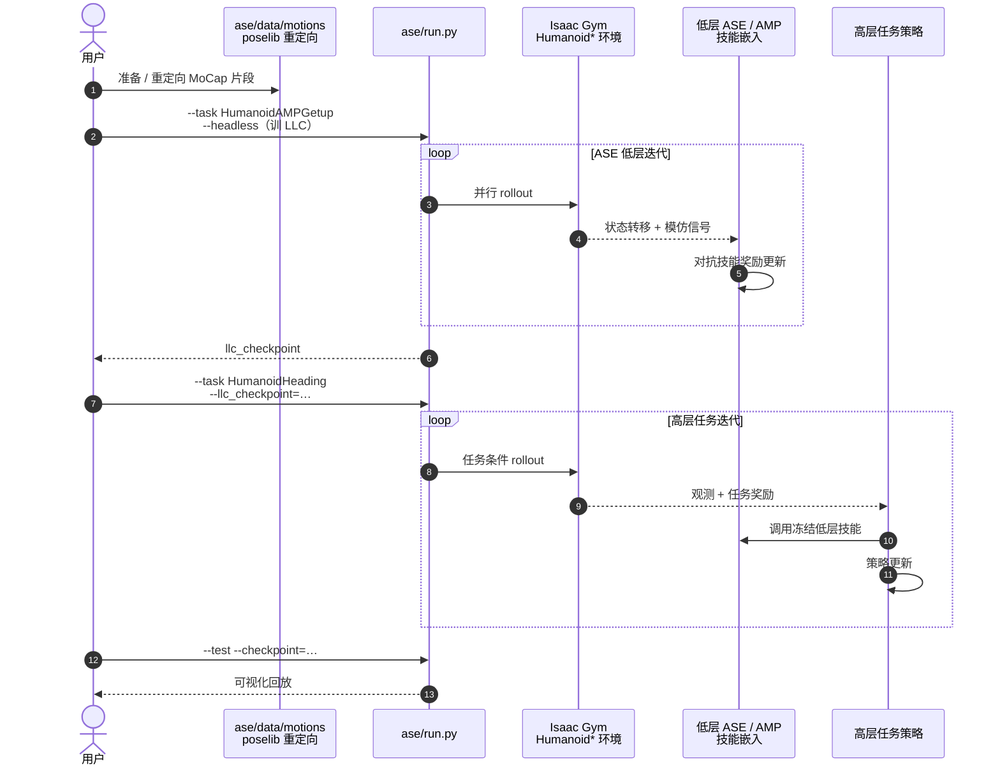

---

type: method
tags: [hierarchical-control, embedding, gan, xbpeng, paper, bfm, behavior-foundation-model, awesome-bfm-papers, nvidia]
status: complete
updated: 2026-07-20
code: https://github.com/nv-tlabs/ASE
venue: "2022 · TOG"
arxiv: "2205.01906"
related:
  - ../overview/bfm-41-papers-technology-map.md
  - ../overview/bfm-category-02-goal-conditioned-learning.md
  - ../overview/humanoid-amp-motion-prior-survey.md
  - ../entities/protomotions.md
  - ./amp-reward.md
  - ../entities/mimickit.md
  - ./smp.md
sources:
  - ../../sources/papers/ase.md
  - ../../sources/papers/bfm_awesome_ase_arxiv_2205_01906.md
  - ../../sources/papers/bfm_awesome_41_catalog.md
  - ../../sources/blogs/wechat_embodied_ai_lab_bfm_41_papers_survey.md
summary: "ASE (Adversarial Skill Embeddings) 通过对抗学习在潜空间中压缩动作风格，实现层次化控制与复杂任务组合。"
---

# ASE: 对抗性技能嵌入

**ASE** 将生成对抗思想与层次化强化学习相结合，旨在从大规模无标注运动数据中学习通用的技能表示。

## 英文缩写速查

| 缩写 | 英文全称 | 简要说明 |
|------|----------|----------|
| AMP | Adversarial Motion Prior | 用对抗判别约束状态转移接近专家运动分布的先验 |

## Survey 坐标（策展索引）

### 在 awesome-bfm-papers 中

| 字段 | 内容 |
|------|------|
| 编号 | 25/41 |
| 分组 | 02 Goal-conditioned 学习 |
| 出处 | 2022 · TOG |
| 索引来源 | [awesome-bfm-papers](https://github.com/friedrichyuan/awesome-bfm-papers) |

## 核心架构：两阶段学习
1. **技能发现 (Skill Discovery)**：
   - 训练一个低层策略（Low-level Policy），其输入除了状态 $ 还有潜变量 $。
   - 潜变量 $ 被映射到特定的动作风格。
   - 判别器确保生成的动作分布与参考数据集一致。
2. **任务适配 (Task Adaptation)**：
   - 低层策略被冻结。
   - 训练高层策略（High-level Policy）在潜空间 $ 中进行搜索，以完成特定任务。

## 主要技术路线
| 阶段 | 关键技术 | 目标 |
|------|---------|------|
| **预训练** | Adversarial Information Bottleneck | 学习解耦且稠密的技能潜空间 |
| **潜空间建模** | [SE(3) 表示](../formalizations/se3-representation.md) Embedding | 将技能约束在超球面上，便于高层搜索 |
| **下游训练** | Skill Chaining | 组合多个基本技能完成长程任务 |

## 与 PhysicsPingPong 的对照

[Table Tennis Strategy & Skill Learning](./table-tennis-strategy-skill-learning.md)（SIGGRAPH 2024）用 **5 路 ASE 技能专家 + mixer** 缓解任务阶段 mode collapse；论文 Table 1 显示相对单 ASE/CASE 在 Skill Accuracy 与连续回球数上显著提升。可作为「单 latent 空间 vs 多专家混合」的体育动画案例。

## 与 GPC 的对照

[GPC](../entities/paper-gpc-generative-pretrained-controllers.md)（SIGGRAPH 2026，Peng 组）代表 **离散 FSQ token + GPT 式自回归** 路线：用 **端到端 RL** 学运动词汇表，再在 **>600 h** 数据上预训练生成式控制器，以 **CoLA** 微调下游任务。相对 ASE 的 **连续对抗潜空间**，GPC 强调规避连续流形 **mode collapse**，并在下游保留 **随机行为多样性**（论文对比 CVAE 任务控制器）。二者同属 **可复用运动先验**，但 GPC 面向 **物理角色动画仿真**，ASE 更常作 **层次 RL 低层技能库**。

## 源码运行时序图

官方实现 [nv-tlabs/ASE](https://github.com/nv-tlabs/ASE)（Isaac Gym）：`ase/run.py` 统一入口，先训低层技能嵌入（如 `HumanoidAMPGetup`），再接高层任务（如 `HumanoidHeading`）并加载 LLC checkpoint；`--test` 做可视化回放。运动数据在 `ase/data/motions`，重定向可用 `ase/poselib/retarget_motion.py`。一次完整运行如下（命令以仓库 README 为准）：

- **两阶段解耦**：低层学可复用技能嵌入，高层只学任务条件；换任务通常只重训 HLC。
- **入口单一**：训练与测试都走 `ase/run.py`，靠 `--task` / `--test` 切换模式。

## 关联页面

- [GPC（Generative Pretrained Controllers）](../entities/paper-gpc-generative-pretrained-controllers.md) — 离散 token 生成式预训练对照
- [Table Tennis Strategy & Skill Learning](./table-tennis-strategy-skill-learning.md) — 五路 ASE 专家 + mixer 体育案例
- [protomotions](../entities/protomotions.md) — 提供大规模并行训练支持。
- [amp-reward](amp-reward.md) — ASE 沿用了 AMP 的判别器结构。
- [mimickit](../entities/mimickit.md) — 核心集成框架。
- [smp](smp.md) — 下一代生成式先验。

## 参考来源
- [sources/papers/ase.md](../../sources/papers/ase.md)
- 论文：<https://arxiv.org/abs/2205.01906>

