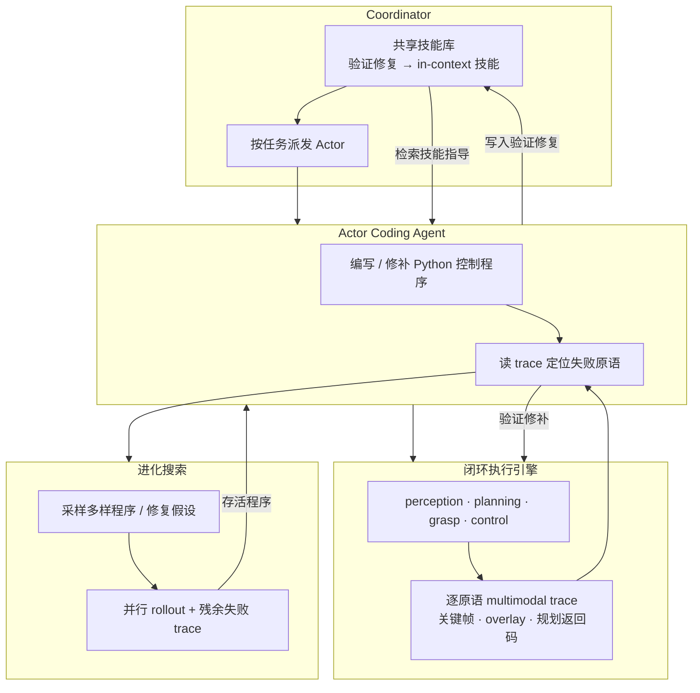

# ASPIRE

**ASPIRE**（NVIDIA [GEAR Lab](../entities/nvidia-gear-lab.md) 等，2026；*Agentic Skill Programming through Iterative Robot Exploration*）研究的是：能否让 **coding agent 写机器人控制程序** 时，像资深工程师一样 **从失败 trace 中学习并复利经验**——而不是每个任务从零调试、成功后丢弃修复策略。

## 一句话定义

面向 frontier **coding agent** 的 **持续学习机器人系统**：在 **code-as-policy** 范式下，用 **闭环执行引擎**（逐原语多模态 trace）+ **进化搜索**（多样控制程序并行调试）+ **持续扩展技能库**（验证修复 → 可检索 in-context 知识）构成开放式学习环，使机器人解决第 100 个任务时不再像第一个任务那样一无所知。

## 英文缩写速查

| 缩写 | 英文全称 | 简要说明 |
|------|----------|----------|
| ASPIRE | Agentic Skill Programming through Iterative Robot Exploration | 本工作提出的持续学习 code-as-policy 系统 |
| CaP | Code as Policy | 用可执行程序组合感知/规划/控制原语表示机器人行为 |
| CaP-X | Code-as-Policy eXtension | 基于 MuJoCo Playground 的开源 code-as-policy 框架（实验栈） |
| VLA | Vision-Language-Action | 端到端视觉-语言-动作策略，ASPIRE 主评测基线之一 |
| LLM | Large Language Model | 大语言模型，本系统依赖 frontier 模型维持调试环 |
| Sim2Real | Simulation to Real | 仿真中学到的 know-how 经技能检索指导真机程序合成 |

## 为什么重要

- **把「经验」从权重搬到技能库：** 持续学习的「训练」是 **技能精炼** 而非梯度下降；「训练产物」是 **传感器–运动技能仓库** 而非浮点权重——与 VLA/RL 权重缩放叙事形成对照。
- **细粒度 trace 是真机/仿真 coding agent 的调试前提：** 仅任务级成败无法区分感知、规划、抓取或接触失败；**逐原语 multimodal trace** 使 agent 能选择性检查证据链并做 **针对性修补**（论文消融：仅加执行引擎即可将 LIBERO-Pro 宏平均成功率 **14% → 62%**）。
- **技能复利解锁零样本长时程：** 在 LIBERO-90 上积累的技能库，可 **零样本** 迁移到未见长时程任务（LIBERO-Pro Long **31%** vs 基线 **4%**），且成功率随库规模单调上升。
- **sim-to-real 的新切口：** 迁移的不是策略权重，而是 **经仿真验证的失败修复 know-how**；跨 Franka 仿真 → YAM 真机时，检索技能可使 **编程 token 降近一个数量级**（非零样本权重部署，agent 仍需真机 trace 调试）。

## 流程总览

## 主要技术路线

### 三组件职责

| 组件 | 职责 | 对 agent 的意义 |
|------|------|----------------|
| **闭环执行引擎** | 每次原语调用记录 API、I/O、状态与 **RGB 关键帧 / overlay / 抓取候选 / 规划结果** | 可 **选择性检查** 失败链路上的证据，而非淹没在完整视频中 |
| **持续扩展技能库** | 将 rollout 验证的修复蒸馏为 **模块化技能**（定位、导航恢复、运动原语、抓取约束、调试工作流等） | 未来任务以 **in-context 检索** 继承经验；actor **不交换完整聊天历史** |
| **进化搜索** | 在单轨迹调试后，并行探索多样程序与修复假设 | 超越「一条 trace 修到底」；难例上仍有递减但可观的增益 |

### 协调器–执行器架构

- **Coordinator** 管理共享技能库并向各任务 spawn **Actor**（各一个 coding agent）。
- 跨任务经验经 **技能库蒸馏** 传递，保持各 actor 上下文聚焦：**任务规格 + 当前程序 + 结构化失败 trace**。
- 仿真侧在 **150+** 任务上并行学习，积累如 `bowl_on_plate()`、`handover()`、`can_in_trash()` 等异质技能。

### 实验栈与基线

| 设定 | 选择 |
|------|------|
| 仿真 coding agent | **Claude Code + Claude Opus 4.6**（1M context） |
| 程序框架 | **CaP-X** on [MuJoCo Playground](../entities/mujoco-playground.md) |
| 主基线 | **CaP-Agent0**（每 evaluation seed 重生成程序 + test-time reasoning） |
| 端到端对照 | OpenVLA、π₀.₅、人类专家程序 |
| 真机跨具身 | **Codex GPT-5.5** on 双臂 YAM；检索 Franka 仿真发现的技能 |

### 主结果（公开论文量级）

| 基准 | 要点 | ASPIRE 相对最强基线（量级） |
|------|------|---------------------------|
| **LIBERO-Pro** | 10 任务 × 50 held-out seeds；Object / Goal / Spatial 三套件 Pos+Task 扰动 | 最高 **+77 pp**（Object 轴宏平均） |
| **Robosuite** | 接触丰富操作；含双手递送 | 双手递送 **20% → 92%** |
| **BEHAVIOR-1K** | 长时程移动操作；程序式场景 | 任务成功率最高 **+32 pp**（如 radio 56% → 88%） |
| **LIBERO-Pro Long** | 在 LIBERO-90 技能库上 **零样本** 长时程 | **31%** vs 基线 **~4%** |

**评测协议差异（读数时注意）：** ASPIRE 在少量 debug seed 上学习后 **每任务输出一个程序** 跨 held-out seeds 评测；CaP-Agent0 **每 seed 重新生成** 并依赖 test-time reasoning——ASPIRE 的优势部分来自 **技能复利 + 单程序泛化**。

### 真机跨具身技能迁移（初步证据）

- **非权重部署：** 真机仍用自身感知/标定/控制栈；agent 通过真机 trace **继续调试**。
- **问题：** 仿真发现的技能作为 in-context 指导，能否减少真机编程 **token 与 rollout 预算**？
- **结果（Table 1 量级）：** soda-can 成功率 **13/20 → 19/20**，总 token **~62M → ~6.6M**；drawer 无技能 **0/20**，有技能 **11/20**。

### 消融要点

- **仅执行引擎：** LIBERO-Pro 宏平均 **14% → 62%**（最大单项增益）。
- **+进化搜索：** 在剩余难例上进一步提升；前几轮迭代收益最陡。

## 与 ENPIRE 的分工（GEAR 内对照）

| 维度 | **ASPIRE** | **ENPIRE** |
|------|-----------|-----------|
| 优化对象 | **控制程序**（code-as-policy） | **策略训练配方**（BC / RL / 启发式等） |
| 经验形态 | **技能库**（验证修复、in-context 检索） | **Git 演化中的 recipe / 假设树** |
| 反馈粒度 | **逐原语 multimodal trace** | **env.py 级 reset / verify / reward** |
| 典型场景 | 仿真操作基准 + 跨具身程序合成 | 高灵巧 **真机桌面** autoresearch |
| 共同前提 | frontier **coding agent** + 可重复闭环试验 | 同左 |

二者同属 GEAR **agent 驱动机器人研发自动化** 谱系，宜与 [真机策略 autoresearch 闭环搭建指南](../queries/real-robot-policy-autoresearch-harness.md) 一并阅读。

## 与 GaP 的分工（agentic 谱系对照）

| 维度 | **ASPIRE** | **[GaP](../entities/paper-gap-graph-as-policy.md)** |
|------|-----------|------------------------------------------------------|
| 策略表示 | **Python 控制程序**（CaP） | **有向计算图**（Graph-as-Policy，类 ROS） |
| 经验/优化 | **技能库复利** + 进化搜索 + trace 调试 | **仿真排练** 改图拓扑/参数 |
| 任务靶心 | LIBERO-Pro / Robosuite / BEHAVIOR-1K | **[变体自动化（VA）](../concepts/variational-automation.md)** 8 benchmark |
| 运行形态 | 程序解释执行 | **edge 图解释器** 持久执行（编译期用 agent） |
| VLA 关系 | 主评测 **对抗** 端到端 VLA | 可将 VLA **staging** 进分布（>2× 增益） |

二者均依赖 frontier coding agent，但 ASPIRE 强调 **失败修复知识沉淀**，GaP 强调 **模块化图 + 工业可解释性**。

## 常见误区或局限

- **误区：「技能库 = 预定义原语表」。** ASPIRE 技能是 agent **发现并验证的修复知识**（如 multi-angle approach、碰撞缓冲绕行），类别可扩展，但受 **预定义 primitive API** 边界约束。
- **误区：「仿真技能可直接零样本真机执行」。** 公开材料强调 **know-how 指导 + 真机 trace 调试**；不是跳过真机实践的权重迁移。
- **局限：frontier LLM 依赖** — 实验固定 **Claude Opus 4.6**；弱模型能否维持调试环 **未验证**。
- **局限：技能库长期管理** — 库增大后可能出现 **陈旧、过拟合特定场景、冗余或误导** 条目；页面自述尚未完全解决。
- **局限：搜索成本** — 每任务多轮 LLM 调用与 rollout；scaling 需更便宜推理或更高效搜索。
- **局限：真机 autonomy** — 成功检测、安全复位、监控与标定仍依赖工程配套，**非完全无人值守学习者**。

## 与其他页面的关系

- 与 [ENPIRE](./enpire.md)：GEAR 内 **程序技能复利** vs **策略训练 autoresearch** 互补对照。
- 与 [VLA](./vla.md)：主评测显示端到端 VLA（OpenVLA、π₀.₅）在扰动与长时程上 **远低于** ASPIRE+技能库路线；读「慢 VLA vs 可调试程序」权衡。
- 与 [Manipulation](../tasks/manipulation.md)：LIBERO / Robosuite / [BEHAVIOR-1K](../entities/behavior-1k.md) 操作任务语境。
- 与 [MuJoCo Playground](../entities/mujoco-playground.md)：CaP-X 仿真栈与 ASPIRE 学习环的基础设施。
- 与 [Data Flywheel](../concepts/data-flywheel.md)：技能库是 **失败修复 → 可复用知识** 的飞轮，而非演示数据飞轮。
- 与 [NVIDIA GEAR Lab](../entities/nvidia-gear-lab.md)：研究组锚点与姊妹工作索引。
- 与 [GaP](../entities/paper-gap-graph-as-policy.md)：同属 agentic 编程谱；**程序技能库** vs **ROS 式计算图 + VA benchmark**。
- 与 [Harness VLA](../entities/paper-harness-vla.md)：同属 LLM harness；ASPIRE **扩张**技能库，Harness VLA **固定**原语并把冻结 VLA 当作 `vla_act`。

## 推荐继续阅读

- ASPIRE 官方项目页：<https://research.nvidia.com/labs/gear/aspire/>
- 论文 PDF：<https://research.nvidia.com/labs/gear/aspire/assets/Aspire.pdf>
- [ENPIRE](./enpire.md) — 真机策略自改进束具（EN–PI–R–E）
- [真机策略 autoresearch 闭环搭建指南](../queries/real-robot-policy-autoresearch-harness.md) — coding agent 闭环前提与范式选型

## 参考来源

- [sources/papers/aspire_nvidia_gear_2026.md](../../sources/papers/aspire_nvidia_gear_2026.md)
- [sources/sites/nvidia-research-aspire.md](../../sources/sites/nvidia-research-aspire.md)
- Lu et al., *ASPIRE: Agentic /Skills Discovery for Robotics*, NVIDIA GEAR 等, 2026. <https://research.nvidia.com/labs/gear/aspire/>

## 关联页面

- [ENPIRE](./enpire.md) — GEAR 真机策略 autoresearch 姊妹工作
- [VLA](./vla.md) — 端到端策略路线对照
- [Manipulation](../tasks/manipulation.md) — 操作基准与任务语境
- [NVIDIA GEAR Lab](../entities/nvidia-gear-lab.md) — 研究组与工程栈锚点
- [MuJoCo Playground](../entities/mujoco-playground.md) — CaP-X 仿真基础设施
- [BEHAVIOR-1K](../entities/behavior-1k.md) — 长时程家务仿真基准
- [Harness VLA](../entities/paper-harness-vla.md) — 固定原语 + 冻结 VLA 接触专家的记忆 harness 对照
