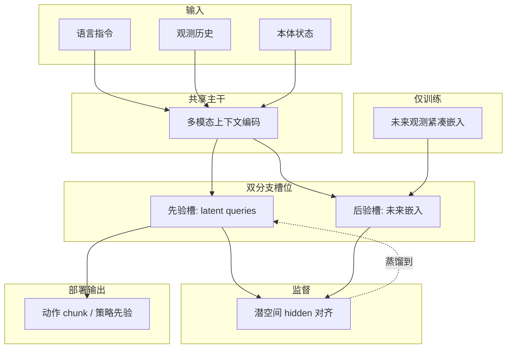

# Being-H0.7（潜空间世界–动作模型）

**Being-H0.7** 是 BeingBeyond 提出的机器人策略：把「世界建模带来的未来结构」压缩进**紧凑潜空间**，用**可学习 latent queries** 作为多模态上下文与低层动作之间的中间工作空间；训练时借助**未来观测的后验分支**对齐先验分支的隐状态，测试时只跑先验分支，从而避免「每步先想象整段未来视频再动」的高延迟与脆弱性。

## 一句话定义

一种面向真机闭环的 **latent world–action model**：从互联网级 **egocentric 人视频** 与机器人演示里学未来相关结构，在潜空间表达为**可部署的动作先验**，而不是像素 rollout。

## 为什么重要

- **缓解 VLA 的行为塌缩**：纯稀疏动作监督时，模型容易忽略视觉细节差异；引入稠密未来对齐信号有助于保留与交互动力学相关的细粒度结构。
- **缓解像素世界模型的部署代价**：高保真视频预测与在线控制的频率、内存和稳定性要求冲突；潜空间接口把「用未来」与「每步生成视频」解耦。
- **规模数据下的工程叙事清晰**：约 20 万小时人视频 + 1.5 万小时机演示，与「潜空间 + 双分支训练」共同支撑跨仿真基准与多真机平台的泛化叙事。

## 核心结构 / 机制

### 1. 潜变量工作空间（latent queries）

模型在指令、观测历史、本体状态之上，引入一组**可学习的 latent queries**，组织「世界–动作」中间表示；未来相关推理主要发生在这里，而不是直接跳到连续低层动作或像素画布。

### 2. 打包双分支与潜空间对齐

- **先验分支**：序列中对应槽位放置 latent queries（部署时唯一路径）。
- **后验分支**：同形状位置替换为**未来观测的紧凑嵌入**（训练期额外信息）。
- **实现约束**：并非两套独立网络，而是**单序列、共享上下文编码 + 双分支注意力掩码**，降低参数与优化复杂度。
- **训练目标**：对齐两分支在潜空间中的 hidden，使先验在**无未来帧**条件下吸收未来相关结构。

### 3. 流程总览（主干数据流）

### 4. 系统部署要点（非模型结构本身，但影响可用性）

- **分块动作 + UAC**：与 chunk 化动作预测配套，客户端用 **Universal Async Chunking** 维持已提交前缀执行、异步拉取下一段后缀再拼接，平滑模型与网络延迟；项目页报告在 Being-H 系列上可将暴露步级延迟压到约 **3–4 ms** 量级叙述（依赖具体机载栈）。
- **人形 G1 的分层执行**：Being-H0.7 作为上层操作接口时，可与 **AMO** 等预训练全身低层策略组合，由 AMO 承担下肢与腰部平衡闭环。

## 常见误区或局限

- **误区：「潜空间」等于经典 Dreamer RSSM。** 本文重点是**操作策略内部的未来监督接口**与双分支训练形式，不必假设与 RSSM 相同的 latent rollout 或 reward 想象循环。
- **误区：去掉像素 rollout 就没有世界模型。** 世界相关结构仍通过训练期未来信息注入；只是**推理接口**不再是显式视频生成器。
- **局限：** 潜对齐质量依赖未来嵌入设计、掩码与损失权重；长视界物理一致性与罕见接触仍可能失败，需与仿真基准和真机套件对照阅读。

## 与其他页面的关系

- 放在 **[VLA](vla.md)** 谱系中：输入仍是语言 + 视觉 + 状态，输出仍是可执行动作，但训练信号侧强调**未来结构**与**潜空间先验**。
- 与 **[生成式世界模型](generative-world-models.md)** 对照：共享「从视频学动力学」动机，但显式回避**测试时像素展开**的主导地位。
- 与 **[潜空间想象](../concepts/latent-imagination.md)** 共享「紧凑未来表示」思想，应用场景更偏**操作模仿与大模型式策略**。

## 主要技术路线

- **策略形态**：[VLA（Vision-Language-Action）](vla.md) — 语言 + 视觉 + 状态 → 连续控制；Being-H0.7 在训练侧额外引入未来对齐。
- **世界信息接口**：[生成式世界模型](generative-world-models.md) / [潜空间想象](../concepts/latent-imagination.md) — 与像素 rollout、RSSM 式潜展开对照阅读。
- **基础模型语境**：[基础策略模型（Foundation Policy）](../concepts/foundation-policy.md) — 大规模异构数据上的通才策略叙事。
- **多模态对齐机制（形式化视角）**：[跨模态注意力](../formalizations/cross-modal-attention.md) — 潜查询与视觉–语言上下文的交互可放在该抽象下理解。

## 推荐继续阅读

- 项目页：[Being-H0.7: A Latent World-Action Model from Egocentric Videos](https://research.beingbeyond.com/being-h07)
- 论文预印本：<https://arxiv.org/abs/2605.00078>
- 与异步动作缓冲相关的站内页：[Action Chunking](action-chunking.md)

## 参考来源

- [sources/papers/being_h07.md](../../sources/papers/being_h07.md) — 本次 ingest 归档与摘录映射
- [Being-H0.7 项目页](https://research.beingbeyond.com/being-h07) — 方法叙述、基准与系统部署说明
- Luo, H., et al. (2026). *Being-H0.7: A Latent World-Action Model from Egocentric Videos.* arXiv:2605.00078.

## 关联页面

- [VLA（Vision-Language-Action）](vla.md)
- [Pelican-Unified 1.0（UEI）](pelican-unified-1.md) — 像素级联合未来–动作扩散 + VLM 推理 \(z\) 的对照阅读
- [Generative World Models（生成式世界模型）](generative-world-models.md)
- [Latent Imagination（潜空间想象）](../concepts/latent-imagination.md)
- [Action Chunking（动作块输出）](action-chunking.md)
- [Imitation Learning（模仿学习）](imitation-learning.md)
- [Foundation Policy（基础策略模型）](../concepts/foundation-policy.md)
- [Cross-modal Attention（跨模态注意力）](../formalizations/cross-modal-attention.md)
