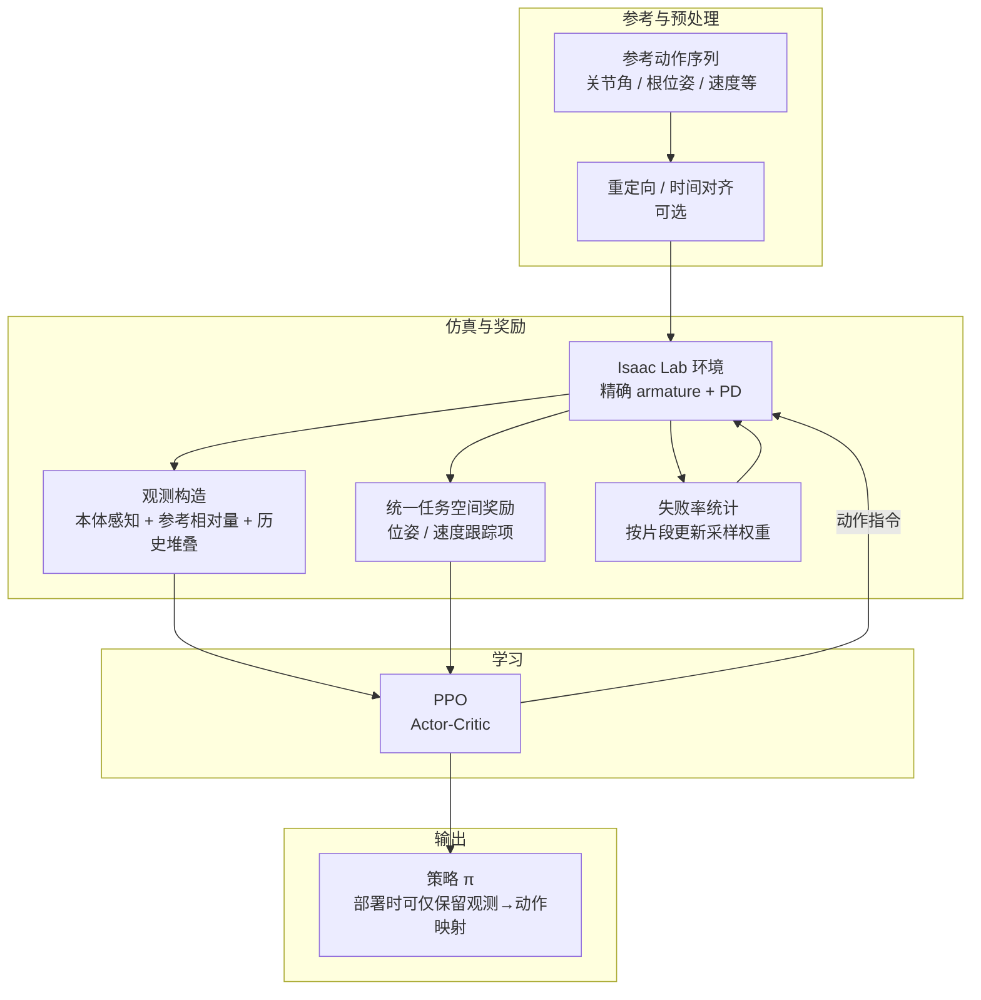
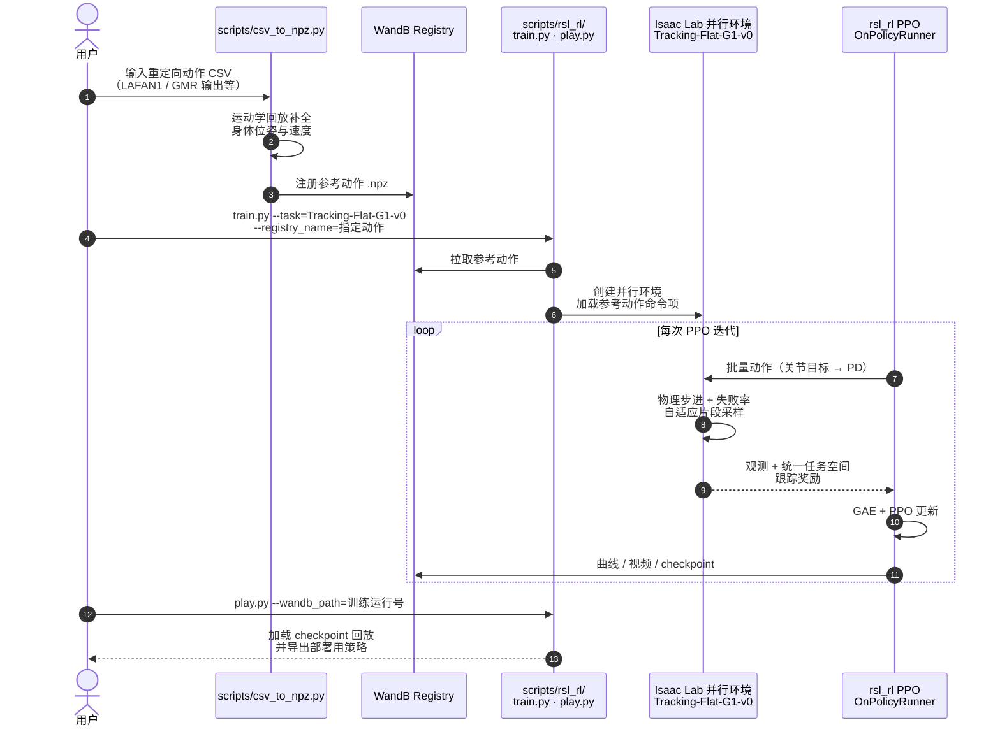
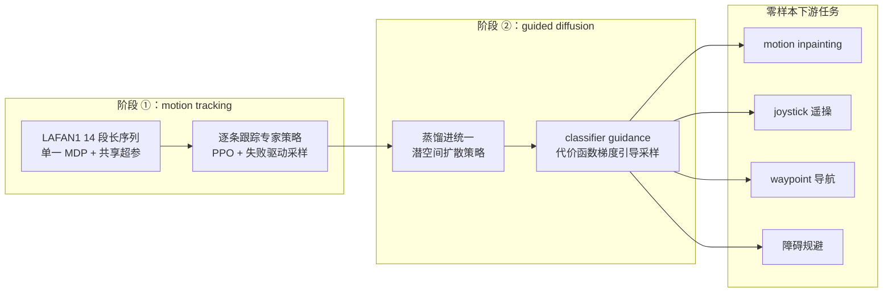

# BeyondMimic

**BeyondMimic** 是由 Hybrid Robotics 等团队开发的高性能机器人动作模仿框架。相比早期的 DeepMimic 或 AMP，BeyondMimic 更侧重于从仿真到真实物理世界的无缝迁移，并在 **Isaac Lab** (IsaacLab) 环境中得到了广泛验证。

## 英文缩写速查

| 缩写 | 英文全称 | 简要说明 |
|------|----------|----------|
| BeyondMimic | BeyondMimic Framework | 高精度仿真人形动作模仿框架 |
| IL | Imitation Learning | 参考轨迹跟踪式模仿学习 |
| RL | Reinforcement Learning | 仿真中 PPO 等优化跟踪策略 |
| Isaac Lab | NVIDIA Isaac Lab | 主要验证与训练环境 |
| Sim2Real | Simulation to Real | 强调物理建模与采样以促迁移 |
| CG | Classifier Guidance | 测试时用代价函数梯度引导扩散采样朝新目标优化 |

## Survey 坐标（策展索引）

### 在 42 篇 RL 运动控制身体系统栈中

| 字段 | 内容 |
|------|------|
| 编号 | 15/42 |
| 系统栈层 | 02 参考跟踪 · 通用控制 |
| 索引来源 | [具身智能研究室 · 42 篇 humanoid RL 运动控制长文](https://mp.weixin.qq.com/s/hz9JXtJeUPRfUGzfD-pZuA) |

### 在 BFM 41 篇技术地图中

| 字段 | 内容 |
|------|------|
| 编号 | 35/41 |
| 分组 | 05 Hierarchical control |
| 索引来源 | [awesome-bfm-papers](https://github.com/friedrichyuan/awesome-bfm-papers) |

### 在人形 Loco-Manip 161 篇中

| 字段 | 内容 |
|------|------|
| 槽位 | 004/161 |
| 分组 | 01 运控基座与通用全身跟踪 |
| 分类 hub | [loco-manip-161-category-01-motion-base-wbt](../overview/loco-manip-161-category-01-motion-base-wbt.md) |
| 索引来源 | [具身智能研究室 · 161 篇人形 Loco-Manip 长文](https://mp.weixin.qq.com/s/pACh9EhsISiyPGdiiR0C3A) |

## 论文信息（arXiv:2508.08241）

| 字段 | 内容 |
|------|------|
| 完整标题 | *BeyondMimic: From Motion Tracking to Versatile Humanoid Control via Guided Diffusion* |
| 作者 | Qiayuan Liao、Takara E. Truong、Xiaoyu Huang、Yuman Gao、Guy Tevet、Koushil Sreenath、C. Karen Liu |
| 机构 | 加州大学伯克利分校（Hybrid Robotics）；斯坦福大学 |
| arXiv 版本 | v1 2025-08-11 → v4 2025-11-13 |
| 代码 | <https://github.com/HybridRobotics/whole_body_tracking>（跟踪阶段开源实现） |
| 项目页 | <https://beyondmimic.github.io/> |

论文叙事分两个阶段：**① 紧凑 motion-tracking 公式**——单一 MDP 设置与共享超参覆盖高动态技能；**② 统一潜空间扩散 + classifier guidance**——把跟踪技能升格为可组合、可引导的通用控制（详见下文「[第二阶段](#第二阶段统一潜空间扩散与测试时引导)」）。本页前半部分的物理建模与采样细节属于阶段 ①。

## 端到端数据流（概览）

下面用一张流程图把「参考动作 → 仿真环境 → 策略学习 → 部署」的主干串起来；具体张量布局随实现（官方仓库与 [robot_lab](../../sources/repos/robot_lab.md) 等 fork）略有差异，但信息流一致。

## 源码运行时序图

官方跟踪阶段实现 [whole_body_tracking](https://github.com/HybridRobotics/whole_body_tracking) 基于 Isaac Lab，参考动作用 WandB Registry 管理：先用 `scripts/csv_to_npz.py` 把重定向动作转成参考 npz 并注册，再用 `scripts/rsl_rl/train.py --task=Tracking-Flat-G1-v0` 训练，`scripts/rsl_rl/play.py` 回放与导出。一次完整运行的模块交互如下（具体张量与命令行以仓库 README 为准）：

- **训练与部署解耦**：本仓库只覆盖「参考动作 → 跟踪策略」的训练闭环；真机部署控制器在配套 deploy 仓库，与上文「端到端数据流」中的 `策略 π` 输出衔接。
- **动作即资产**：参考动作与 checkpoint 全走 WandB Registry，换动作只改 `--registry_name`，与「失败率驱动自适应采样」一起构成多技能批量训练的工程底座。

## 输入与输出：和实现对齐时看什么

本节按「环境 / 策略」两侧说明，便于你对照代码里的 `observation`、`action`、`reward` 配置与 TensorBoard 曲线。

### 1. 参考侧输入（教师信号，非策略网络输入）

| 类型 | 常见内容 | 在训练中的作用 |
|------|-----------|----------------|
| 参考轨迹 | 逐帧根位姿、关节角、根线速度 / 角速度等 | 定义「要像谁」；与 [DeepMimic](./deepmimic.md) 族一样属于 **轨迹跟踪** 范式 |
| 时间索引 | 当前应对齐到参考的第几帧 / 相位 | 决定奖励里与哪一段参考比较；长序列上常配合 **失败驱动采样** 决定 reset 片段 |
| 坐标变换 | 根坐标系、质心 / 骨盆局部系 | 任务空间奖励在 **统一坐标系** 下算误差，避免关节空间手工拼凑 |

参考数据通常 **不** 作为原始像素输入进策略；策略看到的是已在观测里编码好的 **相对几何与速度误差**（见下）。

### 2. 策略观测（Policy 输入）

BeyondMimic 强调 **历史本体感知的堆叠**：让策略记住接触序列、仿真数值阻尼等短时规律。常见组块包括（名称以各实现为准）：

| 组块 | 含义 | 调参 / 排错提示 |
|------|------|------------------|
| 本体状态 | 关节角 / 角速度、上一步动作、IMU 姿态等 | 缺历史时易出现「抖脚、滑脚」式高频补偿 |
| 相对参考量 | 根或骨盆相对参考的位姿差、速度差 | 与「统一任务空间奖励」一致；若与奖励坐标不一致会导致 **回报高但观感差** |
| 相位 / 帧指针 | 当前参考进度或归一化相位 | 长舞 / 行走中帮助衔接；与失败采样联动时，曲线上的 **有效步长** 会随片段难度变化 |

### 3. 策略动作（Policy 输出）

在 Isaac Lab 类人形任务里，动作多为 **目标关节位置 / 速度** 或 **在 PD 之上的残差**，由底层 PD + 精确 armature 模型执行。部署时输出的是 **控制指令**（与训练时相同的接口），而不是奖励或参考索引。

| 输出 | 典型语义 | 备注 |
|------|-----------|------|
| 动作向量 | 各关节目标或残差，维度 = 可控自由度 | 与 URDF / 执行器模型一致；armature 与增益错误会表现为 **同样策略在实物上发散** |
| 隐变量 | 一般无 | 若使用 VAE 等才会多出头；标准 BeyondMimic 叙述以 PPO 为主 |

### 4. 环境反馈与奖励分解（理解曲线用的「物理含义」）

统一任务空间奖励通常可看成若干项的加权和（具体权重看配置）：

- **位置 / 姿态误差**：各关键连杆与参考的平移、旋转差；决定「像不像」。
- **线速度 / 角速度匹配**：决定「节奏与动态是否一致」，避免「pose 对了但发软或发飘」。
- **正则项**（若实现中有）：能量、关节限位、脚滑惩罚等；防止为降位置误差而 **利用仿真漏洞**。

失败率驱动的采样改变的是 **哪些状态被反复见到**，而不是直接改变奖励公式；因此在曲线上更多体现为 **有效 episode 长度、终止原因分布** 的变化，而非单条 reward 斜率突变。

## 训练曲线：每条在说什么、怎样算「好」

以下按「PPO 通用 → 模仿任务特有关」顺序；指标名以 RSL-RL / TensorBoard 常见命名为例。

### PPO 与价值函数

| 曲线 / 指标 | 健康时大致长什么样 | 常见异常与含义 |
|-------------|-------------------|------------------|
| `episode_reward` / return | 前期快速上升后进入平台期；平台期仍有小幅抖动正常 | **长期持平或下滑**：参考进度跟不上、终止过难、或奖励坐标与观测不一致 |
| `policy_loss` | 小幅波动，无单向爆炸 | **持续飙高**：步长过大、优势估计方差大、或 reward scale 突变 |
| `value_loss` | 随训练缓慢下降 | **先降后升且伴随 return 崩**：critic 过拟合或环境非平稳（如突然改奖励权重） |
| `entropy` | 逐渐缓慢下降；保留一定宽度 | **极快掉到接近 0**：探索不足，易卡在局部跟踪模态；**长期过高**：可能没学到确定性跟踪 |
| `approx_kl` | 维持在你设定的小阈值附近（如 0.01–0.03 量级，依实现而定） | **频繁尖峰**：更新过激进；**始终接近 0**：可能学习率过小或梯度被 clip 死 |

判读技巧：**不要单看一条线**。若 return 上升但 `entropy` 骤降且实机变差，多半是策略过拟合仿真可 exploit 的动力学细节（例如不真实 foot friction），应回到 armature / 接触与奖励权重。

### 模仿与跟踪任务特有关

| 曲线 / 指标 | 含义 | 好 / 坏的工程判据 |
|-------------|------|-------------------|
| 分项 reward（若日志拆开） | 位置项 vs 速度项的贡献 | **位置项独高、速度项低**：动作「卡帧」、动态不对；宜检查速度权重或参考微分是否平滑 |
| Episode length | 每回合持续步数 | **逐渐变长** 通常说明更少提前 fall / timeout；配合失败采样时，早期变短有时表示 **正在专攻难点片段**（需结合终止统计看） |
| Success / fall 率（若有） | 是否站住、是否跟完片段 | 比 return 更直观；**成功率 plateau 在低位** 时优先查物理参数而非网络宽度 |
| 脚滑、穿透相关 proxy（若记录） | 接触是否可信 | **单调变差** 说明策略在利用接触模型漏洞；BeyondMimic 路线应先核对 **PD + armature** 再加大域随机 |

### 实操 checklist（看板 5 分钟版）

1. **先看 video / rollout**：return 骗人时，肉眼比任何标量都快。
2. **对齐时间轴**：改奖励权重或参考数据后，旧 run 与新 run 不要横比绝对 return。
3. **看终止原因占比**：timeout 多 = 难或采样太狠；early termination 多 = 平衡或跟踪失败。
4. **对照 sim2real**：若 sim 曲线完美而硬件上发散，优先打开 [Armature](../concepts/armature-modeling.md) 与执行器文档，而不是先加网络层数。

## 核心设计理念

BeyondMimic 提出一个核心观点：**精确的物理建模可以替代大量盲目的域随机化 (Domain Randomization)**。通过缩小仿真与现实在确定性物理量上的差距，策略能更有效地学习到稳健的运动模式。

## 关键技术点

### 1. 精确的物理建模 (Accurate Physical Modeling)
BeyondMimic 强调必须对机器人执行器的反射惯量（[Armature](../concepts/armature-modeling.md)）进行精确计算，并据此设计 PD 增益。

- **Armature 计算**：$I_{arm} = J_{rotor} \cdot G^2$。
- **PD 增益设计**：基于反射惯量计算临界阻尼增益，确保在轻载工况下不振荡，重载下保持柔顺。

### 2. 失败率驱动的自适应采样 (Failure-driven Adaptive Sampling)
在训练长序列动作（如长距离行走或跳舞）时，随机从序列中任意位置 reset 往往效率低下。BeyondMimic 引入了自适应采样：
- **实时评估**：记录每个动作片段（Segment）的训练失败率。
- **权重分配**：失败率越高、难度越大的片段，被采样作为起始位置的概率越大。
- **前瞻卷积**：采样权重考虑当前片段及其后续片段的累计难度，防止机器人卡在“断点”处。

### 3. 统一的任务空间奖励 (Unified Task-space Rewards)
BeyondMimic 并不针对特定关节设计复杂的 reward，而是采用统一的任务空间跟踪项：
- 身体各部位的位置误差与朝向误差。
- 线速度与角速度匹配。
- 支持对特定关键身体部位（如 Pelvis）进行加权优化。

## 主要技术路线

| 模块 | 核心方案 | 目的 |
|------|---------|------|
| **物理建模** | 精确 armature + 关联 PD 增益 | 缩小动力学 Gap，提升部署稳定性 |
| **采样策略** | 失败率驱动的自适应重采样 | 提高对困难动作片段的训练效率 |
| **观测空间** | 历史本体感知观测堆叠 | 利用时序上下文记忆仿真特定模式 |
| **奖励函数** | 统一的任务空间跟踪项 | 简化奖励设计，保持动作自然度 |

## 训练机制：大道至简

BeyondMimic 证明了只要满足以下三点，简单的 PPO 就能学到极强的动作模仿能力：
1. **精确的 Armature 补偿**。
2. **时序历史观测的堆叠**（让策略学会记忆仿真特有的模式）。
3. **针对性的失败重采样**。

论文口径下这套「紧凑公式」的验证方式：在 **LAFAN1** 的 **14 段约 3 分钟长序列** 上逐条训练跟踪策略，**全部使用同一 MDP 设置与共享超参**（不做逐动作调参），覆盖侧空翻（aerial cartwheel）、旋踢（spin-kick）、翻转踢（flip-kick）、冲刺跑等高动态技能，同时保持 SOTA 级人类相似度并可稳定复现地部署到实机。

## 第二阶段：统一潜空间扩散与测试时引导

论文题目的后半句（*Versatile Humanoid Control via **Guided Diffusion***）对应第二阶段：跟踪只能「复现已有动作」，而下游任务往往在训练中从未出现。BeyondMimic 的做法是把技能压进一个生成模型，再在测试时"掰"向新目标：

- **技能蒸馏进统一潜空间扩散模型**：把第一阶段得到的多条跟踪专家策略蒸馏为 **单一 latent diffusion policy**，支持多样的目标指定、任务间无缝切换与技能的动态组合，而不是每任务一条策略。
- **Classifier guidance 做测试时优化**：给定简单的代价函数（如到路点的距离、与障碍的距离），在扩散去噪过程中以代价梯度引导采样方向，**无需针对下游任务再训练**。
- **零样本下游任务**：论文验证了 **motion inpainting（动作补全）**、**joystick 遥操**、**waypoint 导航** 与 **障碍规避**，并将这些能力 **零样本迁移到真实硬件**；实机实验中动捕系统用于给出路点 / 障碍位置并辅助状态估计。

这一步使 BeyondMimic 与「每任务重训一条 goal-conditioned policy」的路线区分开：**任务语义在测试时以代价函数注入**，策略本体保持不变。也因此它在 BFM 谱系里被归入 **hierarchical control**（见 [论文实体页](../methods/beyondmimic.md) 的 survey 坐标）。

## 评价与影响

BeyondMimic 已经成为许多人形机器人项目的底层基座：
- **RobotEra (宇树春晚爆款等)**：其技术路线中大量参考了 BeyondMimic 的物理建模思想。
- **[SONIC](./sonic-motion-tracking.md)（NVIDIA/CMU 等）**：将 BeyondMimic 的能力扩展到手柄、VR 和文本控制；并被 [ExoActor](./exoactor.md) 直接当作"视频生成 → 动作估计 → 通用动作跟踪"流水线中的物理过滤器。

## 参考来源
- [机器人论文阅读笔记：BeyondMimic](https://imchong.github.io/Humanoid_Robot_Learning_Paper_Notebooks/papers/01_Foundational_RL/BeyondMimic/BeyondMimic.html)

- [sources/papers/motion_control_projects.md](../../sources/papers/motion_control_projects.md) — 飞书公开文档《开源运动控制项目》总结。
- [sources/papers/bfm_awesome_beyondmimic_arxiv_2508_08241.md](../../sources/papers/bfm_awesome_beyondmimic_arxiv_2508_08241.md) — awesome-bfm 策展摘录（BFM 谱系坐标：05 Hierarchical control）。
- [sources/papers/loco_manip_161_survey_004_beyondmimic.md](../../sources/papers/loco_manip_161_survey_004_beyondmimic.md) — Loco-Manip 161 #004 策展摘录。
- [sources/repos/robot_lab.md](../../sources/repos/robot_lab.md) — Isaac Lab 侧集成任务与训练栈说明。
- Hybrid Robotics，[whole_body_tracking](https://github.com/HybridRobotics/whole_body_tracking) — 上游开源实现与 issue 讨论入口（张量命名以仓库为准）。
- 论文：<https://arxiv.org/abs/2508.08241>（v4，2025-11-13）；项目页：<https://beyondmimic.github.io/>（阶段划分、LAFAN1 实验与下游任务演示，2026-07-11 对照）。
- 原始抓取：[wechat_humanoid_rl_42_survey_2026-05-26.md](../../sources/raw/wechat_humanoid_rl_42_survey_2026-05-26.md)

## 关联页面

- [BeyondMimic（论文实体页）](../methods/beyondmimic.md) — survey 坐标（RL 身体系统栈 #15/42、BFM 地图 #35/41、Loco-Manip 161 #004）与交叉引用。
- [Imitation Learning (模仿学习)](./imitation-learning.md)
- [DeepMimic](./deepmimic.md) — 轨迹跟踪式模仿的前置脉络。
- [Armature Modeling (电枢惯量建模)](../concepts/armature-modeling.md)
- [Reward Design (奖励设计)](../concepts/reward-design.md) — 统一任务空间跟踪与分项日志的关系。
- [Curriculum Learning (课程学习)](../concepts/curriculum-learning.md) — 失败驱动采样是课程学习的一种高级形式。
