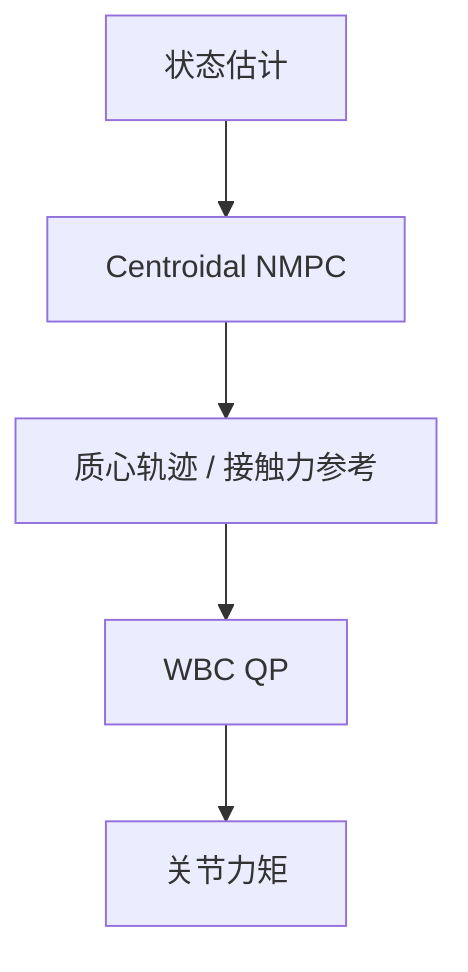

# Centroidal NMPC + WBC 栈

飞书 Know-How 将 **质心动力学模型 + 非线性模型预测控制 + WBC（CD+NMPC+WBC）** 列为传统控制主链的**高保真层**：NMPC 在质心动量/接触力变量上滚动优化，WBC 在全刚体动力学下跟踪 NMPC 输出的接触力与质心轨迹。

## 一句话定义

外层 NMPC 决定「质心与接触力怎么变」，内层 WBC 决定「各关节力矩怎么实现」。

## 英文缩写速查

| 缩写 | 英文全称 | 简要说明 |
|------|----------|----------|
| CD | Centroidal Dynamics | 质心线动量/角动量动力学 |
| NMPC | Nonlinear Model Predictive Control | 非线性滚动时域优化 |
| WBC | Whole-Body Control | 全刚体 QP 力矩分配 |
| SRBD | Single Rigid Body Dynamics | 更低保真单层 MPC 对照 |
| OCP | Optimal Control Problem | NMPC 每步求解的 OCP |
| QP | Quadratic Programming | WBC 常用求解形式 |

## 为什么重要

- **比凸 SRBD-MPC 更准**：可建模质心高度变化、角动量与复杂接触序列。
- **人形高动态**：跑步、大跨步更依赖 CD 层规划而非 LIP 常高度假设。
- **飞书顺序**：位于 SRBD+凸 MPC 之后，代表「模型保真度升级」。

## 核心原理

- **NMPC 决策变量：** 接触力、质心动量变化、步态时序等。
- **约束：** 摩擦锥、力矩限、接触切换逻辑、动力学一致性。
- **WBC：** 最小化跟踪误差 + 正则，满足全刚体方程。

## 主要技术路线

| 路线 | 代表链接 | 说明 |
|------|----------|------|
| 质心层 | [Centroidal Dynamics](../concepts/centroidal-dynamics.md) | NMPC 状态与约束 |
| 执行层 | [Whole-Body Control](../concepts/whole-body-control.md) | 全刚体 QP 跟踪 |
| 对照 | [SRBD+凸MPC](../concepts/srbd-convex-mpc-wbc.md) | 低维实时折中 |

## 工程实践

- 先用 [SRBD+凸 MPC](../concepts/srbd-convex-mpc-wbc.md) 验证步态时序，再升 CD-NMPC。
- 选用实时 NMPC 求解器（acados、OCS2、crocoddyl 等，见 [NMPC 方法页](./nonlinear-model-predictive-control.md)）。
- 与 RL 对照时固定 **状态估计质量** 与 **接触模型**，避免模型不公平。

## 局限与风险

- **算力与建模成本**：NMPC 周期、接触模式枚举、模型误差敏感。
- **接触切换**：错误接触调度导致不可行 QP 或跌倒。
- **调参复杂**：飞书强调「局限性」块需记录失败边界（滑移、软地面）。

## 关联页面

- [Nonlinear MPC](./nonlinear-model-predictive-control.md)
- [Centroidal Dynamics](../concepts/centroidal-dynamics.md)
- [MPC 与 WBC 集成](../concepts/mpc-wbc-integration.md)
- [Model-based 控制栈](../overview/humanoid-model-based-control-stack.md)

## 参考来源

- [humanoid_motion_control_know_how.md](../../sources/papers/humanoid_motion_control_know_how.md)
- [mpc.md](../../sources/papers/mpc.md)

## 推荐继续阅读

- [OCS2 / crocoddyl 实体](../entities/crocoddyl.md)
- [depth-classical-control Stage 3–4](../../roadmap/depth-classical-control.md)
