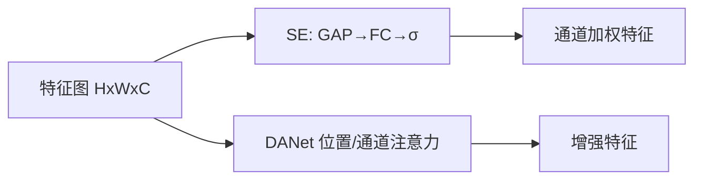

# 通道与空间注意力（SENet / SE-ResNet / DANet）

## 一句话定义

在 **CNN 特征图** 上用轻量模块做 **通道重标定**（SENet/SE-ResNet）或 **位置–通道双注意力**（DANet），以较小代价增强判别特征——是 Transformer 自注意力普及前的主流「Attention 增强 CNN」路线。

## 英文缩写速查

| 缩写 | 英文全称 | 简要说明 |
|------|----------|----------|
| SE | Squeeze-and-Excitation | 全局池化+门控的通道注意力 |
| SENet | Squeeze-and-Excitation Network | 嵌入 SE 块的分类网络 |
| DANet | Dual Attention Network | 位置注意力+通道注意力双分支 |
| GAP | Global Average Pooling | 挤压阶段常用全局平均池化 |
| FC | Fully Connected | SE 激励分支的两层瓶颈 MLP |

## 为什么重要

- 课程 1.2.1 的历史锚点：理解「注意力」并非一开始就是 QKV Transformer。
- SE 块可插拔进 [ResNet](../entities/paper-resnet-deep-residual-learning.md)，工业检测骨干中仍常见类似通道门控。
- 与 [MHA](../concepts/multi-head-attention.md) 对照：SE/DA 作用在 **HxWxC 特征图**，MHA 作用在 **token 序列**。

## 主要技术路线

| 路线 | 机制 | 代表 |
|------|------|------|
| 通道注意力 | GAP + 门控重标定 | SENet / SE-ResNet |
| 双注意力 | 位置注意力 + 通道注意力 | DANet |
| 混合注意力 | 通道+空间串联/并联 | CBAM 等后续变体 |

## 核心原理

### SENet / SE-ResNet

1. **Squeeze**：对特征图做 GAP → 通道描述子。
2. **Excitation**：两层 FC + sigmoid 得到每通道权重。
3. **Scale**：权重乘回原特征。SE-ResNet = ResNet 残差块内嵌 SE。

### DANet

- **位置注意力**：像素间长程空间依赖。
- **通道注意力**：通道图之间的相互依赖。
- 两分支融合后用于场景分割等密集预测。

## 工程实践

| 项 | 建议 |
|----|------|
| 插入位置 | 残差块末尾；reduction ratio 常用 16 |
| 代价 | SE 参数与算力开销很小，适合机载 CNN |
| 迁移 | 检测/分割骨干加 SE 时常稳提点；先 A/B 延迟 |
| 调试 | 看激励权重是否对背景通道长期关闭 |

## 局限与风险

- **表达力上限**低于全局 token 自注意力；复杂关系建模仍看 ViT/DETR。
- DANet 类双注意力在高分辨率上内存开销大。
- 不要与 Transformer MHA API 混用同一套超参直觉。

## 关联页面

- [多头注意力](../concepts/multi-head-attention.md)
- [CNN](../concepts/convolutional-neural-network.md)
- [ResNet](../entities/paper-resnet-deep-residual-learning.md)
- [Transformer CV 课程策展](../entities/transformer-cv-curriculum.md)

## 参考来源

- [Transformer 视觉应用课程大纲](../../sources/courses/transformer_cv_applications_syllabus.md)

## 推荐继续阅读

- [SENet (CVPR 2018)](https://arxiv.org/abs/1709.01507)
- [DANet (CVPR 2019)](https://arxiv.org/abs/1809.02983)
