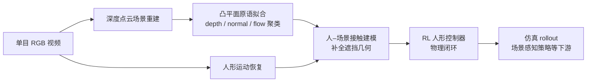

# CRISP（Contact-guided Real2Sim）

**CRISP**（*Contact-guided Real2Sim from Monocular Video with Planar Scene Primitives*，Wang et al.，ICLR 2026）研究如何把**互联网风格单目 RGB 视频**转成**能在接触丰富仿真里跑起来**的人形运动与场景：核心是用**仿真就绪的凸平面原语**近似场景几何，并用**人–场景接触**推断遮挡支撑面，最后用 **RL 驱动的人形控制器**把「人 + 场景」一起约束到物理可信的解空间。

## 一句话定义

用**平面几何 + 接触物理**把单目视频里的「人–场景交互」变成**可 rollout 的仿真资产**，而不是只做视觉好看的稠密重建。

## 为什么重要

- **Real2Sim 的瓶颈常在几何与接触**：稠密 mesh 或噪声深度会在脚–地、臀–椅等接触上产生伪碰撞，后续跟踪/模仿策略大量失败。
- **与 Sim2Real 数据链衔接**：先得到**动力学一致**的仿真场景与参考运动，再在同一套物理里训练策略，是视觉模仿与上下文控制pipeline 的上游模块。
- **论文在 EMDB / PROX 等人-centric 基准上报告**运动跟踪失败率从约 **55.2% 降至 6.9%**，并声称 **RL 仿真吞吐约 +43%**（相对其对比设置），说明「可仿真」不仅是审美指标。

## 主要技术路线

1. **单目视频 + 深度点云**：从 RGB 序列恢复场景点云与人体运动候选（与 [Sim2Real](../concepts/sim2real.md) 数据链中的「资产构建」阶段衔接）。
2. **凸平面原语拟合**：在 depth / normal / optical flow 上聚类，用**仿真就绪的凸平面片**近似可碰撞场景，降低稠密噪声几何对接触的破坏。
3. **接触引导的几何补全**：用人–场景接触（如坐姿推断椅面）补全遮挡区域，避免悬空/穿透等「看起来对、仿真里不可用」的重建。
4. **RL 人形闭环**：用 [强化学习](./reinforcement-learning.md) 驱动 [全身控制](../concepts/whole-body-control.md) 意义上的跟踪/场景感知策略，把运动与场景一起压到物理可行域。

## 流程总览

## 核心机制（编译理解）

1. **平面原语而非万能稠密表面**：在深度点云上聚类并拟合**凸平面片**，使接触求解更接近游戏/仿真引擎里常用的碰撞近似，减少不可控的自穿透与抖动接触法向。
2. **接触引导的遮挡补全**：交互时大量结构不可见（例如座椅面）；用人体姿态与接触假设**推断被挡住的支撑几何**，让人能「坐稳、站起」而不是悬空或穿透。
3. **RL 作为物理一致性过滤器**：重建不仅供可视化，还驱动**人形控制策略**在仿真中运行；物理不可行的运动会在训练/跟踪中暴露，从系统设计上把 **geometry–control** 绑在一起。

## 常见误区

- **把 CRISP 当成纯「4D 视觉重建」**：其卖点是 **simulation-ready**，评价口径包含跟踪失败率与仿真效率，而不是只比渲染逼真度。
- **忽略对比对象差异**：项目页与 VideoMimic 并排展示；不同管线在**几何表示、接触建模、控制接口**上不一致时，数字只能在其论文设定内解读。

## 与其他页面的关系

- 与 **[Sim2Real](../concepts/sim2real.md)**：CRISP 强化 **Real2Sim** 一侧的资产质量，使后续 sim 中训练更稳。
- 与 **[GS-Playground](../entities/gs-playground.md)**：后者用 **3DGS** 做外观 Real2Sim；CRISP 走 **单目视频 + 平面原语 + 接触** 路线，侧重点不同，可对照「视觉真实感 vs 接触动力学可仿真性」。

## 关联页面

- [Sim2Real](../concepts/sim2real.md)
- [Whole-Body Control](../concepts/whole-body-control.md)
- [Reinforcement Learning](./reinforcement-learning.md)
- [GS-Playground](../entities/gs-playground.md)

## 参考来源

- [CRISP（ICLR 2026）论文摘录](../../sources/papers/crisp_real2sim_iclr2026.md)
- [CRISP 项目页归档](../../sources/sites/crisp-real2sim-project-github-io.md)
- [CRISP-Real2Sim 官方仓库索引](../../sources/repos/crisp_real2sim_repo.md)

## 推荐继续阅读

- [OpenReview：CRISP 论文页](https://openreview.net/forum?id=xlr3NqxUqY)
- [VideoMimic 项目页](https://videomimic.github.io/)（站点中与 CRISP 做交互对比的基线之一）
- [Sim2Real 论文导航](../../references/papers/sim2real.md)
