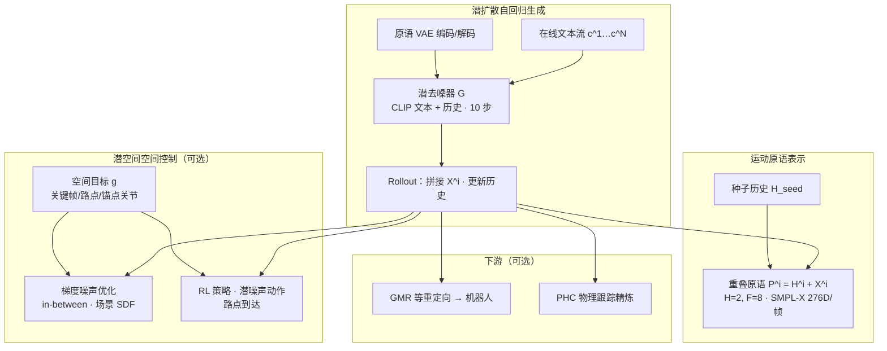

# DART（DartControl：实时文本驱动人体运动控制）

**DART**（*DartControl: A Diffusion-Based Autoregressive Motion Model for Real-Time Text-Driven Motion Control*，Kaifeng Zhao / Gen Li / Siyu Tang，ETH Zürich，**ICLR 2025**；[arXiv:2410.05260](https://arxiv.org/abs/2410.05260)，[项目页](https://zkf1997.github.io/DART/)，[代码](https://github.com/zkf1997/DART)）把 **人体运动** 建模为 **重叠短原语的自回归 rollout**，用 **运动原语 VAE + 潜扩散** 在 **文本 + 历史** 条件下在线生成；并在已学的 **realistic 潜空间** 上叠加 **梯度噪声优化** 或 **RL 策略**，统一支持 **长文本组合、in-between、路点到达与场景几何** 等空间任务。单卡 RTX 4090 上生成 **>300 FPS**，相对离线时序组合基线（如 FlowMDM）强调 **在线实时**。

## 一句话定义

**短原语潜扩散自回归生成器 + 潜噪声空间上的后验空间控制**，把「流式文本语义」与「几何/场景目标」放进同一人体运动先验框架。

## 英文缩写速查

| 缩写 | 英文全称 | 简要说明 |
|------|----------|----------|
| DART | Diffusion-based Autoregressive motion primitive model for Real-time Text-driven motion Control | 本文方法名（DartControl 简称） |
| VAE | Variational Autoencoder | 将运动原语压缩到紧凑潜空间 |
| SMPL-X | SMPL eXpressive | 带手/脸的参数化人体模型；DART 每帧 276 维表示 |
| RL | Reinforcement Learning | 在潜噪声动作空间学习路点等控制策略 |
| SDF | Signed Distance Field | 场景几何距离场，用于人体–场景接触/碰撞正则 |
| CFG | Classifier-Free Guidance | 训练时随机 mask 文本，推理时放大文本条件强度 |
| AMASS | Archive of Motion Capture as Surface Shapes | 训练用大规模 SMPL 人体运动库 |
| T2M | Text-to-Motion | 文本条件三维人体运动生成任务族 |

## 为什么重要？

- **在线长序列：** 多数 T2M 方法输出 **孤立短 clip**；DART 用 **原语自回归** 接 **在线文本流**，可稳定生成分钟级连续动作（jog / dance / cartwheel 等），并处理 **动作边界态**（如 kneel down 触地后波动）。
- **实时性：** 仅 **10 步扩散** + 短原语（$H{=}2,F{=}8$）使单卡 **>300 FPS** 成为可能，适合交互 demo 与 RL 闭环控制（路点策略 **~240 FPS**）。
- **统一空间控制接口：** 不需为每种空间目标收集 **配对控制–运动** 数据（对比 CloSD 等）；在 **motion-only** 预训练后，把 DDIM 采样视作 $\mathbf{Z}_T \mapsto$ 运动 的确定性映射，再优化或学习 $\mathbf{Z}_T$。
- **机器人链路相邻：** 输出 **SMPL-X 运动学轨迹**，可经 [GMR](./motion-retargeting-gmr.md) 等重定向到人形；项目页演示 **DART + [PHC](../entities/phc.md)** 可减轻穿模/滑步等运动学 artifact（仍非端到端 WBC）。

## 主要技术路线

### 1. 重叠运动原语表示

长序列 $\mathbf{M}=[\mathbf{H}_{seed},\mathbf{X}^1,\ldots,\mathbf{X}^N]$ 由重叠原语拼接：第 $i$ 个原语含历史 $\mathbf{H}^i$（与上一原语末 $H$ 帧重叠）与未来 $\mathbf{X}^i$（$F$ 帧）。每帧 **276 维** SMPL-X 过参数化向量：根平移/朝向、局部关节旋转、关节位置、位置与旋转的一阶差分；原语在 **首帧骨盆** 局部坐标系 canonicalize。与 [HY-Motion 1.0](./hy-motion-1.md) 类似，**刻意不同于 HumanML3D 263 维**，更贴近动画管线与后续空间控制（关节位置通道）。

### 2. 潜扩散自回归生成

| 模块 | 作用 |
|------|------|
| **原语 VAE** $\mathcal{E}/\mathcal{D}$ | Transformer（MLD 风格）把未来帧压到潜变量 $\mathbf{z}$；缓解 AMASS 抖动/毛刺 |
| **潜去噪器** $\mathcal{G}$ | 预测干净 $\hat{\mathbf{z}}_0$；条件：扩散步 $t$、**CLIP 文本**、历史 $\mathbf{H}$ |
| **训练技巧** | 文本 10% mask → **CFG**；**scheduled training** 渐进对齐测试时历史分布 |
| **推理** | 每原语从 $\mathbf{z}_T \sim \mathcal{N}(0,I)$ 出发 **10 步**去噪 → 解码 → 拼接 → 更新历史 |

相对 **离线** 的 FlowMDM 式全序列组合，DART 只需当前文本与短历史，**无需预知全时间线**。

### 3. 潜空间空间控制（两条路）

**优化（Alg. 2）：** 对噪声列表 $\mathbf{Z}_T$ 做梯度下降，最小化 $\mathcal{F}(\Pi(\text{rollout}(\mathbf{Z}_T)), g) + cons(\text{rollout}(\cdot))$。实例：

- **In-between：** 给定起止关键帧 + 文本，优化中间过渡
- **人体–场景：** 输入场景 **SDF**、文本与锚点关节目标（如坐下的骨盆位置），正则足地接触与防碰撞

**RL：** 把每原语初始潜噪声当作动作，训练策略在 **文本条件** 下依次到达动态路点（walk / run / hop 等风格由 prompt 切换）。

### 4. 使用注意（语义与标签）

- **粗粒度整句多动作标签** 在原语级会引发 **局部可行动作的随机跳转**；应拆成 **逐动作短 prompt** 序列（可用 LLM 分解）。
- **运动学局限：** 纯 kinematic 生成可能出现滑步/浮空；可与物理跟踪（PHC）或下游人形控制器联用。

## 流程总览

## 常见误区或局限

- **≠ WBC 文献里的 “DART”：** [WBC vs RL](../comparisons/wbc-vs-rl.md) 中 “DART（MPC 生成数据教神经网络）” 是 **另一套蒸馏架构**，与本文 **DartControl** 无关。
- **≠ 端到端人形控制：** DART 主体在 **图形学/视觉人体运动** 域；落地足式/人形需额外处理平衡、接触与执行器动力学。
- **空间控制成本：** 噪声优化比纯生成慢；RL 路点快但需针对任务训练策略。
- **数据与表示绑定：** 在 AMASS + SMPL-X 原语空间训练；与 HumanML3D 基准的直接数值对比需重表示或复现脚本。

## 参考来源

- [DartControl 论文摘录](../../sources/papers/dart_control_arxiv_2410_05260.md)
- [zkf1997/DART 代码仓库](../../sources/repos/zkf1997_dart.md)
- [DART 项目页归档](../../sources/sites/dart-control-project.md)

## 关联页面

- [Diffusion-based Motion Generation](./diffusion-motion-generation.md) — 机器人域扩散运动生成；人体/机器人扩散路线对照
- [Probability Flow](../formalizations/probability-flow.md) — 潜扩散与 DDPM/DDIM 采样的数学背景
- [HY-Motion 1.0](./hy-motion-1.md) — 十亿级 DiT+流匹配 T2M；与 DART 共享「非 HumanML3D 表示」等工程选择
- [GENMO（统一人体运动估计与生成）](./genmo.md) — 估计–生成统一扩散人体模型
- [Awesome Text-to-Motion（Zilize）](../entities/awesome-text-to-motion-zilize.md) — 单人 T2M 文献索引
- [PHC](../entities/phc.md) — DART 项目页演示的物理跟踪后处理
- [AMASS](../entities/amass.md) — DART 训练数据基础
- [General Motion Retargeting（GMR）](./motion-retargeting-gmr.md) — 人体轨迹→机器人执行接口

## 推荐继续阅读

- [论文 PDF（arXiv:2410.05260）](https://arxiv.org/pdf/2410.05260)
- [DART 项目页（视频与交互 demo）](https://zkf1997.github.io/DART/)
- [GitHub 仓库](https://github.com/zkf1997/DART)
- [FlowMDM（离线时序组合基线）](https://arxiv.org/abs/2312.11562) — 理解 DART 强调的在线/速度差异
