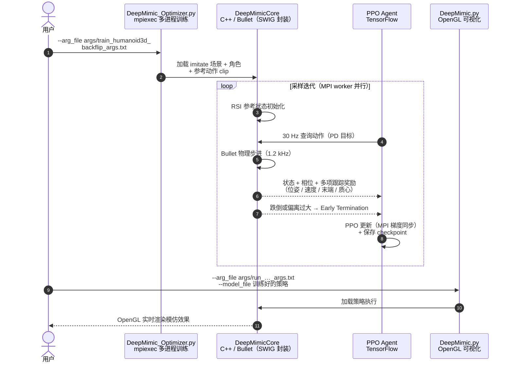

# DeepMimic: 示例引导的技能学习

**DeepMimic** 是第一个能够让物理仿真智能体高保重模仿后空翻、武术等高难度动作的深度 RL 算法。

## 英文缩写速查

| 缩写 | 英文全称 | 简要说明 |
|------|----------|----------|
| RL | Reinforcement Learning | 通过与环境交互最大化长期回报来学习策略的范式 |
| AMP | Adversarial Motion Prior | 用对抗判别约束状态转移接近专家运动分布的先验 |
| Reward | Reward Function | 塑造强化学习策略行为的标量反馈 |

## Survey 坐标（策展索引）

### 在 具身智能研究室 · 42 篇 humanoid RL 运动控制长文 中

| 字段 | 内容 |
|------|------|
| 编号 | 11/42 |
| 系统栈层 | 02 参考跟踪 · 通用控制 |
| 出处 | curated |
| 索引来源 | [具身智能研究室 · 42 篇 humanoid RL 运动控制长文](https://mp.weixin.qq.com/s/hz9JXtJeUPRfUGzfD-pZuA) |

## 核心：显式跟踪 (Explicit Tracking)
不同于后来的 AMP 靠判别器“悟”，DeepMimic 靠“盯”。它要求机器人的每一个关节在每一时刻都要尽可能贴合参考轨迹。

## 局限：「发条玩具」式灵活性

[Peng 在 human five 分享](../../sources/blogs/wechat_human_five_jason_peng_flexible_motion_skills.md) 中把纯运动跟踪控制器比作 **高级发条玩具**：擅长高保真复现固定 clip，但目标位姿微变、物体变化时常需新参考；数据稀缺时更难覆盖任务变体。超越路径见 [Jason Peng 灵活运动技能学习技术地图](../overview/jason-peng-flexible-motion-skill-learning.md)（对抗分布匹配、PARC 迭代增强）。

## 主要技术路线
| 模块 | 方案 | 作用 |
|------|-----|------|
| **奖励函数** | [奖励函数设计](../concepts/reward-design.md) Multi-term Reward | 综合位置、速度、末端位姿和质心偏差 |
| **初始化** | RSI (Reference State Initialization) | 在轨迹的任意点开始训练，增加样本多样性 |
| **早期终止** | Early Exit | 如果跌倒或偏离过大则重置，提高训练效率 |

## 源码运行时序图

官方实现 [xbpeng/DeepMimic](https://github.com/xbpeng/DeepMimic)：C++ 仿真核 `DeepMimicCore`（Bullet 物理 + OpenGL 渲染，SWIG 封装给 Python）+ TensorFlow PPO Agent + MPI 多进程采样。训练入口 `DeepMimic_Optimizer.py`（headless），可视化入口 `DeepMimic.py`；场景、角色、参考动作与算法超参全部由 `args/*.txt` 参数文件指定。一次完整运行的模块交互如下：

- **主要技术路线的三个模块都在循环里**：RSI 对应循环开头的随机初始化，multi-term reward 对应仿真核返回的多项跟踪奖励，Early Exit 对应偏离即重置。
- **原版栈较老（TF1 + SWIG 编译）**：现代复现建议直接用 [MimicKit](../entities/mimickit.md)（同作者，集成 DeepMimic / AMP 等算法，支持 Isaac Gym / Isaac Lab）。

## 关联页面
- [protomotions](../entities/protomotions.md) — 提供大规模并行训练支持。
- [amp-reward](amp-reward.md) — 后续的“无奖励设计”版本。
- [mimickit](../entities/mimickit.md) — 现代化的实现框架。

## 参考来源
- [sources/papers/deepmimic.md](../../sources/papers/deepmimic.md)
- [wechat_human_five_jason_peng_flexible_motion_skills.md](../../sources/blogs/wechat_human_five_jason_peng_flexible_motion_skills.md) — 跟踪局限与超越路径（讲者自述归纳）
- 原始抓取：[wechat_humanoid_rl_42_survey_2026-05-26.md](../../sources/raw/wechat_humanoid_rl_42_survey_2026-05-26.md)

