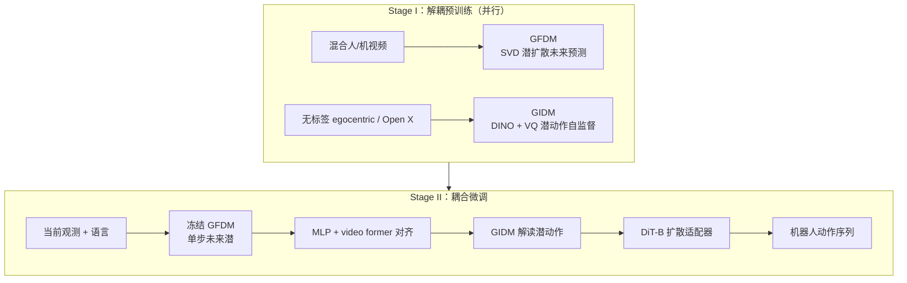

# DeFI（解耦前向/逆动力学 VLA）

**DeFI**（*Decoupling visual **F**orward and **I**nverse dynamics*）提出：先把 **前向动力学**（未来视频/潜状态预测）与 **逆动力学**（由状态转移推断可执行动作）在 **不同数据与目标** 上 **分开预训练**，再在下游任务上 **耦合微调**，缓解端到端 VLA 里 **2D 像素滚动** 与 **3D 动作推理** 的目标冲突，并释放 **无动作标签** 人/Web 视频的规模红利。

## 一句话定义

用 **GFDM** 学「指令条件下世界怎么变」，用 **GIDM** 学「观测怎么变对应什么潜动作」，最后用 **轻量扩散适配器** 把潜动作落成机器人控制序列。

## 为什么重要

- **目标解耦**：联合 VLA（Seer、UP-VLA 等）把未来预测与动作绑在同一损失里，易出现 **训练不稳** 与 **模态竞争**；DeFI 让前向模块专攻 **运动级规律**，逆向模块专攻 **状态转移→动作码**。
- **数据分工**：GFDM 吃 **混合人+机视频** 的生成式监督；GIDM 用 **自监督重建** 在 **Ego4D、Open X** 等无动作标签数据上扩展逆动力学，而不必把整颗 VLA 压在伪动作标签上（对照 UniVLA / LAPA 路线）。
- **工程可复用**：前向侧可继承 **SVD 类** 大规模视频先验；逆向侧用 **VQ 离散潜动作**，便于与语言–视觉栈衔接；下游 **冻结 GFDM** 保护大规模先验，用小数据也能抬 SOTA（论文报告 CALVIN 上约 **60%** 标注即可超过先前最佳）。

## 主要技术路线

### Stage I：解耦预训练

| 模块 | 角色 | 关键机制 | 预训练数据倾向 |
|------|------|----------|----------------|
| **GFDM** | 前向动力学 | **SVD + CLIP 文本** 潜扩散；条件 \((o_t, l)\) 预测短视界未来潜视频；推理常 **单步去噪** 取动力学相关特征 | 人视频 + 机器人操作视频混合 |
| **GIDM** | 逆动力学 | **DINOv2** 编码间隔约 **1s** 的 \((o_t,o_{t+n})\)；**时空 Transformer + VQ-VAE** 与 action queries；以 **未来 DINO 特征 MSE** 为代理任务学 **离散潜动作** | 大规模 **无动作标签** egocentric / 开放具身视频 |

### Stage II：耦合微调

- **冻结 GFDM**：避免下游小集 **侵蚀** 已学动力学先验。
- **对齐层**：MLP 将 GFDM 未来潜投影到 GIDM 流形；叠加 **video former** 抽取中间层时空特征。
- **动作头**：约 **30M DiT-B** 扩散适配器，把 GIDM 潜动作译为 **可执行动作序列**（与 [Diffusion Policy](./diffusion-policy.md) 同属生成式 IL，但条件来自 **解耦动力学栈**）。

### 与相邻范式的坐标

- **相对 [VLA](./vla.md)**：接口仍是语言+视觉→动作，但 **预训练阶段显式拆模块**，而非单一 VLM 端到端纠缠。
- **相对 [mimic-video](./mimic-video.md)（VAM）**：同属「视频先验 + 逆动力学动作头」，DeFI 强调 **两模块独立配方与数据源**，且 GIDM 用 **VQ 潜动作 + 重建代理** 而非仅冻结 Cosmos 骨干边际采样。
- **相对 [World Action Models](../concepts/world-action-models.md)**：在 **Cascaded WAM** 谱系中，`future plan → action` 的模块边界 **更清晰**，且逆动力学预训练与 forward **同等权重**（对照 VPP 弱化逆向、Vidar 轻量逆向等）。

## 流程总览

## 论文报告结果（摘要级）

> 数字以 [arXiv:2604.16391](https://arxiv.org/abs/2604.16391) 为准；复现请对照官方 [DeFi 仓库](https://github.com/LogosRoboticsGroup/DeFi)。

- **CALVIN ABC-D（多视角）**：连续 5 任务 **Avg. Len. 4.51**；相对 VPP、Seer、π₀.5、GR00T N1 等提升 **长程** 任务完成度。
- **SimplerEnv-Fractal**：Google Robot 多任务 **Visual Matching ~51.2%** 平均成功率；部分任务受 **真机预训练 GFDM 与仿真域差** 影响（论文 §4.3 讨论）。
- **Franka 真机（8 任务）**：平均成功率 **81.3%**。
- **消融**：去掉解耦预训练或弱化 GIDM 会显著掉点，支持「**准确逆动力学与准确前向同样重要**」的论点。

## 常见误区或局限

- **误区：DeFI = 每步完整生成操作视频再跟踪。** 工程上依赖 **单步去噪潜特征** 与 **GIDM 潜动作**，而非高保真像素 rollout 闭环。
- **局限：两阶段系统复杂度高。** 需维护 GFDM、GIDM、对齐与扩散头四条训练线，算力与数据管线成本高于「单 VLA + MLP」极简路线（如 StarVLA）。
- **局限：域移仍会出现。** SimplerEnv 部分任务失败与 **冻结 GFDM 仅见过真机分布** 相关；换仿真或新相机布局需重新评估对齐策略。

## 与其他页面的关系

- 与 [VLA](./vla.md)：共享 **语言条件操作** 任务形态；DeFI 是 **动力学模块解耦 + 人视频规模** 方向的补强条目。
- 与 [mimic-video](./mimic-video.md)：都利用 **视频生成先验**；选型时对比 **是否拆分逆向预训练** 与 **潜动作表示（VQ vs 流匹配连续块）**。
- 与 [Being-H0.7](./being-h07.md)：都做 **未来结构 + 动作**；Being-H0.7 偏 **潜空间世界–动作联合** 与 egocentric 预训练，DeFI 偏 **显式 forward/inverse 分工与 SVD 视频栈**。
- 与 [Manipulation](../tasks/manipulation.md)：CALVIN / SimplerEnv / 桌面 Franka 属于典型 **语言条件操作** 评测带。

## 推荐继续阅读

- 论文：<https://arxiv.org/abs/2604.16391>
- 代码：<https://github.com/LogosRoboticsGroup/DeFi>
- 权重：<https://huggingface.co/zbzzbz/DeFI>

## 英文缩写速查

| 缩写 | 英文全称 | 简要说明 |
|------|----------|----------|
| VLA | Vision-Language-Action | 视觉-语言-动作多模态基础策略方向 |
| SOTA | State of the Art | 当前最优水平 |
| VAE | Variational Autoencoder | 变分自编码器，学习隐变量生成表示 |
| MLP | Multi-Layer Perceptron | 多层感知机，处理本体向量等低维输入 |
| DiT | Diffusion Transformer | 以 Transformer 为骨干的扩散生成架构 |
| IL | Imitation Learning | 从专家演示学习策略，奖励难定义时的主路线 |
| VLM | Vision-Language Model | 视觉-语言多模态理解模型，VLA 的上游 |
| VAM | Video-Action Model | 从视频学习并预测动作的模型 |
| WAM | World Action Model | 联合世界模型与动作预测的架构 |
| VPP | Video Prediction Policy | 以视频预测为中介生成动作的策略架构 |
| Manipulation | Robot Manipulation | 抓取、移动、操作物体的任务总称 |

## 参考来源

- [DeFI 论文摘录（arXiv:2604.16391）](../../sources/papers/defi_arxiv_2604_16391.md)
- [LogosRoboticsGroup/DeFi 官方仓库](../../sources/repos/defi-logos-robotics.md)

## 关联页面

- [VLA（Vision-Language-Action）](./vla.md)
- [mimic-video（Video-Action Model）](./mimic-video.md)
- [World Action Models（WAM）](../concepts/world-action-models.md)
- [Diffusion Policy](./diffusion-policy.md)
- [Action Chunking](./action-chunking.md)
- [Manipulation（操作任务）](../tasks/manipulation.md)
- [Video-as-Simulation](../concepts/video-as-simulation.md)
