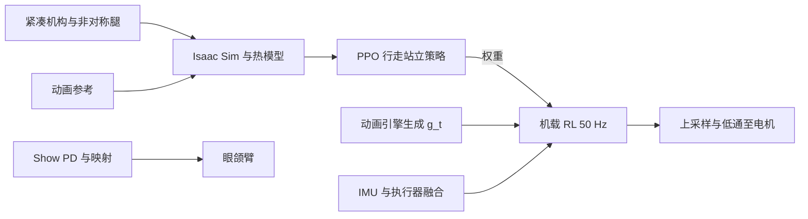

# Disney Olaf 角色机器人（实机动画角色）

**一句话定义：** 面向「高角色保真 + 紧凑机电包络」的娱乐型双足平台：用**动画参考 + RL** 解决非物理比例与风格化步态，用**机构设计**解决「看不见腿」与**热/声学**等实演约束。

## 为什么重要

- **目标函数不同：** 传统腿式机器人优先功能与能效；主题乐园/陪伴场景里**可信度与角色一致性**与机构隐藏性同等关键，会反过来约束机构与控制。
- **奖励设计可迁移：** 论文把**热安全**与**冲击噪声抑制**做成可与模仿项叠加的显式项，对其它穿 costume、小执行器扛大惯量的平台有参考价值。
- **分层控制范例：** 动力学敏感的主干用 RL，低惯量「表演自由度」用经典跟踪，是常见但写得较清楚的一例。

## 主要技术路线

1. **机构先行：** 在 costume 包络内定 DoF 与连杆布局（非对称腿、球面肩、泡沫裙），保证「看不见机构」与可动空间。
2. **动画 → 参考轨迹：** 艺术家步态与路径坐标系对齐，训练期随机化高层指令 $g_t$，部署期由动画引擎实时生成。
3. **仿真 RL（PPO）：** Isaac Sim 大规模并行，模仿项 + 正则 + CBF 风格约束（热、关节限位）+ 降噪项；行走与站立分策略。
4. **分层部署：** 50 Hz RL + 经典 show 控制；机载估计 + 上采样与低通；木偶接口驱动引擎切换。

## 核心结构 / 机制

### 机电：视觉欺骗与包络

- **非对称 6-DoF 双腿：** 左右腿非镜像布置（髋 roll / 膝朝向相反），在躯干内容纳工作空间并减轻自碰；两腿零件可复用以减零件数。
- **泡沫裙与雪球足：** 聚氨酯泡沫既藏腿又允许大恢复步时的形变，并缓冲跌落。
- **远端驱动：** 肩（球面五杆）、眼（四杆耦合 pitch/眼睑）、下颌（单电机 + 四杆耦合上下颌）等把电机放到躯干内有空间处。

### 控制：双策略 + 动画引擎

- **Walking / Standing 分立 RL 问题**，共享「路径坐标系 + 高层指令 $g_t$」接口；训练时对 $g_t$ 随机化，运行时由动画引擎根据木偶指令生成 $g_t$（策略切换、触发动画与音频等）。
- **Show functions**（臂、眼、眉、颌）与主干动力学解耦，用采样 + 多项式拟合把「动画功能空间」映射到执行器空间，PD 闭环；下颌加**测力矩拟合的前馈**补偿布料张力。

### 奖励与模型（与通用 locomotion RL 的接口）

- **模仿：** 躯干位姿/速度、颈与腿关节位置速度、足接触等与参考对齐（权重在颈/腿间区分以反映惯量差异）。
- **正则：** 力矩、关节加速度、动作变化率与二阶差分（抑制抖振）。
- **约束型项：** 颈部温度与关节限位用 **CBF 条件**转惩罚；足–足接触惩罚。
- **降噪：** 对垂向脚速的步间变化加**饱和二次惩罚**，减轻落地声同时避免仿真接触解算带来的过大奖励尖峰拖垮 critic。
- **热动力学：** $\dot T=-\alpha(T-T_\mathrm{ambient})+\beta\tau^2$（Joule 热主导），参数最小二乘拟合；观测与奖励中对温度 clip，$\gamma_T$ 取在零力矩下仍可行。

### 训练与部署要点

- **PPO**；critic 特权信息（无噪观测、摩擦、地形采样等），actor 观测加噪并施扰动力。
- **Isaac Sim**，8192 env / RTX 4090，约 100k 迭代量级。
- **50 Hz** 策略输出，一阶保持到 **600 Hz**，再 **37.5 Hz** 低通后送电机。

## 流程总览

## 常见误区或局限

- **「像动画」≠ 物理最优：** 风格化步态与heel-toe 等艺术选择会增大力与声学挑战，需要额外项而不是单靠模仿权重硬扛。
- **热与 costume 强耦合：** 温度模型与 clip 区间依赖实机数据与保守阈值，换角色外形或环境对流条件需重标定。
- **分层边界要维护：** show 自由度若与躯干动力学强耦合，「全 RL」与「全经典」的拆分不再成立；本文假设 show 惯量可忽略。

## 与其他页面的关系

- 奖励工程中模仿、正则与**安全/约束奖励**的配比，见 [Reward Design](../concepts/reward-design.md)。
- CBF 在奖励里作为「软约束惩罚」的写法，可与 [Control Barrier Function](../concepts/control-barrier-function.md) 的形式化定义对照。
- 任务语境见 [Locomotion](../tasks/locomotion.md)；动画参考跟踪属于 [Imitation Learning](./imitation-learning.md) 与 RL 结合的工程分支。

## 推荐继续阅读

- [Olaf 论文（arXiv 摘要）](https://arxiv.org/abs/2512.16705)
- [Olaf 论文 HTML 全文 v2](https://arxiv.org/html/2512.16705v2)
- [Peng et al., DeepMimic（arXiv）](https://arxiv.org/abs/1804.06401) — 物理角色技能 RL 模仿的经典参照
- [Ames et al., Control Barrier Functions: Theory and Applications（arXiv）](https://arxiv.org/abs/1903.11199) — CBF 理论与应用综述

## 参考来源

- [sources/papers/disney_olaf_character_robot.md](../../sources/papers/disney_olaf_character_robot.md)（本页知识编译自该 ingest 档案与 arXiv:2512.16705 多形态链接）
