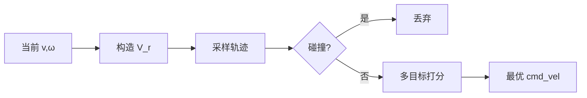

# DWA（Dynamic Window Approach）局部路径规划

## 一句话定义

**动态窗口法（DWA）** 在机器人当前速度可达的 **动态窗口** \(V_d\) 内采样线速度/角速度，前向仿真轨迹并用朝向、速度、间隙等目标打分，选出本周期最优 \((v,\omega)\)——课程第 4.3 节局部避障算法。

## 英文缩写速查

| 缩写 | 英文全称 | 简要说明 |
|------|----------|----------|
| DWA | Dynamic Window Approach | 速度空间采样局部规划 |
| DWB | DWB Controller（Nav2） | 插件化轨迹生成 + 批评器 |
| \(V_r,V_s,V_a\) | Reachable / admissible / dynamic sets | 速度可行域分层 |
| cmd_vel | Command Velocity | ROS 速度指令 |
| Footprint | Robot Footprint | 碰撞检测外形 |
| TEB | Timed Elastic Band | 优化式局部规划对照 |

## 为什么重要

- 全局 [A\*](./a-star.md) 只保证几何连通；DWA 把 **加速度限幅、碰撞预测、目标进度** 放进同一评分，才能安全跟线。
- 课程实践「A\* + DWA」是移动机器人导航的最小可运行栈；迁移到 [G1](../entities/unitree-g1.md) 时，难点常在 **把 `cmd_vel` 接到行走策略**，而非 DWA 公式本身。
- Nav2 的 DWB 把「轨迹生成器 / 批评器」插件化，便于换评分而不重写内核。

## 主要技术路线

| 路线 | 说明 | 工程入口 |
|------|------|----------|
| 经典 DWA | 均匀/网格采样速度 + 标量打分 | PythonRobotics、教材 |
| DWB（Nav2） | 生成器 + 多批评器加权 | [Navigation2](../entities/navigation2.md) |
| TEB / MPC 对照 | 优化轨迹 vs 采样 | 狭窄通道、高动态 |
| 人形桥接 | `cmd_vel` → 运控接口 | [G1 软件栈](../entities/unitree-g1-software-stack.md) |

## 核心原理

### 速度窗口构造

在差速模型下，候选速度需同时落在：

1. **机器人极限** \(V_s\)：\(v\in[0,v_{\max}],\ \omega\in[-\omega_{\max},\omega_{\max}]\)
2. **动力学可达** \(V_d\)：由当前 \((v_0,\omega_0)\) 与加速度在仿真时域 \(\Delta t\) 内可达的矩形/梯形窗口
3. **制动安全** \(V_a\)：若以最大减速度仍能在撞障前停住

动态窗口取交集：\(V_r = V_s \cap V_d \cap V_a\)。

### 轨迹仿真与打分

对 \(V_r\) 内采样点前向积分圆弧（常速假设），用 footprint 查 costmap：

\[
G(v,\omega)=\alpha\cdot\text{heading}+\beta\cdot\text{dist}+\gamma\cdot\text{velocity}
\]

| 项 | 含义 | 调大效果 |
|----|------|----------|
| heading | 轨迹末端朝向目标/路径的偏差 | 更「盯着」目标，可能贴障 |
| dist | 到最近障碍距离（间隙） | 更保守 |
| velocity | 偏好高速 | 更激进、易振荡 |

### 与全局层的接口

- 输入：全局路径（或局部路径段）、当前位姿、costmap。
- 输出：本周期速度；下一控制周期 **完全重规划**（反应式，无长时域承诺）。

## 工程实践

### 课程实验建议

1. 固定全局直线/折线，只调 DWA，观察绕障是否「贴墙切弯」。
2. 分别关掉 heading / dist 权重，记录失败模式（冲向障碍 vs 原地打转）。
3. 人形：先在差速仿真跑通，再把输出限幅后的 \((v_x,v_y,\omega)\) 映射到 G1 速度服务；确认控制频率（常 10–20 Hz）与行走策略期望一致。

### 调试指标

| 现象 | 优先检查 |
|------|----------|
| 狭窄通道卡死 | sim_time 过短、dist 权重过大、膨胀过大 |
| 左右振荡 | heading/路径偏差权重、采样过稀 |
| 撞障 | footprint 偏小、costmap 未更新、\(V_a\) 未启用 |
| 不跟全局路径 | 路径跟随批评器权重、局部目标选取距离 |

### 参数起点（差速教学）

| 参数 | 典型范围 |
|------|----------|
| `max_vel_x` | 0.3–0.8 m/s（教学偏慢） |
| `acc_lim_x` / `acc_lim_theta` | 与真机手册一致 |
| `sim_time` | 1.5–3.0 s |
| `vx_samples` × `vtheta_samples` | 10×20 量级起调 |

## 局限与风险

- **局部最优**：U 形陷阱需全局重规划或恢复行为（Nav2 recovery）。
- **模型假设**：常速圆弧对打滑/人形落足误差敏感。
- **误区**：「DWA 可替代建图」——没有全局层与静态地图，远程目标不可达。
- 高速非完整强约束场景优先评估 TEB/MPC。

## 关联页面

- [A\* 全局规划](./a-star.md)
- [动态障碍物滤波](../concepts/dynamic-obstacle-filtering.md)
- [PythonRobotics](../entities/python-robotics.md)
- [Navigation2](../entities/navigation2.md)
- [G1 软件服务栈](../entities/unitree-g1-software-stack.md)
- [人形系统课程策展](../entities/humanoid-system-curriculum.md)
- [导航规划方法对比：全局·局部·平滑](../comparisons/mobile-robot-navigation-planning-methods.md) — 本页是其局部避障层的选型落地

## 参考来源

- [深蓝学院人形系统课程大纲](../../sources/courses/shenlan_humanoid_system_theory_practice.md)
- [PythonRobotics 归档](../../sources/repos/python_robotics.md)
- [Navigation2 归档](../../sources/repos/navigation2.md)

## 推荐继续阅读

- Fox, Burgard, Thrun, *The Dynamic Window Approach to Collision Avoidance*, IEEE Robotics & Automation Magazine, 1997
- Nav2 DWB 插件文档：<https://docs.nav2.org/>
