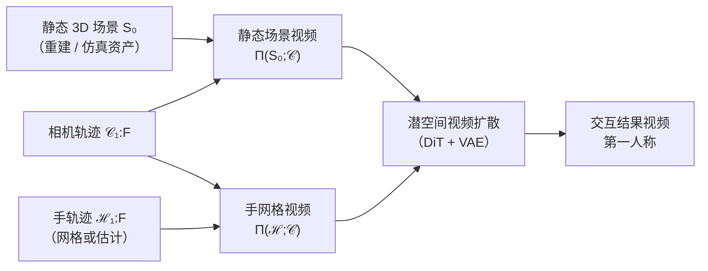

# DWM（Dexterous World Models，灵巧世界模型）

**DWM**（Kim 等，CVPR 2026）研究的是：当环境的**静态几何**已经可用（典型来自重建得到的数字孪生），如何用**视频扩散**去预测**灵巧手操作**会在第一人称视频里诱发哪些**物体与场景外观变化**，而不是让模型从零「画」整个场景。

## 一句话定义

**把「沿指定轨迹渲染的静态场景视频」和「同视角手网格视频」喂给视频扩散模型，让它在保留导航一致性的前提下，只补上手–物交互带来的视觉变化。**

## 为什么重要

- **动作接口对准操纵主因：** 许多视觉世界模型以**相机运动**或粗语义（文本）为条件；日常室内变化的主因往往是**双手接触与物体状态改变**，DWM 把手部几何与运动抬到与静态场景并列的条件里。
- **减轻场景幻觉与动力学纠缠：** 显式提供 \(\mathbf{S}_0\) 的渲染，让生成器专注 \(\Delta\) 动态，而不是同时承担「猜背景长什么样」与「猜物体怎么动」。
- **数据工程可落地：** 用 **TRUMANS** 在仿真里拿到**交互 / 静态 / 手**严格对齐的三元组，再用 **Taste-Rob** 固定机位真实视频 + **HaMeR** 手网格，绕开「真实世界动态第一人称严格配对」的高成本。

## 核心结构

| 模块 | 作用 |
|------|------|
| **条件：静态场景视频** | 沿第一人称相机轨迹 \(\mathcal{C}_{1:F}\) 渲染 \(\Pi(\mathbf{S}_0;\mathcal{C})\)，锁定**空间布局与相机运动**基线。 |
| **条件：手网格视频** | 沿同一 \(\mathcal{C}\) 渲染 \(\Pi(\mathcal{H}_{1:F};\mathcal{C})\)，提供**几何 + 时序**上的精细操纵线索。 |
| **潜空间视频扩散** | VAE 潜变量 + DiT 去噪；条件潜变量在通道维拼接后注入 \(\epsilon_\theta\)。 |
| **全掩码修复初始化** | 利用预训练视频修复模型在「全像素可见」时近似**恒等重建**的性质：先把静态场景视频当**无交互 rollout**，再在手条件下学**残差动力学**，稳定优化并解耦导航与操纵。 |
| **混合训练数据** | 合成：**TRUMANS** 对齐三元组；真实：**Taste-Rob** 首帧复制的伪静态视频 + HaMeR 手序列。 |

### 流程总览

## 主要技术路线

- **显式静态场景条件：** 不把场景几何交给扩散「从头想象」，而是用 \(\Pi(\mathbf{S}_0;\mathcal{C})\) 提供布局与外观锚点，动力学专注残差。
- **手网格作为动作载体：** 相对语言或稀疏关节角，手部网格序列同时编码接触几何与时序，适合细粒度操纵条件。
- **修复式恒等先验：** 以全掩码视频修复权重初始化，把无交互的静态渲染当基轨迹，再注入手驱动的 \(\Delta\) 视觉变化。
- **合成精确对齐 + 真实固定机位混合：** TRUMANS 提供同轨迹三元组；Taste-Rob + HaMeR 用固定相机近似配对，换真实材质与动力学多样性。

## 常见误区或局限

- **误区：DWM 是通用「文生世界」。** 论文强调已知 \(\mathbf{S}_0\) 与显式手条件；开放词汇语义更多通过**文本提示**提供辅助，而非单独依赖语言描述手形。
- **误区：固定机位真实段与合成段在分布上完全一致。** Taste-Rob 分支用**首帧复制**伪造静态视频，**没有真实相机运动**； gains 是真实材质与动力学，代价是与合成分支的**相机运动条件分布不一致**，需要靠模型与损失容忍这种混合。
- **局限：** 像素视频_rollout 仍缺乏力/触觉闭环；论文另述的「模拟若干候选动作再打分」属于**粗粒度视觉规划/评估**，不等同于毫秒级关节伺服。

## 关联页面

- [Generative World Models（生成式世界模型）](./generative-world-models.md)
- [Video-as-Simulation（视频即仿真）](../concepts/video-as-simulation.md)
- [Manipulation（操作任务）](../tasks/manipulation.md)
- [Loco-Manipulation（移动操作）](../tasks/loco-manipulation.md)
- [GENMO（人体运动估计与生成）](./genmo.md) — 与手/身体网格条件化生成相邻（DWM 侧重场景交互视频）。

## 推荐继续阅读

- Kim, B., et al. (2026). *Dexterous World Models* — [arXiv:2512.17907](https://arxiv.org/abs/2512.17907)（全文与实验细节）。
- TRUMANS 项目页：<https://jnnan.github.io/trumans/>（合成人类–场景交互数据来源）。
- Taste-Rob：<https://taste-rob.github.io/>（固定机位真实交互视频来源）。
- HaMeR：<https://geopavlakos.github.io/hamer/>（真实视频上手网格条件构造）。

## 参考来源

- [DWM 论文摘录（arXiv:2512.17907）](../../sources/papers/dwm_arxiv_2512_17907.md)
- [DWM 项目页（snuvclab.github.io）](../../sources/sites/snuvclab-dwm-github-io.md)
- [snuvclab/dwm 代码仓库](../../sources/repos/snuvclab_dwm.md)
