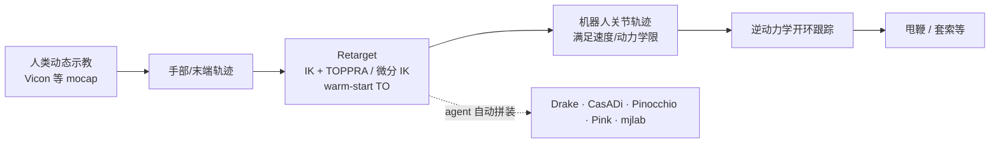

# 动捕手部轨迹的开环动态操作

**动捕手部轨迹 + 开环跟踪** 指：用 motion capture 记录人类 **高速动态操作** 的手部（或末端）轨迹，经 **带速度/动力学约束的 retarget** 生成机器人关节轨迹，再在真机上 **开环执行**——在跟踪精度足够时，**不必** 再跑模仿学习或 RL。Krishna Suresh & Chris Atkeson 2026 博客 [*The need for speed*](https://krishnasuresh.org/blog/2026/robot-whips/) 用 **甩鞭（cattleman's crack）** 与 **套索系 cleat** 给出直观证据。

## 一句话定义

**把「动态 manipulation」先降维成「跟准示教手轨迹」：动捕 → retarget（IK/TO 组合）→ 逆动力学开环跟踪；跟不准时再升级到 Flying Knots 式少量真机迭代，而不是默认上大规模 BC。**

## 英文缩写速查

| 缩写 | 英文全称 | 简要说明 |
|------|----------|----------|
| mocap | Motion Capture | 光学/惯性等运动捕捉 |
| IK | Inverse Kinematics | 末端/手轨迹→关节角 |
| TO | Trajectory Optimization | 动力学可行轨迹优化 |
| ILC | Iterative Learning Control | 任务级迭代学习修正跟踪误差 |
| ID | Inverse Dynamics | 逆动力学前馈/跟踪控制 |
| UMI | Universal Manipulation Interface | 常见便携遥操作/数据采集接口 |

## 为什么重要

- **对照准静态 demo 叙事：** 许多机器人展示可暂停续跑；**甩鞭、套索** 等任务本质 **非 quasi-static**，遥操作接口又难示教。
- **样本效率极端：** 博客强调 **零学习** 即可完成部分技能——与「动态任务必须大数据+策略学习」的默认假设形成张力。
- **与 Flying Knots 互补：** 同一作者组；开环够用时省事，不够时用 **≤10 trials** 任务级 ILC（见 [Flying Knots](../entities/paper-flying-knots.md)）。
- **工程自动化信号：** 作者称 retarget、标定、动力学与 ID 控制可由 **GPT-6 Astra** 类 agent 从社区栈（Drake、CasADi、Pinocchio、Pink、mjlab）拼装——_credit assignment_ 与可复现性仍是开放问题。

## 核心原理

### 与遥操作 / 学习管线的位置

| 路线 | 示教方式 | 动态任务友好度 | 本文博客读法 |
|------|----------|----------------|--------------|
| 遥操作 + BC/扩散 | 手套/主从 | 准静态为主 | 高速鞭/套索难示教 |
| 动捕 + 开环跟踪 | 人类真做任务 | 高（直接采动态） | **主路径** |
| 动捕 + ILC 修正 | 同上 | 高 | 跟踪误差大时的后备 |

### 流程总览

### Retarget 要点（博客归纳）

- **只关心路径、不关心手速** 时：多采样 IK 中间点 + **TOPPRA** 时间参数化，或 **微分 IK** 平滑跟路径。
- **高速 + 动力学** 时：纯 TO/RL 易局部最优或跟丢 demo → **用 IK 解 warm-start TO**。
- 示教轨迹（蓝）与机器人轨迹（黄）**不必逐点重合**，但需满足 **关节速度/动力学限**；有时跟踪不完美仍能 **响鞭**（鞭尖超音速 crack）。

## 主要技术路线

- **纯开环 mocap→retarget→ID（博客主路径）**：Vicon 手部轨迹 → IK/TOPPRA 或微分 IK + TO warm-start → 逆动力学开环执行；**零策略学习**。
- **agent 拼装管线**：单 prompt 自动写标定、模型与控制器（Drake / Pinocchio / Pink / mjlab 等）；适合原型，需人工安全审查。
- **跟踪不足 → Task-Level ILC**：[Flying Knots](../entities/paper-flying-knots.md) — 简化绳/任务模型 + 少量真机 trial 修正 Bézier 命令。

## 工程实践

| 项 | 建议 |
|----|------|
| **动捕** | 博客用 Vicon + 鞭柄 marker；鞭身 marker 偏可视化；xArm7 用绿胶带减 IR 反射 |
| **平台** | 示例：**OpenarmX**（甩鞭）、**xArm7**（套索） |
| **自动化** | 单 prompt agent 可写标定脚本、模型与 ID 控制器；生产环境仍须人工验安全与限位 |
| **跟踪不够** | 转 [Flying Knots](../entities/paper-flying-knots.md) 路线：简化模型 + 少量真机 trial |
| **开源** | 本篇 **无统一代码仓**；复现靠自搭栈或等作者发布 |

## 局限与风险

- **开环无闭环纠错：** 模型/标定/延迟误差会直接表现为任务失败或安全风险（高速鞭/套索）。
- **只跟手，不跟鞭/绳全状态：** 鞭/索柔性体动力学未显式建模；成功依赖 **手轨迹 + 物理运气** 的耦合。
- **agent 生成管线：** 难审计、难 cite 中间依赖；不适合直接当 safety-critical 默认流程。
- **泛化未证：** 博客展示少数技能与平台；换 embodiment 需重做 retarget 与限位验证。

## 关联页面

- [Manipulation 任务](../tasks/manipulation.md) · [Teleoperation](../tasks/teleoperation.md)
- [Flying Knots](../entities/paper-flying-knots.md) — 跟踪不足时的 task-level ILC
- [Motion Retargeting Pipeline](../concepts/motion-retargeting-pipeline.md)
- [URDF 与辨识](../queries/urdf-link-inertia-real-robot-check.md) — Atkeson 系动力学脉络

## 参考来源

- [Krishna Suresh · Robot Whips 博客归档](../../sources/blogs/krishnasuresh_robot_whips_2026-09-26.md)

## 推荐继续阅读

- [The need for speed（原文）](https://krishnasuresh.org/blog/2026/robot-whips/)
- [Flying Knots 项目页](https://flying-knots.github.io/)
- Mason & Lynch — *The Joy of Movement*（动态操作动机，文内引用）
