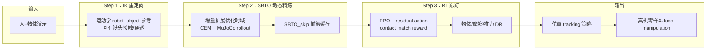

# DynaRetarget / SBTO（增量采样式动力学重定向）

**DynaRetarget**（Dhédin 等，arXiv:[2602.06827](https://arxiv.org/abs/2602.06827)，[项目页](https://atarilab.github.io/dynaretarget.io/)）是一条面向 **人形 loco-manipulation** 的完整重定向管线：先用 **IK** 得到运动学参考，再用 novel **SBTO**（Sampling-Based Trajectory Optimization）把 imperfect kinematic 轨迹精炼为 **动力学可行** 状态序列，最后以 **PPO + domain randomization** 学习 tracking policy 并 **零样本** 部署真机。核心算法 **SBTO** 开源于 [Atarilab/sbto](https://github.com/Atarilab/sbto)。

## 英文缩写速查

| 缩写 | 英文全称 | 简要说明 |
|------|----------|----------|
| SBTO | Sampling-Based Trajectory Optimization | 增量扩展优化时域的采样式轨迹优化（本文核心） |
| SBMPC | Sampling-Based Model Predictive Control | 短视距 receding-horizon 采样 MPC；SPIDER 等基线 |
| CEM | Cross-Entropy Method | SBTO 默认采样分布更新器 |
| FHTO | Fixed-Horizon Trajectory Optimization | SBTO 内环固定窗口子问题 |
| IK | Inverse Kinematics | 运动学前端，产出 imperfect 参考 |
| DR | Domain Randomization | RL 训练随机化以 sim2real |
| G1 | Unitree G1 Humanoid | 论文主实验平台 |

## 为什么重要

- **长时域 loco-manipulation 的 dynamic gap：** 纯 IK（PHC/GMR）与 kinematic-only 数据集（如 [OmniRetarget](../entities/paper-hrl-stack-03-omniretarget.md) 初版轨迹）常缺真实接触、脚滑与穿透；下游 RL 会把伪影当监督放大。
- **相对 SBMPC 的算法差异：** [SPIDER](./spider-physics-informed-dexterous-retargeting.md) 等用 **短 horizon MPC** 做 refinement，论文指出其 **短视、贪心不可回溯、轨迹抖动** 三问题；SBTO 通过 **incremental horizon + warm-start** 在保持采样优化框架的同时逼近 **full-horizon** 一致性。
- **可规模化 synthetic 数据：** 在 OmniRetarget **285** 条 G1–box motion 上 SBTO_skip 成功率 **76.8%** vs SPIDER **37.9%**；精炼轨迹使下游 RL 成功率 **97%** vs kinematic 参考 **79%**（Table V），并支持 **物体质量/尺寸/几何** 增广而无需新人类演示。

## 主要技术路线

| 阶段 | 输入 / 输出 | 作用 |
|------|-------------|------|
| **IK 重定向** | 人–物体演示 | 运动学可行 robot–object 参考（可来自 OmniRetarget 等） |
| **SBTO refinement** | kinematic 参考 + MuJoCo 模型 | CEM 采样 **PD 目标 knot**，partial rollout 最小化 tracking + 碰撞代价 |
| **增量时域** | knot 序列 $\boldsymbol{\tau}$ | 外环增加决策变量；内环 FHTO 至 $\sigma_{\min}$；**SBTO_skip** 缓存已收敛前缀 |
| **RL tracking** | SBTO 轨迹 + 仿真 contact | PPO（mjlab）+ object/body tracking + contact match + DR |
| **Sim2Real** | 训练策略 | 真机零样本 loco-manipulation（踢、搬、推、手递等） |

## 管线总览（Mermaid）

## SBTO vs SBMPC（相对 SPIDER）

| 维度 | SBMPC（SPIDER 等） | SBTO（DynaRetarget） |
|------|-------------------|----------------------|
| 优化视野 | 短 horizon，每步 receding | 增量增长至 **full horizon**；effective horizon 可达数秒 |
| 早期决策 | 执行后难回溯 | 长 effective horizon 内持续 refine 早期 knot |
| 轨迹形态 | 反馈控制易 **抖动** | 开环控制序列，smoothness 优于 SPIDER（Table III） |
| OmniRetarget 285 motions | **37.9%** success | **76.8%**（SBTO_skip） |

## 局限与阅读时注意点

- **计算：** 全 SBTO 约为 SPIDER 的 **3.3×** 仿真步；SBTO_skip 约 **0.96×** 且成功率更高，但绝对成本仍高（论文约 **20 s CPU / 1 s**  motion，112-core Xeon）。
- **参考质量下界：** 手–物体接触突变或物体朝向翻转时仍易失败。
- **开源范围：** [sbto](https://github.com/Atarilab/sbto) 发布 **SBTO 优化器**；IK 前端与 RL/mjlab 训练以论文描述为准，需自行对接 OmniRetarget 等上游。
- **RL 训练栈：** 论文使用 **mjlab**（GPU MuJoCo）；与 holosoma/Isaac 栈的复现需自行对齐观测与 reward。

## 关联页面

- [Motion Retargeting（动作重定向）](../concepts/motion-retargeting.md) — 「运动学 vs 动力学」分层。
- [Motion Retargeting Pipeline（动作重定向流水线）](../concepts/motion-retargeting-pipeline.md) — 本方法占据「IK → 物理修补」段的 **增量 SBTO** 落点。
- [SPIDER（物理感知采样式灵巧重定向）](./spider-physics-informed-dexterous-retargeting.md) — 同族采样物理 refinement，**SBMPC** 对照基线。
- [OmniRetarget](../entities/paper-hrl-stack-03-omniretarget.md) — 默认 kinematic 参考数据源与对比 baseline。
- [Loco-Manipulation（移动操作）](../tasks/loco-manipulation.md) — 任务域。

## 推荐继续阅读

- arXiv：<https://arxiv.org/abs/2602.06827>
- 项目页：<https://atarilab.github.io/dynaretarget.io/>
- SBTO 代码：<https://github.com/Atarilab/sbto>
- OmniRetarget 数据：<https://huggingface.co/datasets/omniretarget/OmniRetarget_Dataset>

## 参考来源

- [dynaretarget_arxiv_2602_06827.md](../../sources/papers/dynaretarget_arxiv_2602_06827.md) — 论文全文消化（主归档）
- [dynaretarget-github-io.md](../../sources/sites/dynaretarget-github-io.md) — 项目页
- [sbto.md](../../sources/repos/sbto.md) — SBTO 官方实现
