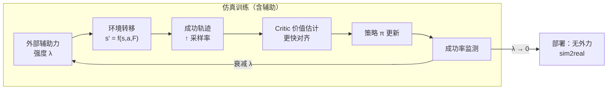

# EFGCL（External Force-Guided Curriculum Learning）

**EFGCL** 是一种面向腿足机器人**高动态全身动作**的 **guided RL / 物理引导探索** 训练范式：在仿真里对机器人施加**外部辅助力**，使其在课程早期就能反复完成目标动作；再按**成功率自适应衰减**辅助强度直至为零，使策略在**无参考轨迹、弱奖励塑形**的条件下仍能学会并**迁移到实机**。

## 一句话定义

用**可撤除的训练期外力**代替复杂的任务专用奖励或示范轨迹，让价值函数先「看见」成功动力学，再把同一套稀疏奖励下的策略收束到**自主执行**。

## 为什么重要

- **稀疏奖励 + 高动态** 的组合常使探索在物理上「够不到」成功集，Critic 长期得不到正信号；外力把成功流形**临时拉进可达集**，与 HER、势函数 shaping 等**在状态转移层面**做文章的方式不同。
- 与地形难度、子目标间距等**离散课程**互补：这里是**连续可调**的**物理辅助强度**课程，直接作用于接触/质心动力学。
- 论文在四足 **KLEIYN** 上演示 Jump、Backflip、Lateral-Flip 的 **sim2real**，说明辅助仅留在训练仿真、不污染部署观测的前提下仍可迁移。

## 主要技术路线

1. **训练期外力注入**：在仿真动力学中对机体施加辅助外力/力矩，临时扩大「成功动力学」在状态–动作空间中的可达性，提高成功 rollout 频率。
2. **成功率驱动的课程衰减**：随策略表现提升单调降低辅助强度直至完全关闭，使优化目标逐步对齐无辅助部署 MDP。
3. **Actor–Critic 协同**：借助早期成功样本稳定 **优势估计 / 价值 bootstrap**，缓解稀疏奖励下 Critic 冷启动（论文给出与基线的迭代收敛对比口径）。
4. **Sim2Real**：在仅仿真训练、部署无辅助的前提下，将策略迁移到四足实机并复现目标动态技能（以原文实验与系统辨识为准）。

## 核心机制

### 1. 辅助力（Assistive Force）

- 训练初期施加**较强**的外部力（页面叙事类比体操 **spotting**），帮助机体完成目标动态动作。
- 目的：提高**成功轨迹**的采样频率，使 **Critic** 尽快对「高回报状态」形成可用估计，从而稳定 Actor–Critic 整体优化。

### 2. 课程衰减（Curriculum Decay）

- 辅助强度**不是**手工固定全程，而是随智能体**成功率提升**自动**减小**，避免策略对外力过拟合。
- 末期辅助**完全关闭**，MDP 回到无外力形式，策略需在真实动力学下复现行为（与部署一致）。

### 3. 与奖励设计的关系

- 主张仍可使用**简单、稀疏**的任务奖励；复杂 shaping 与参考轨迹依赖可减弱（以论文实验设定为准）。
- 工程上需明确：外力**改变训练时的转移核**；分析样本效率、安全性约束时，应把「带辅助阶段」与「无辅助阶段」分开记录。

## 流程总览

## 与其它路线的关系

- **vs 模仿学习 / 参考轨迹 RL**：不依赖示范轨迹或判别器先验；辅助是**物理层**干预。
- **vs 纯课程式地形 / 目标**：EFGCL 的「课程变量」主要是**连续辅助力幅度**，可与地形课程、PGCL 式子目标课程**叠加**使用。
- **与 ZEST 的「虚拟辅助扳手」**：同属**辅助力 + 衰减**家族，但 EFGCL 来自学术 RA-L 设定，强调**体操 spotting 隐喻**与四足实机实验；见 [ZEST](./zest.md)。

## 关联页面

- [Curriculum Learning（课程学习）](../concepts/curriculum-learning.md) — 将外力幅度视为连续课程变量
- [Reinforcement Learning](./reinforcement-learning.md) — Actor–Critic 与探索效率
- [Sim2Real](../concepts/sim2real.md) — 训练修改与部署环境一致性问题
- [Locomotion](../tasks/locomotion.md) — 腿足高动态技能任务语境
- [ZEST](./zest.md) — 工业界同类「辅助力 + 课程」范式对照
- [Reward Design](../concepts/reward-design.md) — 稀疏奖励与塑形取舍

## 推荐继续阅读

- 项目页（视频、图表与 BibTeX）：<https://keitayoneda.github.io/kleiyn-efgcl/>
- IEEE RA-L 正式条目（DOI）：<https://doi.org/10.1109/LRA.2026.3675955>

## 参考来源

- [EFGCL（KLEIYN 项目页 / RA-L 2026）](../../sources/sites/kleiyn-efgcl.md)
