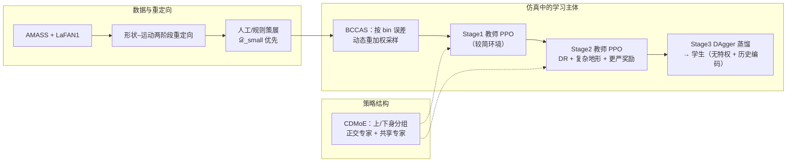

# EGM（Efficient General Mimic，高效通用模仿跟踪）

**EGM**（Yang 等，arXiv:2512.19043）研究 **单一神经网络策略** 在仿真中对 **多段人体参考运动** 做 **全身动态跟踪**：重点解决 **大规模 MoCap 冗余/不平衡导致的训练低效**，以及 **高动态动作上精度与稳定性不足**。方法名 **Efficient General Mimic** 概括其目标：**数据效率 + 跨动作泛化 + 高动态跟踪**。

## 一句话定义

**「Bin 级误差驱动的跨动作采样课程 + 上下身分组 CDMoE + 两阶段特权教师 PPO + DAgger 历史编码学生」**，在 **约 4 小时级** 精选重定向数据上得到可推广到 **数十小时级** 测试运动的跟踪策略。

## 为什么重要？

- **与「堆更多小时 MoCap」路线对照**：论文通过 **小高质量集优于大规则筛集** 的实验，支持「**通用 tracking 更吃质量与多样性**」这一判断，对 **数据策展与采样** 的优先级有直接启示。
- **工程上可拆的四个旋钮**：**采样粒度（bin）**、**专家结构（上下身 + 共享/正交）**、**课程式采样分布**、**仿真课程（地形/DR/奖励收紧）**，便于与 [BeyondMimic](./beyondmimic.md) 等 **失败率驱动采样** 路线对照。
- **平台语境清晰**：**Unitree G1、23 DoF 跟踪 + PD 扭矩**，与当前开源人形 **RL tracking** 生态一致，便于和 [DeepMimic](./deepmimic.md)、规模化 tracking 叙述（如 [SONIC](./sonic-motion-tracking.md)）放在同一知识地图里。

## 主要技术路线

| 模块 | 做法（与论文对齐的抽象） |
|------|-------------------------|
| **BCCAS** | 1 s **motion bin** 全局 ID；按 **复合跟踪误差 EMA** 分配采样权重；加 **均匀混合 + 幂次温度** 做 **探索→利用** 调度；采样起点后 **随机 0–5 s 偏移** 再取 ≤20 s 片段，缓解整 clip 采样下的 **长短与片段内异质性** 问题。 |
| **CDMoE** | **上半身 / 下半身** 各一组专家；**正交化专家 + top‑k 门控** 抽 **动作专用特征**，**共享专家** 显式承载 **跨动作共性**（如平衡）；统一头输出 **目标关节角**。 |
| **数据** | AMASS + LaFAN1，**形状–运动两阶段重定向**；剔除不可行/失败轨迹；强调 **𝒟_small（4.08 h）** 相对 **𝒟_large（27.47 h）** 的优越性来自 **冗余与低质样本对注意力的稀释**。 |
| **训练** | **教师**：Stage1 **PPO** 基础跟踪 → Stage2 **域随机化 + 崎岖地形 + 更严奖励**；**学生**：[DAgger](./dagger.md) 蒸馏，**历史堆叠编码** 补偿去掉 **特权观测** 的损失（与 OmniH2O / ExBody2 等叙述同族）。 |

## 流程总览（Mermaid）

## 常见误区或局限

- **不要把「4.08 h」误解为「任意 4h 都行」**：对应的是 **高多样性 + 低冗余的人工筛选子集**，与 **27h 规则筛集** 的对照才支持论文结论。
- **CDMoE 不是通用「加 MoE 就强」**：关键在 **上下身分流** 与 **共享通道显式保留共性特征**，缺一侧时容易只剩「专家打架」或 **过专化失稳**。
- **学生侧仍依赖仿真里教师的可蒸馏性**：域随机与地形课程在教师阶段完成，**实机 gap** 需结合项目自述与后续工作判断，本文以 **仿真跟踪指标** 为主。

## 与其他页面的关系

- 与 [BeyondMimic](./beyondmimic.md)、[DeepMimic](./deepmimic.md) 同属 **参考轨迹 + RL** 的 **tracking** 家族；EGM 更强调 **跨 clip 的 bin 级采样与 MoE 结构** 对 **数据不平衡** 与 **高动态** 的针对性。
- **特权–非特权** 叙述见 [Privileged Training](../concepts/privileged-training.md)；蒸馏算法见 [DAgger](./dagger.md)。
- 数据来源与版权边界见 [AMASS](../entities/amass.md) 与 LaFAN1 仓库索引（`sources/repos/ubisoft-laforge-animation-dataset.md`）。

## 关联页面

- [BeyondMimic](./beyondmimic.md) — Isaac Lab 上高精度模仿与失败驱动采样的代表框架
- [DeepMimic](./deepmimic.md) — 显式跟踪奖励与 RSI 等基线概念
- [DAgger](./dagger.md) — 学生阶段使用的在线模仿聚合
- [Unitree G1](../entities/unitree-g1.md) — 论文使用的硬件平台语境
- [AMASS](../entities/amass.md) — MoCap 元数据集入口
- [Curriculum Learning](../concepts/curriculum-learning.md) — 采样与仿真两层面的课程化

## 参考来源

- [sources/papers/egm_arxiv_2512_19043.md](../../sources/papers/egm_arxiv_2512_19043.md)
- [sources/blogs/egm_themoonlight_literature_review_2512_19043.md](../../sources/blogs/egm_themoonlight_literature_review_2512_19043.md)

## 推荐继续阅读

- [EGM 论文（arXiv:2512.19043）](https://arxiv.org/abs/2512.19043)
- [EGM HTML 实验版（arXiv HTML）](https://arxiv.org/html/2512.19043v1)
- [Moonlight 社区导读（英文）](https://www.themoonlight.io/en/review/egm-efficiently-learning-general-motion-tracking-policy-for-high-dynamic-humanoid-whole-body-control)
