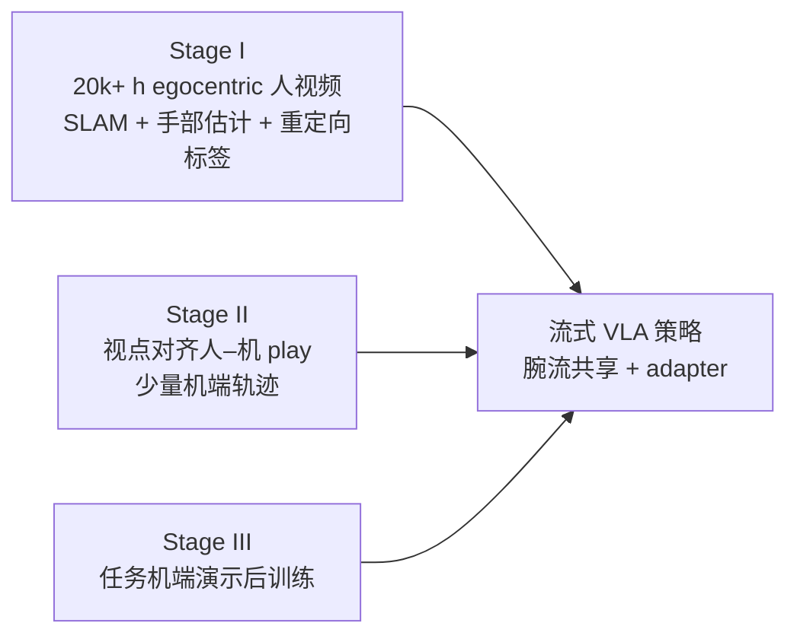

# EgoScale

**EgoScale**（NVIDIA GEAR 等，arXiv:2602.16710）研究的是：能否把 **互联网尺度的第一人称人操作视频** 当成 **灵巧机械臂–手策略** 的主监督来源，并在数据继续变大时 **可预测地** 提升真机表现。

## 一句话定义

用 **海量 egocentric 人视频上的显式腕–手动作预测** 预训练 **流匹配式 VLA**，再用 **小规模、视点与场景严格对齐的人–机 play 数据** 做 mid-training，把表示落到可执行机器人接口上，最后用常规 **任务演示后训练** 完成部署。

## 为什么重要

- **把「人视频小时」接到可复核指标上：** 论文在约 **1k–20k 小时** 扫描上给出 **验证损失随数据规模近似 log-linear 下降**，并展示其与 **后训练后真机平均完成度** 同向改善，便于把数据采集预算和实验设计对齐到同一标尺。
- **分离「规模」与「对齐」：** 大规模野外人数据提供 **行为长尾与语义覆盖**；对齐阶段用 **机位匹配的头 + 双腕相机** 与少量机端轨迹解决 **感知与控制域 gap**，避免把一切都押在昂贵的大规模配对演示上。
- **与低 DoF 迁移叙事相容：** 预训练监督定义在 **高 DoF 重定向手空间**，论文仍报告向 **更少手指自由度** 平台迁移的增益，支持把 rich human motion 当作 **可复用的 motor prior** 来读（具体数值以论文图表为准）。

## 主要技术路线

### 人侧动作接口

- **臂：** 用 **相对腕位姿** \(\Delta\mathbf{W}\)（chunk 内相对首帧），弱化全局 SLAM 漂移，并与机器人相对末端控制对齐。
- **手：** 从估计的 **21 手部关键点** 做 **优化式重定向** 到默认 **22-DoF Sharpa** 关节目标，使预训练直接优化 **操纵相关的手指结构**。

### 数据两阶段

1. **Stage I（人预训练，大规模、噪声容忍）：** 论文叙述合计约 **20,854 h** egocentric；其中包含大量 **野外** 场景，并混入约 **829 h EgoDex**（Vision Pro 等更精确腕/手信号）作 **锚定**。
2. **Stage II（对齐 mid-training，小规模、强对应）：** 桌面 **344** 任务，约 **50 h** 人 + **4 h** 机；人与机 **共享相机布置**（ego + 双腕），人用 **Vive + Manus** 与视频流同步，强调 **可比视觉观测**。

### 模型与训练三阶段（与 GR00T N1 同族叙述）

- **架构：** **VLM 编码语言–图像** → **共享 DiT 动作专家** + **flow matching** 生成动作块；人数据无本体时用 **可学习占位 token** 代替 proprio；跨硬件用 **轻量 embodiment adapter** 处理输入本体与输出手指维度。
- **优化日程（论文 §2.4 量级）：** Stage I **全模型** 长步数吸收人数据；Stage II **多冻结 VLM 骨干**，主要更新 **视觉编码器 + 动作专家** 以锚到机器人；Stage III **任务后训练** 细调，是否冻结视觉取决于是否经过 mid-training 等设定。

## 流程总览

## 常见误区或局限

- **误区：「只靠 YouTube 级人视频就能零样本上机」。** 论文明确需要 **对齐 mid-training** 与 **任务后训练**；人数据主要提供 **可扩展的先验**，不是单独闭环。
- **局限：标签来自估计栈。** Stage I 依赖 **SLAM / 手部估计**，噪声存在；论文论点是大规模 **统计上** 仍改善表示，但 **域外失败模式** 仍需用机端评测与数据清洗约束。
- **局限：公开复现材料。** 截至项目页文案，**GitHub 仍为 Coming Soon**，工程复现应以后续官方发布为准。

## 与其他页面的关系

- 与 [VLA](./vla.md)：属于 **同一 VLA 家族接口**（图像 + 语言 → 动作），但强调 **人侧小时数** 与 **腕–手显式监督** 的预训练位置，以及 **mid-training** 在跨本体中的角色。
- 与 [mimic-video](./mimic-video.md)：mimic-video 把瓶颈叙事放在 **视频骨干潜质量**；EgoScale 把瓶颈叙事放在 **人操纵轨迹规模 + 对齐阶段**，二者可对照阅读而非互斥。
- 与 [HumanNet](../entities/humannet.md)：HumanNet 侧重建 **互联网级人中心语料与标注管线**；EgoScale 给出 **两万小时量级 egocentric + 动作标签** 上 **VLA 预训练缩放** 的实证数据点。
- 与 [具身规模法则](../concepts/embodied-scaling-laws.md)：可把本文的 **log-linear 验证损失–数据规模** 与 **下游完成度** 的联动，当作 **人侧监督缩放** 的一个具体案例研究。
- 与 [Motion Retargeting](../concepts/motion-retargeting.md)：重定向是 **人手关键点 → 机器人手关节** 的硬接口；误差形态会进入 **预训练标签噪声** 讨论。

## 推荐继续阅读

- 论文 HTML（方法与实验锚点）：<https://arxiv.org/html/2602.16710v1>
- 官方项目页（演示、作者、BibTeX）：<https://research.nvidia.com/labs/gear/egoscale/>
- GR00T N1 公开材料（同族 flow-VLA 叙述入口，便于对照架构选择）：<https://github.com/NVIDIA/Isaac-GR00T>（以官方 README 为准）

## 参考来源

- [EgoScale 论文摘录（arXiv:2602.16710）](../../sources/papers/egoscale_arxiv_2602_16710.md)
- [NVIDIA Research EgoScale 项目页](../../sources/sites/nvidia-research-egoscale.md)

## 关联页面

- [VLA（Vision-Language-Action）](./vla.md)
- [Imitation Learning](./imitation-learning.md)
- [mimic-video（VAM）](./mimic-video.md)
- [Manipulation（操作任务）](../tasks/manipulation.md)
- [HumanNet](../entities/humannet.md)
- [Motion Retargeting](../concepts/motion-retargeting.md)
- [Embodied Scaling Laws](../concepts/embodied-scaling-laws.md)
