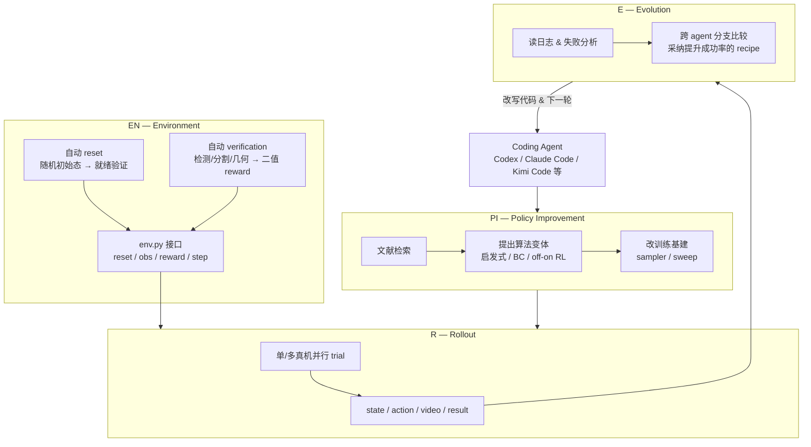

# ENPIRE

**ENPIRE**（NVIDIA [GEAR Lab](../entities/nvidia-gear-lab.md) 等，2026）研究的是：能否把 **真机机器人策略开发** 从「人类盯实验 + 手工改代码」变成 **coding agent 可重复管理的物理反馈优化**——像数字 AutoResearch 一样，在 **reset → rollout → verify → refine** 环上自动搜训练配方与算法变体。

## 一句话定义

面向 frontier **coding agent** 的 **真机策略自改进束具（harness）**：用 **Environment / Policy Improvement / Rollout / Evolution** 四模块把场景复位、策略试验、结果验证与代码演化闭合成 agent 可驱动的优化过程，从而最小化人机环路并支持公平 ablation。

## 英文缩写速查

| 缩写 | 英文全称 | 简要说明 |
|------|----------|----------|
| ENPIRE | Environment–Policy Improvement–Rollout–Evolution | 四模块真机 autoresearch 束具缩写 |
| BC | Behavior Cloning | 从演示或日志监督学习策略 |
| RL | Reinforcement Learning | 通过与环境交互最大化长期回报来学习策略 |
| MRU | Mean Robot Utilization | 多 agent 物理 autoresearch 中机器人时间利用率 |
| MTU | Mean Token Utilization | 多 agent 协作时 LLM token 吞吐利用率 |
| PI | Policy Improvement | ENPIRE 中启动/切换策略精炼范式的模块 |
| IL | Imitation Learning | 示教驱动路线，BC 等常见于操作 |
| Manipulation | Robot Manipulation | 抓取、移动、操作物体的任务总称 |

## 为什么重要

- **补齐物理世界的 AutoResearch 抽象：** 数字环境里 agent 已能自动搜算法；机器人侧瓶颈是缺 **可重复、可验证、可复位** 的真机闭环，而非单个 SOTA 网络结构。
- **把「环境工程」前置为一等公民：** 没有 **自动 reset + 自动 verification**，agent 无法高密度 trial；ENPIRE 强调任务必须先变成 **agent-operable environment**（`env.py` 式接口）。
- **多 PI 范式统一评测：** 同一 harness 下可比较 **启发式、BC、offline/online RL、code-as-policy** 等路线，并以 **真机成功率** 而非纯仿真曲线做选择。
- **机队 scaling 的可测性：** 提出 **MRU/MTU** 与 **AutoEnvBench**，把「更多机器人 / 更多 agent」的收益与 **token 成本、硬件空转** 放在同一坐标系里读。

## 流程总览

## 主要技术路线

### 四模块职责

| 模块 | 职责 | 对 agent 的接口形态 |
|------|------|---------------------|
| **EN** | 把硬件任务封装成 **自复位、自评分** 环境 | Tool APIs + `env.py`（reset / get_observation / get_reward / step） |
| **PI** | 生成并精炼策略代码与训练配方 | 切换 BC、RL、启发式等；读论文；调 infra |
| **R** | 在预算内跑真机 rollout | 并行多机；强制留存视频与 trace |
| **E** | 跨试验分支演化 | 分析日志、合并有效改动、剪枝失败假设 |

### 自动评测与自动 reset（环境侧硬前提）

- **Auto Evaluation：** 例：扎带插入任务用 **目标检测 + 分割**（页面代码示例含 SAM3 等）在多相机独立判定 strap 是否穿过 head，再融合为 **二值 reward**——避免人类判成功/失败。
- **Auto Reset：** Push-T、插针、GPU 插拔、扎带等任务需 **随机初始态采样 + 复位行为 + 复位成功确认**；否则 agent 无法无人值守地连续 trial。

### 策略改进范式（PI regimes）

公开材料展示 agent 可在同一任务上切换并组合：

- **启发式 / code-as-policy**（如 Push-T 先写无神经网络启发式策略）
- **Behavior Cloning**（含正则、loss 权重等 ablation）
- **Offline / Online RL**（页面时间线示例：online RL mix demo、batch size、controller 补偿等逐步 +pp）

### 主结果与基准（公开页面量级）

- **任务：** Push-T、Pin Insertion、GPU Insertion、Tie Ziptie、Cut Ziptie 等 **高灵巧桌面操作**。
- **成功率：** 展示策略达 **约 99% pass@8**（8 次独立 rollout 中至少一次成功的通过率表述，以项目页为准）。
- **AutoEnvBench：** 比较 **Codex（GPT-5.5）**、**Claude Code（Opus 4.7）**、**Kimi Code（K2.6）** 在 Push-T（启发式学习）与 Pin Insertion（梯度学习）上的 **墙钟研究进展曲线**。
- **Fleet scaling：** **1 / 4 / 8 agent** 团队；更大并行可更快抬高成功率，但 **token-to-success 与协调开销** 上升。

### 仿真侧补充（RoboCasa）

在 **RoboCasa** 厨房操作任务（如 Coffee Setup Mug、开柜/开抽屉等）上补充评测，用于在 **受控 reset** 下做更密 ablation，并与真机吞吐瓶颈分离讨论。

## 常见误区或局限

- **误区：「有 coding agent 就能跳过环境工程」。** ENPIRE 的核心贡献之一是 **reset/verify 接口**；没有可自动判分与复位的任务，agent 只能低频人工试验。
- **误区：「成功率数字可脱离 harness 泛化」。** 报告的高成功率建立在 **特定自动评测器、复位策略与 trial 预算** 上；换传感器布局或安全约束需重新标定 verification。
- **局限：资源利用率权衡（页面自述）：** agent 读日志、写代码、等 LLM 时 **机器人 MRU 下降**；机队变大后 **GPU 利用率升、token 消耗增**，需把 **物理 scaling** 与 **token scaling** 分开优化。
- **局限：公开复现材料：** 截至入库日 **无 arXiv 正式条目、无公开代码仓**；工程细节应以后续官方发布为准。

## 与其他页面的关系

- 与 [Manipulation](../tasks/manipulation.md)：ENPIRE 是 **灵巧操作** 方向上「**agent 驱动 recipe 搜索 + 真机闭环**」的系统样本，可与 IL/RL/VLA 数据路线并列阅读。
- 与 [Imitation Learning](./imitation-learning.md) / [Behavior Cloning](./behavior-cloning.md)：BC 是 ENPIRE 支持的 **PI regime 之一**，页面展示 BC 正则等 ablation 对成功率的具体 +pp 贡献。
- 与 [Reinforcement Learning](./reinforcement-learning.md)：online/offline RL 同样在 harness 内与启发式、BC **公平对比**，选型由真机反馈驱动。
- 与 [仿真评测基础设施](../concepts/simulation-evaluation-infrastructure.md)：RoboCasa 评测用于 **密集 agent 行为 ablation**；真机环仍是 **最终判据**，二者分工而非互替。
- 与 [具身规模法则](../concepts/embodied-scaling-laws.md)：MRU/MTU 与多机队曲线可视为 **物理 autoresearch 的 scaling 维度**，与数据/模型缩放律互补。
- 与 [EgoScale](./egoscale.md)：同属 NVIDIA GEAR **灵巧操作** 叙事，但 EgoScale 强调 **人视频规模预训练 VLA**；ENPIRE 强调 **agent 编排的真机策略搜索闭环**。
- 与 [GR00T-WholeBodyControl](../entities/gr00t-wholebodycontrol.md)：GEAR 生态内 **低层 WBC / SONIC** 与 ENPIRE 的 **桌面灵巧 autoresearch** 面向不同层级，可对照「能力栈 vs 研究自动化栈」。

## 推荐继续阅读

- [真机策略 autoresearch 闭环搭建指南](../queries/real-robot-policy-autoresearch-harness.md) — 把 EN–PI–R–E 落到环境前提、范式选型与机队 scaling 的实操页
- ENPIRE 官方项目页：<https://research.nvidia.com/labs/gear/enpire/>
- RoboCasa 论文（仿真日常操作基准）：<https://arxiv.org/abs/2406.02545>
- Karpathy LLM Wiki 模式（本库维护哲学）：[llm-wiki-karpathy](../references/llm-wiki-karpathy.md)

## 参考来源

- [sources/papers/enpire_nvidia_gear_2026.md](../../sources/papers/enpire_nvidia_gear_2026.md)
- [sources/sites/nvidia-research-enpire.md](../../sources/sites/nvidia-research-enpire.md)
- NVIDIA GEAR, *ENPIRE: Agentic Robot Policy Self-Improvement in the Real World*, 项目页, 2026. <https://research.nvidia.com/labs/gear/enpire/>
