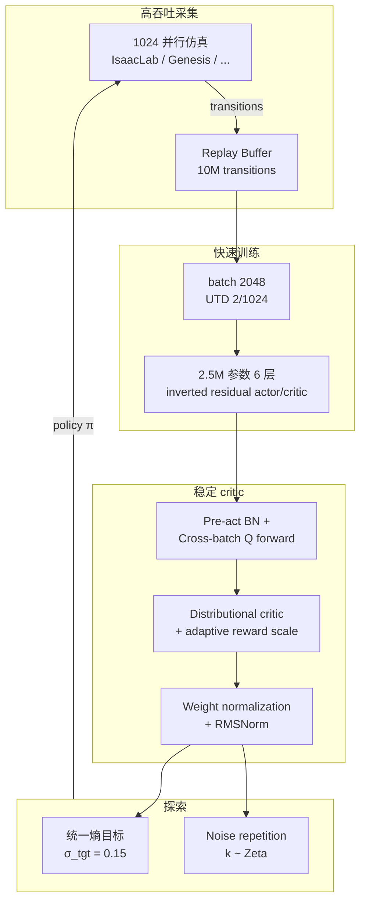

# FlashSAC

**FlashSAC**（arXiv:[2604.04539](https://arxiv.org/abs/2604.04539)，[项目页](https://holiday-robot.github.io/FlashSAC/)，[GitHub](https://github.com/Holiday-Robot/FlashSAC)）是在 [SAC](./sac.md) 最大熵 off-policy 框架上，面向 **高维机器人控制** 重新设计的算法：用 **监督学习式 scaling**（更少梯度步、更大网络、更高数据吞吐）换墙钟，并用 **权重/特征/梯度范数约束** 抑制 bootstrap critic 误差累积；在 **60+ 任务 / 10 个仿真器** 上稳定超越 [PPO](./ppo.md) 与强 off-policy 基线，**Unitree G1** 盲行走 sim-to-real 训练可从 **小时级降到约 20 分钟**（平地）。

## 一句话定义

> **把 off-policy 当默认 sim-to-real 选项**：少做 critic 梯度更新、多做并行采集与大网络，再用范数约束把 bootstrap 稳住——高维任务上比 PPO 更省墙钟，比经典 SAC 更稳更快。

## 英文缩写速查

| 缩写 | 英文全称 | 简要说明 |
|------|----------|----------|
| FlashSAC | Fast and Stable Soft Actor-Critic | 本文提出的快速稳定 off-policy 机器人 RL 算法 |
| SAC | Soft Actor-Critic | FlashSAC 的算法基底与最大熵目标 |
| PPO | Proximal Policy Optimization | 高并行仿真下常用的 on-policy 对照基线 |
| UTD | Update-to-Data ratio | 每次环境步对应的梯度更新次数比 |
| BN | Batch Normalization | 预激活批归一化，平滑大批次 critic 训练 |
| RMSNorm | Root Mean Square Layer Normalization | 约束 per-sample 特征范数的归一化层 |
| DoF | Degrees of Freedom | 状态–动作维度；高 DoF 任务收益最大 |
| Sim2Real | Simulation to Real | 仿真策略迁移真机；本文 G1 行走/楼梯为代表 |
| CENet | Context Estimator Network | sim-to-real 中隐式系统辨识的历史编码模块 |
| G1 | Unitree G1 Humanoid | 论文与项目页真机验证平台（29 DoF） |

## 为什么重要

- **奖项：** RSS 2026 **最佳论文奖**（Holiday Robotics / KAIST 等）；本库节点已存在，本次由量子位报道交叉回链。
- **挑战 PPO 默认地位：** 人形、灵巧手、视觉控制进入 **高维状态–动作空间** 后，on-policy 窄分布数据难以支撑准确策略评估；FlashSAC 用 replay 覆盖更广分布，在最难任务上 **渐近回报与墙钟** 同时领先 PPO。
- **补齐 FastSAC 短板：** [FastSAC / FastTD3](../entities/paper-notebook-learning-sim-to-real-humanoid-locomotion-in-15-m.md) 用 ~0.2M 小网络换墙钟，渐近性能受限；FlashSAC 用 **2.5M 参数** 与稳定性机制，在 scaling 下兼顾 **速度 + 上限**。
- **sim-to-real 可部署：** 论文在 **G1 盲行走** 上与 PPO 共享同一 sim-to-real 管线（CENet、非对称 actor-critic、域随机 + 地形课程），仅换算法即获 **约 10×** 墙钟增益，且真机行为稳定。
- **系统栈友好：** [UniLab](../entities/unilab.md) 等异构 **CPU 仿真 + GPU learner** runtime 已将 FlashSAC 列为支持算法，replay 路径可与采集–学习重叠。

## 流程总览

## 主要技术路线

FlashSAC 仍优化 SAC 的 **最大熵** off-policy 目标，但针对机器人 bootstrap critic 的三类痛点做 **统一配方**：

### 1. 快速训练（少更新 + scaling）

| 设计 | 典型值 | 直觉 |
|------|--------|------|
| 并行环境 | 1024 | 墙钟数据采集 |
| Replay | 10M | 长尾经验、稳定大批训练 |
| 网络 | 2.5M 参数、6 层 | 提升高 DoF 渐近性能 |
| Batch / UTD | 2048 / 2:1024 | **极少** critic 更新步，靠吞吐与容量补偿 |
| 实现 | JIT + 混合精度 | 降低 per-step 开销 |

### 2. 稳定训练（范数约束）

- **Inverted residual + pre-activation BN + RMSNorm：** 约束激活与特征尺度，使大批次 bootstrap 目标更平滑。
- **Cross-batch value prediction：** $(s,a)$ 与 $(s',a')$ **同一次 forward**，预测 Q 与 target Q 共享 BN 统计，减少 train–eval 分布偏移。
- **Distributional critic：** Q 在固定 support 上分类训练；奖励按回报方差自适应缩放，避免 support 溢出。
- **Weight normalization：** 每步将权重投影到单位球，抑制无界权重放大 bootstrap 误差。

### 3. 探索（跨机体免调）

- **Unified entropy target：** 用固定 $\sigma_{\mathrm{tgt}}=0.15$ 导出目标熵 $\bar{\mathcal{H}}$，不同 DoF/机体无需 per-task 调温度。
- **Noise repetition：** 动作噪声向量保持 $k$ 步（$k$ 服从 Zeta 分布），以极低开销获得 **时间相关** 轨迹探索。

## 工程实践

### 官方代码库

| 字段 | 内容 |
|------|------|
| 仓库 | <https://github.com/Holiday-Robot/FlashSAC> |
| 训练入口 | `uv run python train.py`（[Hydra](https://hydra.cc/)，`configs/flashSAC_base.yaml`） |
| 批量脚本 | `scripts/run_mujoco.sh`、`scripts/run_isaaclab.sh` 等 |
| 可视化 | `play_isaaclab.py`（IsaacLab checkpoint 回放） |
| 覆盖仿真器 | IsaacLab、MuJoCo Playground、ManiSkill、Genesis、HumanoidBench、MyoSuite、MuJoCo、Meta-World、DMC（**100+ 任务**） |
| 依赖管理 | `uv sync`；可选 `--extra isaaclab` 等（`isaaclab` 与 `genesis`/`humanoid-bench` 需分环境） |

仓库按仿真器类型自动切换吞吐预设（与论文叙事一致）：

| | GPU 仿真 | CPU 仿真 |
|---|---|---|
| `num_envs` | 1024 | 1 |
| `batch_size` | 2048 | 512 |
| AMP | On | Off |
| Replay buffer | `cuda:0` | `cpu` |

### 默认超参数（GPU 大规模状态控制，论文 §9 归纳）

| 超参数 | 推荐值 | 说明 |
|--------|--------|------|
| `num_envs` | 1024 | 与 FlashSAC 叙事一致的高并行设定 |
| `buffer_size` | 10M | 过大（如 50M）可能拖慢近期高质量样本采样 |
| `batch_size` | 2048（GPU）/ 512（CPU 单 env） | 低吞吐时减小 batch 与 UTD |
| `UTD` | 2/1024（GPU）/ 1（CPU） | 核心：**少更新** |
| `network` | width×depth 随 scaling 增大 | 消融显示更大模型在稳定机制下收敛更快 |
| `σ_tgt` | 0.15 | 统一熵目标，跨任务共享 |

### sim-to-real（G1 盲行走，论文 §5.4）

- **仿真：** 金字塔楼梯 / 离散格 / 波浪 / 坑洞 **10 级地形课程**（台阶高 0–23 cm）；大规模域随机。
- **与 PPO 公平对比：** 相同奖励、CENet 隐式系统辨识、非对称 critic 特权信息；仅算法不同。
- **墙钟（论文报告）：** 平地稳定行走约 **20 min**（PPO ~3 h）；15 cm OOD 楼梯约 **4 h**（PPO ~20 h）。
- **项目页视频：** 平地行走/转向/推扰、粗糙楼梯攀爬。

### 何时优先考虑 FlashSAC

| 场景 | 倾向 FlashSAC | 仍倾向 PPO |
|------|---------------|------------|
| 高 DoF 人形 / 灵巧手 / 视觉控制 | ✓ replay 覆盖 + scaling | 低 DoF 四足/夹爪且并行极便宜时 PPO 仍够用 |
| 样本或墙钟预算紧的 sim-to-real | ✓ 论文 G1 约 10× 墙钟 | 仅需成熟生态 baseline、不追极限墙钟 |
| 需要最大渐近性能的小网络 FastSAC 栈 | 视任务选 FlashSAC 大网络 | FastSAC 小网络更快但上限低 |
| 异构 CPU sim + GPU learn | ✓ [UniLab](../entities/unilab.md) 已集成 | on-policy 强同步时收益较小 |

## 局限与风险

- **依赖高并行或长 replay：** 配方为 **数据丰富** 仿真设计；极低并行、极小 buffer 时需下调 batch/UTD（论文 CPU 设定），否则优势减弱。
- **实现复杂度高于 PPO：** distributional critic、weight norm、cross-batch BN 等组件增加工程与调试面；不如 PPO + RSL-RL 生态即插即用。
- **真机结论范围：** 论文聚焦 **G1 盲行走**；操作、视觉端到端真机仍待更多公开复现。
- **与模型法/表示学习正交：** MR.Q 等辅助动力学目标、DrQ 式增广可叠加，但不在本文默认配方内。

## 关联页面

- [SAC（软演员-评论家）](./sac.md) — 最大熵 off-policy 基底
- [PPO（近端策略优化）](./ppo.md) — 主要 on-policy 对照
- [Policy Optimization（算法族）](./policy-optimization.md)
- [PPO vs SAC（对比）](../comparisons/ppo-vs-sac.md)
- [面向机器人的 PPO/SAC 选型](../queries/ppo-vs-sac-for-robots.md)
- [Locomotion（任务）](../tasks/locomotion.md)
- [Sim2Real（概念）](../concepts/sim2real.md)
- [Unitree G1](../entities/unitree-g1.md)
- [UniLab](../entities/unilab.md)
- [15 分钟人形行走（FastSAC/FastTD3）](../entities/paper-notebook-learning-sim-to-real-humanoid-locomotion-in-15-m.md)

## 参考来源

- [深蓝具身智能：RSS 2026 Final List 八篇盘点](../../sources/blogs/wechat_shenlan_rss2026_eight_papers_2026-07-24.md)
- [flashsac_arxiv_2604_04539.md](../../sources/papers/flashsac_arxiv_2604_04539.md)
- [flashsac-project.md](../../sources/sites/flashsac-project.md)
- [flashsac.md（官方仓库）](../../sources/repos/flashsac.md)
- Kim et al. (2026). *FlashSAC: Fast and Stable Off-Policy Reinforcement Learning for High-Dimensional Robot Control*. <https://arxiv.org/abs/2604.04539>

## 推荐继续阅读

- 官方实现与训练脚本：<https://github.com/Holiday-Robot/FlashSAC>
- 项目页演示与任务视频：<https://holiday-robot.github.io/FlashSAC/>
- Antonin Raffin 博客系列：*Getting SAC to work on a massive parallel simulator* — 大规模并行 SAC 调参经验（论文 Related Work 引用）
