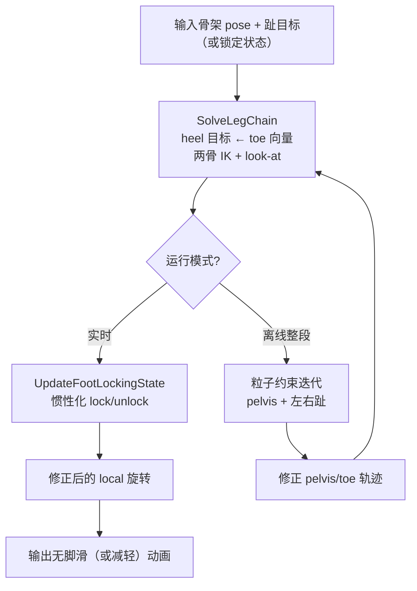

# 足锁 IK（Orange Duck 配方）

**一句话：** 把「脚滑」当作 **趾在世界空间的速度与源动画不一致**；用 **最小旋转的两骨 IK** 把趾钉到（锁定或离线修正后的）目标，再用 **三次惯性化** 在跟动画与跟地板之间平滑切换——锁趾不锁跟，IK 修正输入 pose 而非整链重算。

## 英文缩写速查

| 缩写 | 英文全称 | 简要说明 |
|------|----------|----------|
| IK | Inverse Kinematics | 由趾/跟目标反解髋膝等局部旋转 |
| FK | Forward Kinematics | 每步 IK 后更新全局变换 |
| PBD | Position Based Dynamics | 离线脚滑移除的 Jacobi 式约束投影 |
| MoCap | Motion Capture | 输入 BVH/骨架序列的常见来源 |
| Geno | Geno character skeleton | 文内示例骨架与 LaFAN1 等数据集 |

## 为什么重要

| 场景 | 作用 |
|------|------|
| 游戏/动画 runtime | 根运动缩放、状态混合、程序化修正后，视觉脚滑几乎不可避免 |
| 重定向后处理 | GMR 等几何重定向产出「像人」的轨迹，仍常需 **接触段足位** 修补（对照 [CoRe](../entities/core-retarget.md)、[KDMR](../entities/paper-kdmr.md) 的机器人侧做法） |
| 数据质检 | 高对比网格地面 + 慢放，是发现脚滑/穿透的低成本手段（[GenoView](../entities/genoview-inverse-kinematics.md)） |

脚滑在学术圈关注少于机器人动力学，却是 **动捕→ playable 动画** 链路上极常见的视觉瑕疵；此文给出可复现的四段配方与三条易错哲学，适合作为动画侧 IK 入门对照 [逆运动学形式化](../formalizations/inverse-kinematics.md) 中的雅可比/QP 路线。

## 主要技术路线

| 路线 | 输入 | 核心机制 | 适用 |
|------|------|----------|------|
| **Runtime 足锁** | 逐帧 pose + 接触标签 | 惯性化切换 toe target → `SolveLegChain` | 游戏/实时动画 |
| **离线约束修正** | 整段 clip + 接触日程 | PBD 式 pelvis/toe 粒子迭代 → 再 IK | 动捕后处理、根运动缩放 |
| **仅 IK 腿链** | 单帧 toe 目标 | 两骨 IK + look-at + 高度 clamp | 程序化修正、无锁定状态机 |

## 核心原理

### 流程总览

### 1. 腿链 IK（SolveLegChain）

在 **保留输入 pose** 前提下把趾放到目标：

1. **Heel 目标**：`targetHeel = targetToe + (heel - toe)_input`。
2. **两骨 IK**（hip–knee–heel）：余弦定理求髋/膝增量旋转；`maxExtension` 配合指数 soft clamp 防超伸；用 knee **side vector**（非 pole vector）定弯曲平面。
3. **Heel → toe look-at**：`QuaternionBetween` 对齐趾方向。
4. **可选 toe-end + 高度 clamp**：bind pose 最小 y，防趾尖穿地；动态地形需 raycast 替代表面 y=0。

IK 每步后需 **FK** 更新下游全局变换（实现可只重算子链）。

### 2. 运行时足锁 + 惯性化

每接触点维护 `FootLockingState`（位置、速度、输入源、惯性化 offset、锁定标志、接触点）。

| 状态 | 趾目标来源 |
|------|-----------|
| 未锁定 | 输入动画趾位置 |
| 已锁定 | 进入接触时记录的地板接触点（y = contactHeight） |

**三次惯性化**（`InertializeCubicUpdate` / `Transition`）在切换源时保持速度连续；`lockDistance` / `unlockDistance` 形成迟滞，避免边界抖动。

### 3. 接触时间标注

| 信号 | 典型阈值（60Hz 高质量数据） | 作用 |
|------|---------------------------|------|
| 趾全局速度模长 | 0.1–0.5 m/s | 主判据：低速 ≈ 支撑 |
| 趾高度 | ~0.1 m | 防「悬空静止」误标 |

后处理：**5 帧 majority/median** 去单帧毛刺；可选 Gaussian 平滑得连续强度再 runtime 阈值。跑步短接触（30Hz 仅 1–2 帧）易漏标——**60Hz 源数据 + 三次插值速度** 明显更稳。

### 4. 离线全局修正（PBD 式）

有整段 clip 且可离线迭代时：

- 变量：每帧 **pelvis、左右趾** 三维位置。
- **软约束**（`softFactor≈0.05`）：帧间/帧内相对几何贴近源动画。
- **硬约束**（`hardFactor≈0.9`）：双帧均接触时，两帧趾粒子拉向中点并钉地高。
- 上万次 Jacobi 迭代 → 新 pelvis/toe 轨迹 → 再跑 `SolveLegChain` 写回局部旋转。

相对 runtime 惯性化，能 **全局分摊** 根运动缩放带来的误差，更保源动作形状。

### 5. 三条设计哲学

1. **脚滑 = 速度误差**，不是「违反静摩擦」——根运动不匹配、局部旋转混合都会让 **视觉足速 ≠ 源数据足速**；只在接触段强约束是工程折中，摆动相仍可能错。
2. **锁趾不锁跟**—— locomotion 多为前掌接触；跟锁死反而假； pivot 常绕趾。
3. **IK 是修正**——在输入 local rotation 上叠加最小变化，而非 rigging 式 pole-vector **替换** 整段 pose。

## 工程实践

| 步骤 | 建议 |
|------|------|
| 1. 数据 | 优先 60Hz；30Hz 上采样时用三次插值算速度 |
| 2. 标注 | 趾速阈值 + 高度 sanity → median 5 帧 → 可视检查 |
| 3. Runtime | `blendTime`、`lockDistance`/`unlockDistance` 与角色步幅联调 |
| 4. 腿 IK | `softening≈0.005 m`；knee side vector 与骨架 rest pose 一致 |
| 5. 离线 | `softFactor`/`hardFactor` 权衡「跟源动画」vs「消脚滑」；迭代次数 vs 耗时 |
| 6. 对照 | 机器人重定向脚滑见 [GMR](./motion-retargeting-gmr.md) 下游 [CoRe](../entities/core-retarget.md) / [KDMR](../entities/paper-kdmr.md) |

可运行参考：[GenoView-InverseKinematics](../entities/genoview-inverse-kinematics.md)（MIT，raylib + Geno BVH 导出脚本）。

## 局限与风险

1. **平面地面假设**——文内 y clamp；斜坡/台阶需 raycast 或 per-foot 高度场。
2. **仅运动学**——不保证动力学可行；机器人部署仍需 QP/仿真验证（与 [TSID](../concepts/tsid.md) / WBC 分层）。
3. **接触启发式非金标准**——快跑、鞋形变形大时易漏/误标；关键镜头仍宜人工修。
4. **离线迭代耗时**——迭代上万次；不适合 strict realtime pipeline 内联。
5. **与机器人 Jacobian IK 不同层**——此文是 **动画 pose 修正**；勿与 [Mink](../entities/mink-ik.md)/[Pink](../entities/pink-ik.md) 任务 QP 混为一谈。

## 关联页面

- [逆运动学](../formalizations/inverse-kinematics.md) — 机器人侧解析/雅可比/零空间
- [正向运动学](../formalizations/forward-kinematics.md) — IK 每步误差来源
- [Motion Retargeting](../concepts/motion-retargeting.md) — 重定向后脚滑在管线中的位置
- [GMR 通用动作重定向](./motion-retargeting-gmr.md) — 几何重定向前端
- [GenoView-InverseKinematics](../entities/genoview-inverse-kinematics.md) — 官方可运行实现

## 参考来源

- [Orange Duck：Inverse Kinematics and Foot Locking](../../sources/blogs/orangeduck_inverse_kinematics_foot_locking.md)
- [GenoView-InverseKinematics 仓库归档](../../sources/repos/genoview-inverse-kinematics.md)
- [theorangeduck 项目页归档](../../sources/sites/theorangeduck-ik-foot-locking.md)

## 推荐继续阅读

- Andrew McDonald, [Inverse Kinematics and Foot Locking](https://theorangeduck.com/page/inverse-kinematics-foot-locking)（原文 + 代码）
- [GenoView-InverseKinematics](https://github.com/orangeduck/GenoView-InverseKinematics)（MIT 示例工程）
