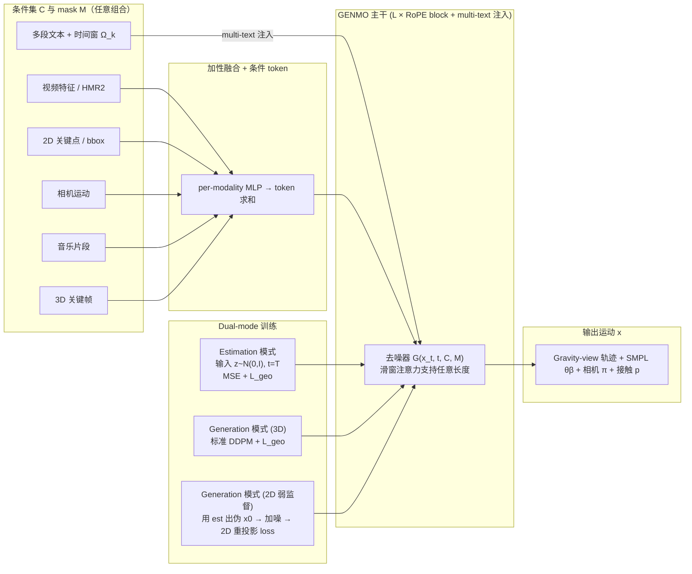

# GENMO（统一人体运动估计与生成）

**GENMO**（*A GENeralist Model for Human MOtion*，NVIDIA Research，**ICCV 2025 Highlight**；代码与权重发布后更名为 **GEM**）把 **运动估计** 与 **运动生成** 放进同一套扩散式框架：在给定观测约束（如视频特征 / 2D 关键点 / 文本 / 音乐 / 3D 关键帧）的前提下生成完整 SMPL 参数序列，从而既保留生成模型的弹性，又让生成先验来修补遮挡、截断等脆弱帧。它与 [Video-as-Simulation（视频即仿真）](../concepts/video-as-simulation.md) 所讨论的「像素域动力学接口」相衔接：先把视频变成可跟踪的人体运动，再交给下游执行器。

## 为什么重要？

- **打破「估计 vs 生成」的人为分裂**：传统流水线维护两套权重 —— 估计追求精度（视频/2D 输入），生成追求多样性（文本/音乐输入）。GENMO 论文论证两者共享时间动力学 + 运动学表示，可以由「带观测约束的生成」一种范式统一吸收。
- **视频→机器人链路的中枢**：从单目或生成视频恢复时间一致的全身 SMPL 序列，是「像素 → 跟踪控制器」管道的标准中间表示之一（参见 [ExoActor](./exoactor.md)、[SONIC](./sonic-motion-tracking.md) 中明确把 GEM 列为「视频/音乐/文本 → 人体运动」的接口）。
- **生成 ↔ 估计的双向收益**：生成先验显式改善遮挡 / 截断等困难帧上的估计质量；同时大规模野外视频上的 2D 弱监督又能反过来扩宽生成分布。这是论文最核心的「同模型多任务」论据。
- **多模态混合可编辑**：同一模型可在时间轴上混合多种条件（视频片段 + 文本片段 + 音乐 + 关键帧），适合接 LLM / VLA / 视频生成模块当上游。

## 主要技术路线

### 1. 联合 local-global 运动表示

每帧 $x^i$ 同时编码：

| 子段 | 形状 | 含义 |
|------|------|------|
| $\Gamma_{\text{gv}}^i$ | $\mathbb{R}^{6}$ | gravity-view 朝向（全局轨迹用） |
| $v_{\text{root}}^i$ | $\mathbb{R}^{3}$ | 根关节速度（局部坐标系） |
| $\theta^i$ | $\mathbb{R}^{24\times 6}$ | SMPL 关节角（6D 旋转） |
| $\beta^i$ | $\mathbb{R}^{10}$ | SMPL shape |
| $t_{\text{root}}^i$ | $\mathbb{R}^{3}$ | 根关节平移 |
| $\pi^i$ | $(\Gamma_{\text{cv}}^i, t_{\text{cv}}^i)$ | 相机到世界外参（6D 朝向 + 平移） |
| $p^i$ | $\mathbb{R}^{6}$ | 手脚接触（heel/toe + hand）标签 |

把 gravity-view 全局轨迹、相机系局部 SMPL 与相机外参拼进同一向量，使**估计任务**（需要相机系对齐图像特征）与**生成任务**（需要 heading-free 表达）能共享同一权重。

### 2. 统一架构：加性融合 + RoPE Transformer + Multi-Text 注入

- **加性融合块**：每种 frame-aligned 条件 $c_\star \in \{\text{video}, \text{cam}, \text{2d}, \text{music}, \text{bbox}\}$ 经各自 MLP 编码后**逐 token 相加**得到统一条件 token，再与噪声运动 $x_t$ 融合。
- **$L$ 个 GENMO block**：每个 block = RoPE-based Transformer + multi-text 注入；RoPE 相对位置编码允许推理期任意长度，并配合**滑窗注意力**（W 帧窗口）扩展到比训练长得多的序列。
- **Multi-text 注意力**：对 $K$ 段文本 $\{c_{\text{text}}^k\}$，每段绑定时间窗口 mask $\Omega_k$，只允许文本特征作用于窗内运动 token：

  $$f_{\text{out}} = \sum_{k=1}^{K} \text{MaskedMHA}(f_{\text{in}}, c_{\text{text}}^k, \Omega_k)$$

  让用户在长序列里**逐段下达可编辑的语言指令**，并由后续 RoPE 块抹平边界。

### 3. Dual-mode 训练范式

论文核心创新之一。作者观察到：**视频条件下扩散的第一步预测几乎就是最终结果，方差极低**；而文本条件下方差很大。因此估计任务的「首步必须准」，否则后续 DDIM 步无法修正。对策是同一权重交替两种训练模式：

| 模式 | 输入 | 损失 | 目标 |
|------|------|------|------|
| **Estimation** | 纯高斯噪声 $z\sim\mathcal{N}(0,I)$ + 最大时间步 $T$ | $\mathcal{L}_{\text{est}} = \mathbb{E}\|x_0 - \mathcal{G}(z, T, \mathcal{C}, \mathcal{M})\|^2 + \mathcal{L}_{\text{geo}}$ | 强迫首步预测就是 MLE，对齐回归 |
| **Generation（3D）** | 标准前向加噪 $x_t$ | 标准 DDPM $\mathcal{L}_{\text{gen}}$ + $\mathcal{L}_{\text{geo}}$ | 学习条件分布的多样性 |
| **Generation（2D 弱监督）** | 用 estimation 模式生成伪 clean $\hat{x}_0$，再加噪得 $\hat{x}_t$ | $\mathcal{L}_{\text{gen-2D}} = \|x_{\text{2d}} - \Pi(\mathcal{G}(\hat{x}_t, t, \mathcal{C}))\|^2$ | 不需 3D GT，野外视频也能扩宽生成分布 |

强条件数据（视频 / 2D 骨架）同时跑估计 + 生成两模式；弱条件数据（文本 / 音乐）只跑生成模式。$\mathcal{L}_{\text{geo}}$ 是世界系与相机系下的关节/顶点位置一致性 + 脚-手接触约束，二者通用。

## 流程总览（Mermaid）

图中：文本条件不走加性融合，而是通过 multi-text 注意力按窗注入；三种训练损失共享同一去噪器权重。节点标签使用 Mermaid 引号形式，避免 `~`、括号等在 `[]` 裸文本中被解析为流程图语法。

## 实验结论（v1 公开表述）

- **全局动作估计**：在 EMDB-2 / RICH 上的 WA-MPJPE100 / W-MPJPE100 / RTE / Jitter / Foot-Sliding 指标对比 GLAMR、TRAM、WHAM 等基线达到 SOTA。
- **局部动作估计 + music-to-dance 生成**：同一权重在多任务上接近或超过专用模型。
- **关键消融**：
  - 去掉估计模式 → 估计精度显著下降。
  - 去掉 estimation-guided 2D 监督 → 生成多样性下降。
  - 去掉 multi-text 注意力 → 多段文本条件下出现时间错位。
- **鲁棒性**：生成先验在遮挡 / 截断帧上明显提升估计质量，验证「双向收益」。

## 仓库与权重发布（README 摘要）

- **代码**：<https://github.com/NVlabs/GENMO>（Apache-2.0）。
- **权重**：HuggingFace `nvidia/GEM-X` 上的 **GEM-SMPL** checkpoint（regression + generation 一体）。
- **demo 入口**：`scripts/demo/demo_smpl.py`（视频 + 文本 + 文件混合输入）；`demo_smpl_hpe.py`（视频→SMPL 估计）；`demo_webcam.py`（ONNX Runtime + 滑窗的实时管线）。
- **训练入口**：`scripts/train.py exp=gem_smpl_regression`（纯回归）/ `exp=gem_smpl`（完整模型），AdamW lr=2e-4，500K steps，fp16-mixed。
- **命名**：2025-12 起 GENMO 正式更名为 **GEM**；论文 / arXiv 仍用旧名；检索仓库时两个关键词都要试。

## 在 NVIDIA 人形栈中的位置

GEM/GENMO 是 NVIDIA Research 人形运动数据栈的「人体运动 I/O」环节，与下列工作官方互链：

- [GEM-X](https://github.com/NVlabs/GEM-X)：把 GEM 扩展到全身（手、脸）。
- [SOMA-X](https://github.com/NVlabs/SOMA-X) + SOMA Retargeter：body model 与重定向。
- [ProtoMotions](../entities/protomotions.md)：大规模并行人形仿真与 RL 训练框架，常以 SMPL 系动作（含 GEM 产出）作为参考运动来源。
- [SONIC](./sonic-motion-tracking.md)：把人体运动作为 token 化条件喂入大规模 motion tracking 控制器，落到 Unitree G1 等硬件。
- [Kimodo](../entities/kimodo.md)：文本 + 运动学约束的运动扩散与生成工具链。

## 常见误区或局限

- **不等于实时控制器**：GENMO 输出的是人体运动序列；要在实体人形上闭环还需动力学可行的跟踪策略（如 [SONIC](./sonic-motion-tracking.md)）或经典 WBC/MPC。
- **命名迁移**：论文使用 GENMO，仓库与权重以 **GEM** 发布，并存在 [GEM-X](https://github.com/NVlabs/GEM-X) 全身扩展；检索代码与 checkpoint 时需两者兼顾。
- **域差异**：从「生成的人体视频」估计运动时，视频生成阶段的物体幻觉、手腕方向错误等会传递到下游；[ExoActor](./exoactor.md) 详细讨论了这一类失败模式。
- **首步预测的依赖**：dual-mode 的有效性建立在「视频条件下扩散方差极低」这一观察上；如果上游条件分布偏离这一假设（例如极抽象的语言指令直接驱动估计），估计精度会回退到生成模式的方差水平。

## 与其他页面的关系

- [ExoActor (视频生成驱动的交互式人形控制)](./exoactor.md)：典型系统集成位 —— GENMO 承担「生成视频 → 全身 SMPL 序列」。
- [SONIC（规模化运动跟踪人形控制）](./sonic-motion-tracking.md)：把 GEM/GENMO 的人体运动作为统一 token 喂入大规模跟踪策略。
- [WiLoR（野外手部 3D 重建）](./wilor.md)：与 GENMO 拼接成「全身 SMPL + 手部姿态」的下游接口。
- [Diffusion-based Motion Generation](./diffusion-motion-generation.md)：扩散范式在人体运动域的代表实现，与机器人控制域的扩散生成（如 ETH G1）形成跨领域对照。
- [ProtoMotions](../entities/protomotions.md) 与 [Kimodo](../entities/kimodo.md)：同属 NVIDIA 人形运动栈，构成「数据 → 运动表示 → 训练 → 跟踪」的上下游闭环。

## 推荐继续阅读

- 论文 abs / HTML：<https://arxiv.org/abs/2505.01425v1>、<https://arxiv.org/html/2505.01425v1>
- 项目页（GEM）：<https://research.nvidia.com/labs/dair/gem/>
- 代码：<https://github.com/NVlabs/GENMO>
- 全身扩展：<https://github.com/NVlabs/GEM-X>

## 参考来源

- [GENMO（A GENeralist Model for Human MOtion）— 论文摘录](../../sources/papers/genmo.md)
- [GENMO / GEM（NVlabs/GENMO 代码仓与权重发布）— 仓库归档](../../sources/repos/genmo.md)

## 关联页面

- [ExoActor (视频生成驱动的交互式人形控制)](./exoactor.md)
- [SONIC（规模化运动跟踪人形控制）](./sonic-motion-tracking.md)
- [WiLoR（野外手部 3D 重建）](./wilor.md)
- [Diffusion-based Motion Generation](./diffusion-motion-generation.md)
- [ProtoMotions](../entities/protomotions.md)
- [Kimodo](../entities/kimodo.md)
