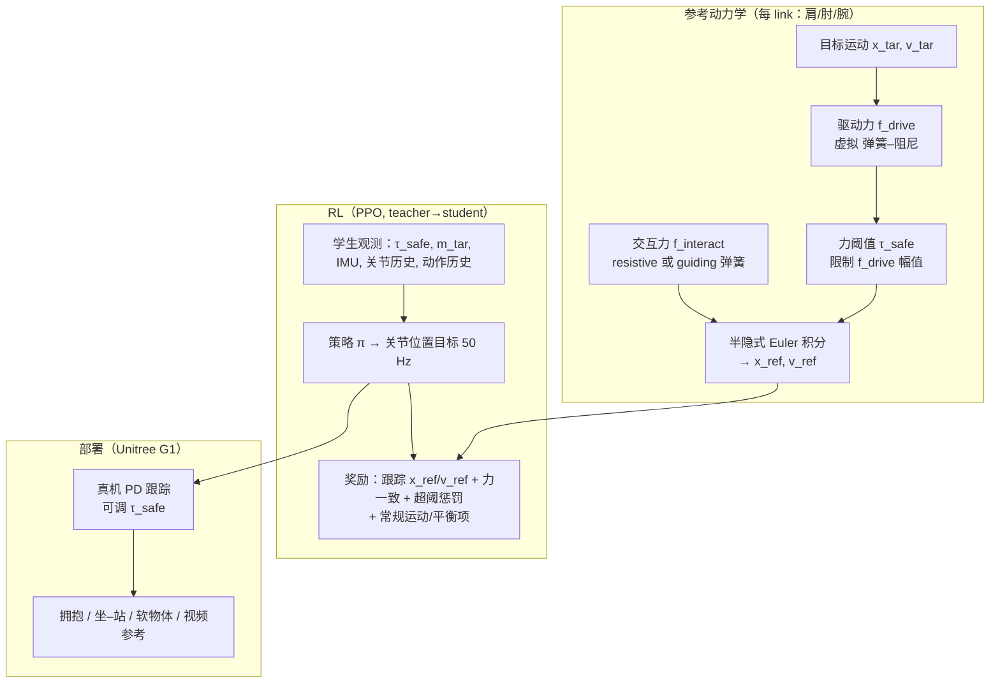

# GentleHumanoid（上半身柔顺全身运动跟踪）

**GentleHumanoid**（Stanford 等，[arXiv:2511.04679](https://arxiv.org/abs/2511.04679)，[项目页](https://gentle-humanoid.axell.top/)）在 **全身 motion tracking** 策略中显式集成 **上半身阻抗式柔顺**：跟踪参考运动的同时，对人与可变形物体的接触产生 **可调、可部署** 的力响应，而不是把外力一律当作扰动压掉。

与 [SONIC](./sonic-motion-tracking.md) 等强调 **规模化刚性跟踪** 的路线对照：GentleHumanoid 把「**跟踪成功率 vs 交互安全**」写成同一套参考动力学里的 **驱动力 + 交互力 + 力阈值**，面向拥抱、坐–站辅助、气球等 **接触丰富** 任务。

## 为什么重要？

- **多连杆柔顺，而非单点阻抗**：拥抱与搀扶常同时接触肩、肘、腕；论文用 **完整上身姿态采样** 作为 guiding contact 的弹簧锚点，避免各 link 独立施力导致运动学不协调。
- **训练期覆盖、部署期可调**：仿真中用统一弹簧公式合成 **resistive**（压向表面）与 **guiding**（推拉引导）力；**τ_safe ∈ [5, 15] N** 训练随机化，部署可按任务切换（站点示例：握手 5 N、拥抱 10 N、坐–站 15 N）。
- **与视频→机器人流水线衔接**：项目页展示 **PromptHMR → GMR → 跟踪** 的噪声参考仍可做柔顺操控；另有一条 **视觉 shape-aware 自主拥抱**（人体 shape 估计 + 策略）。
- **工程可复现**：作者侧开源 [Axellwppr/motion_tracking](https://github.com/Axellwppr/motion_tracking)（基于 GentleHumanoid 代码、**mjlab** 训练、ONNX sim2real），与论文方法页形成「论文 + 代码 + 演示站」三角。

## 流程总览

## 核心机制（提炼）

### 1. 参考动力学

每个上身关键点（肩、肘、手）在根坐标系下满足：

\[
M \ddot{x} = f_{\text{drive}} + f_{\text{interact}}
\]

- **驱动力**：\(f_{\text{drive}} = K_p(x_{\text{tar}}-x) + K_d(v_{\text{tar}}-v)\)，\(K_d = 2\sqrt{M K_p}\)（临界阻尼）；\(M=0.1\) kg（论文设定）。
- **交互力**：统一弹簧 \(f_{\text{interact}} = K_{\text{spring}}(x_{\text{anchor}} - x)\)；resistive 时锚点为 **初次接触位置**，guiding 时锚点从 **人体动捕姿态分布** 采样，保证多 link 力方向一致。
- **训练随机化**：\(K_{\text{spring}} \sim U(5,250)\)；约 40% 无外力、其余按臂/单 link 组合；每 5 s 重采样锚点与激活 link 集。

### 2. 安全力阈值

\[
f_{\text{drive\_limited}} = \min\left(1,\ \frac{\tau_{\text{safe}}}{\|f_{\text{drive}}\|}\right) f_{\text{drive}}
\]

训练时 \(\tau_{\text{safe}}\) 在 **[5, 15] N** 分段常值随机；策略观测中包含当前阈值。合规奖励还惩罚 \(\|f_{\text{interact}}\| > \tau_{\text{safe}} + \delta_{\text{tol}}\)（\(\delta_{\text{tol}}=10\) N）。

### 3. Teacher–Student 与数据

- **Teacher** 额外观测参考动力学状态、预测/仿真交互力、连杆高度、力矩、累积误差等 **特权信息**；**Student** 仅保留部署可得量（与 [prior impedance-augmented RL](https://arxiv.org/abs/2511.04679) 同架构族）。
- **动作**：29 维关节位置目标，底层 PD；**PPO** 训练。
- **运动数据**：经 **GMR** 重定向 AMASS、InterX、LAFAN，约 **25 h @ 50 Hz**，滤除不适于交互场景的高动态片段（详见 [motion-retargeting-gmr](./motion-retargeting-gmr.md)）。

### 4. 评测与扩展管线

- **定量**：商用测力计 + 人台 **40 taxel** 腰侧压力垫（对齐/错位拥抱）。
- **定性**：人台拥抱、坐–站、气球；对比 vanilla tracking 与 end-effector 力自适应 baseline。
- **扩展**（项目页）：单目 RGB → PromptHMR → GMR → 柔顺跟踪；自主拥抱 = 视觉人体 shape + 策略。

## 与相邻工作的关系

| 维度 | GentleHumanoid | [SONIC](./sonic-motion-tracking.md) | 经典阻抗 WBC |
|------|----------------|--------------------------------------|----------------|
| 目标 | 跟踪 + **上身柔顺交互** | 规模化 **通用跟踪** | 解析力/位姿调节 |
| 交互建模 | 仿真中 **合成弹簧力** + 参考动力学跟踪 | 主要靠跟踪损失与数据 scaling | 接触力/导纳律 |
| 部署接口 | **τ_safe** 任务可调 | 统一 token / 多模态条件 | 刚度/阻尼矩阵调参 |

## 主要技术路线

| 维度 | 要点 |
|------|------|
| **任务形式** | Compliant **motion tracking**：跟踪参考全身运动，同时满足阻抗参考动力学与力安全约束。 |
| **交互建模** | 统一弹簧式 **resistive / guiding** 力；guiding 锚点从 **完整上身姿态** 采样，保证肩–肘–腕链协调。 |
| **安全** | 训练随机化 **τ_safe ∈ [5, 15] N**；部署按任务调节（握手 / 拥抱 / 坐–站）。 |
| **学习** | **PPO** + **teacher–student**（特权参考动力学 / 力信息 → 可部署学生观测）。 |
| **数据** | **GMR** 重定向 AMASS / InterX / LAFAN，~25 h @ 50 Hz；工程仓另支持 AMASS+LAFAN 预处理包。 |
| **平台** | 仿真 **mjlab**；真机 **Unitree G1**；可选 **PromptHMR → GMR** 视频参考与视觉拥抱管线。 |

## 工程入口

| 类型 | URL |
|------|-----|
| 论文 | [arXiv:2511.04679](https://arxiv.org/abs/2511.04679) |
| 项目页 | [gentle-humanoid.axell.top](https://gentle-humanoid.axell.top/) |
| 代码（训练/部署） | [github.com/Axellwppr/motion_tracking](https://github.com/Axellwppr/motion_tracking) |
| Tracking 演示 | [motion-tracking.axell.top](https://motion-tracking.axell.top/) |
| 修改版 GMR | [github.com/Axellwppr/GMR](https://github.com/Axellwppr/GMR) |

实现栈细节见 [axellwppr-motion-tracking](../entities/axellwppr-motion-tracking.md) 与 [mjlab](../entities/mjlab.md)。

## 参考来源

- [GentleHumanoid 论文摘录](../../sources/papers/gentlehumanoid_upper_body_compliance.md)
- [GentleHumanoid 项目页归档](../../sources/sites/gentle-humanoid-axell-top.md)
- [Axellwppr/motion_tracking 仓库归档](../../sources/repos/axellwppr_motion_tracking.md)

## 关联页面

- [Whole-Body Control](../concepts/whole-body-control.md) — 全身协调控制背景
- [Contact Dynamics](../concepts/contact-dynamics.md) — 多 link 接触与力分布
- [Impedance Control](../concepts/impedance-control.md) — 虚拟弹簧–阻尼基础
- [Loco-Manipulation](../tasks/loco-manipulation.md) — 移动操作与接触丰富任务
- [Teleoperation](../tasks/teleoperation.md) — 仓库支持的 VR 遥操作栈
- [SONIC（规模化运动跟踪）](./sonic-motion-tracking.md) — 刚性跟踪 scaling 对照

## 推荐继续阅读

- [ISO/TS 15066](https://www.iso.org/standard/62996.html) — 协作机器人力限相关安全参考（论文阈值论证引用）
- [GMR 官方仓库](https://github.com/YanjieZe/GMR) — 人体→人形重定向基线实现
