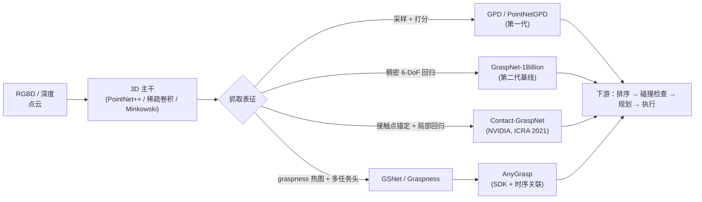

# Grasp Pose Estimation（抓取位姿估计）

**抓取位姿估计 (Grasp Pose Estimation)** 解决「相机看到一堆物体，应该把夹爪放在哪、怎么转、张多大」这一感知子问题：把 **RGBD / 深度 / 点云** 观测映射为一组可执行的 **6-DoF**（位置 + 朝向）或 **7-DoF**（再加夹爪开度）**抓取候选** 与对应的 **质量分数**，作为下游规划与执行的输入。它是 [Manipulation](../tasks/manipulation.md) 闭环中「视觉 → 抓取规划」一环的核心。

## 一句话定义

> 给定一帧 RGBD/点云，**稠密**或**稀疏**地输出 $(R, t, w, q)$ 候选集合——其中 $R \in SO(3)$ 表示夹爪朝向，$t \in \mathbb{R}^3$ 表示接近点，$w$ 是夹爪开度，$q \in [0, 1]$ 是质量/可执行性分数。

## 任务参数化

不同方法在 **抓取表示** 上略有差异，主流约定如下：

| 维度 | 含义 | 常见取值 |
|------|------|----------|
| 接近点 $t$ | 夹爪指尖中心或掌心目标点 | 取自点云的某个 surface point |
| 朝向 $R$ | 接近方向 + 绕轴旋转 | SO(3) 全 6 自由度，或退化为「接近向量 + 平面内角度」 |
| 开度 $w$ | 夹爪闭合前的张开宽度 | 离散区间或连续值 |
| 质量 $q$ | 学习侧打分 / 可执行性 | $[0,1]$ 概率或 antipodal 几何分数 |
| 表征空间 | 抓取所在的几何位置 | **场景级（场景中任意点）** vs **物体级（已知 CAD / 掩码）** |

> **6-DoF vs 7-DoF**：在平行夹爪设定下，**6-DoF** 指位姿，**7-DoF** 是 6-DoF + 开度，多数 SDK（如 [AnyGrasp](../entities/anygrasp.md)）按 7-DoF 输出。

## 主要技术路线

抓取位姿估计的现代脉络可大致划分为三代，逐渐从 **稀疏候选 + 评估** 走向 **稠密场景预测 + 时序关联**：

### 第一代：候选采样 + 打分

- **代表**：GPD (Grasp Pose Detection)、PointNetGPD。
- **机制**：在表面点附近 **采样** 大量候选夹爪位姿（基于法向量 / 局部几何），用一个分类器/打分网络评估每个候选的可抓性。
- **问题**：候选生成与评估解耦，时间复杂度高；候选覆盖度依赖采样启发式。

### 第二代：端到端稠密预测（GraspNet 起点）

- **代表**：**GraspNet-1Billion**（Fang et al., CVPR 2020）。
- **机制**：在场景点云每个采样点上直接 **回归** 一组 6-DoF 抓取参数 + 质量分数，单次前向得到稠密候选；同时发布 GraspNet-1Billion 数据集（百万级真实标注抓取）作为评测基准。
- **意义**：把抓取检测变成「分割/回归」式的稠密任务，与 PointNet++ / 稀疏卷积主干自然对接。

### 第三代：接触一致 + 物理 / 时序约束

- **Contact-GraspNet**（NVIDIA, ICRA 2021）：以 **接触点 (contact point)** 为锚 —— 在场景中每个 3D 点上回归 **基线方向 + 接近向量 + 抓取宽度**，把抓取参数化压缩到接触面，显著降低输出维度，提升稠密预测稳定性。强调在 **杂乱堆叠** 与 **未知物体** 上的泛化。
- **GSNet / Graspness**（Wang et al., 2021；SJTU MVIG）：先学一个「**抓取适宜度热图 (graspness)**」对场景做体素级前景筛选，把后续的角度/宽度预测集中在高 graspness 区域，进一步压缩候选预算。
- **[AnyGrasp](../entities/anygrasp.md)**（Fang et al., T-RO 2023）：在 GSNet 基础上叠加 **跨帧时序关联** 与 **COG 稳定分数 + 障碍感知**，把抓取从「单帧检测」推到 **动态跟踪 + bin clearing** 端到端 SDK。

## 输入模态与几何前处理

| 模态 | 优势 | 风险 |
|------|------|------|
| **结构光 / ToF 深度** | 直接给出 3D 几何，主流抓取数据集（GraspNet-1Billion 等）默认形态 | 反光 / 透明物体深度缺失；远距离精度下降 |
| **RGBD** | 颜色辅助语义 / 物体分割与开放词汇接入 | 需对齐 RGB 与深度内外参；模型主干更重 |
| **多视点点云融合** | 提升遮挡侧覆盖与 7-DoF 估计精度 | 需手眼标定与相对位姿，鲜见 SDK 默认配置 |
| **单目 RGB → 深度估计** | 在没有深度相机时可作为兜底，配合 AnyGrasp 等管线落地 | 单目深度噪声大；几何细节缺失会导致抓取偏移 |

常见前处理：**离群点 / 平面剔除（RANSAC 桌面分割）→ 工作空间裁剪 → 体素下采样 → 法向量估计**。这些步骤直接影响稠密预测网络的有效感受野与负样本分布。

## 训练数据与标签生成

- **GraspNet-1Billion**：约 **9 万** 张 RGBD、**100** 个物体、**百万级** 抓取标签；由 **解析 antipodal 评分** 自动生成，是第二/第三代方法的事实标准训练集。
- **ACRONYM / DexNet 系列**：早期仿真生成的大规模抓取标签库，倾向单物体设定。
- **Contact-GraspNet** 标签：在 ACRONYM 等基础上做 **接触点投影**，把抓取标注降到点级，方便稠密监督。
- **AnyGrasp** 训练数据：在 **约 144 个真实物体、268 场景** 上扩展 GraspNet-1Billion，并通过 **相邻多视点** 自构造时序关联监督。

## 评测指标

- **AP / AP_seen / AP_similar / AP_novel**（GraspNet 标准）：按物体集合的可见性分层评估，看泛化能力。
- **Top-K 成功率**（仿真物理执行）：抓起最优 K 个候选的实际成功率，是 AP 的物理化补充。
- **MPPH (Mean Picks Per Hour)**：bin clearing 场景下的 **吞吐**，AnyGrasp 等 SDK 常报。
- **抓取稳定性**：执行后保持时长、滑移率（结合触觉反馈，参见 [Contact-Rich Manipulation](../concepts/contact-rich-manipulation.md)）。

## 与下游的衔接

- **碰撞与可达性过滤**：网络输出的高分候选不等于「可执行」，仍需结合机械臂 IK / 运动规划做 **可达性筛选**，常见做法是把抓取候选送入 [cuRobo](../entities/curobo.md) 或 MoveIt 做并行检查。
- **接触执行**：抓取位姿只给到「接近 + 闭合」前的目标，**最后几厘米**通常切换到 [Visual Servoing](./visual-servoing.md) / 阻抗控制（[Impedance Control](../concepts/impedance-control.md)）以吸收深度与标定误差。
- **触觉闭环**：抓握后通过触觉反馈判定滑移 / 重抓，把检测式 grasp pose 与 [Tactile Sensing](../concepts/tactile-sensing.md) 串联，构成 **完整抓取闭环**。

## 常见误区

- **6-DoF ≠ 物理可执行**：网络打分高的候选不保证 IK 解存在或避碰通过，**显式碰撞检查仍不可省略**。
- **AP 高 ≠ 真实成功率高**：AP 评测基于离线匹配，未考虑控制误差与摩擦不确定性；仿真物理或真机试验是必要补丁。
- **稠密 ≠ 一定更好**：稠密预测的输出量大、显存高，下游排序与碰撞检查会成为瓶颈；很多场景下 **graspness 热图 + Top-K** 比裸稠密候选更工程友好。
- **平行夹爪假设**：本页谱系默认 **平行二指夹爪**；多指 / 灵巧手抓取是另一套表征（接触面分配、力闭合），见 [In-hand Reorientation](./in-hand-reorientation.md) / [Contact-Rich Manipulation](../concepts/contact-rich-manipulation.md)。

## 关联页面

- [Manipulation（操作任务）](../tasks/manipulation.md) — 抓取位姿估计在操作闭环中的位置
- [AnyGrasp（抓取感知 SDK）](../entities/anygrasp.md) — GraspNet 系第三代代表，工程化 SDK
- [ContactNet](./contact-net.md) — 与 Contact-GraspNet 在「接触面预测」思路上同源
- [Visual Servoing](./visual-servoing.md) — 抓取位姿之后的亚毫米级对齐方案
- [Contact-Rich Manipulation](../concepts/contact-rich-manipulation.md) — 抓握后接触阶段的执行层
- [cuRobo](../entities/curobo.md) — 抓取候选 → 规划 / 避障的下游求解器
- [Query：抓取策略选型](../queries/grasp-policy-selection.md) — 开放场景 vs 已知物体 / 稀疏 vs 稠密 / 几何 vs 学习的方案组合指南

## 参考来源

- Fang H., Wang C., Gou M., Lu C. (2020). *GraspNet-1Billion: A Large-Scale Benchmark for General Object Grasping*. CVPR.
- Sundermeyer M., Mousavian A., Triebel R., Fox D. (2021). *Contact-GraspNet: Efficient 6-DoF Grasp Generation in Cluttered Scenes*. ICRA. — <https://arxiv.org/abs/2103.14127>
- Wang C., Fang H., Gou M., et al. (2021). *Graspness Discovery in Clutters for Fast and Accurate Grasp Detection*. ICCV.
- Fang H., et al. (2023). *AnyGrasp: Robust and Efficient Grasp Perception in Spatial and Temporal Domains*. IEEE T-RO. — <https://arxiv.org/abs/2212.08333>
- [sources/repos/anygrasp-sdk.md](../../sources/repos/anygrasp-sdk.md) — GraspNet 生态资料索引
- 项目页：<https://graspnet.net/>
