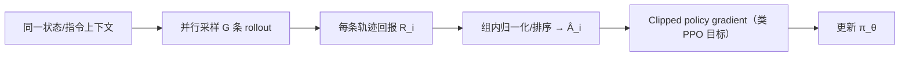

# GRPO（Group Relative Policy Optimization）

**GRPO** 是 DeepSeekMath 提出的 RL 算法变体：在同一 prompt/状态下采样一组轨迹，用**组内相对回报**估计 advantage，省去独立 critic 网络。

## 一句话定义

**用一组并行 rollout 的相对排序代替 per-token critic，适合大模型 / VLA 后训练阶段的在线 RL。**

## 英文缩写速查

| 缩写 | 英文全称 | 简要说明 |
|------|----------|----------|
| GRPO | Group Relative Policy Optimization | 组相对策略优化 |
| RL | Reinforcement Learning | 强化学习 |
| PPO | Proximal Policy Optimization | 近端策略优化；GRPO 常作为其 advantage 估计替代 |
| VLA | Vision-Language-Action | 视觉-语言-动作策略 |

## 为什么重要

- [LightNav-0](../entities/paper-lightnav-0.md) 第三阶段在仿真中用 **GRPO** 比较自主规划执行结果，EVT-Bench 跟踪 SR 从 74.4→82.6。
- [DriveTeach-VLA](../entities/paper-driveteach-vla.md)（ECCV 2026）在 **TGP-guided SFT** 后用 **GRPO** 对齐 BEV 轨迹与驾驶偏好；RL 实现见 [Curious-VLA](https://github.com/Mashiroln/curious_vla)。
- 仓库另有 [Prism-GRPO](../entities/paper-prism-grpo.md)、[Temporal-GRPO](../entities/paper-temporal-grpo.md) 等变体论文页。
- 与 [PPO](./ppo.md) 同属 on-policy 家族，但 **advantage 来自组内排序** 而非独立 value network（见 [MDP](../formalizations/mdp.md) 回报定义）。

## 主要技术路线

典型部署：**SFT 后在线 RL**（LightNav-0）、LLM RLVR（[SDPG](../entities/paper-sdpg-self-distilled-policy-gradient.md) 等变体）。

## 核心原理

1. 对同一上下文采样多条 rollout（规划/动作序列）。
2. 按组内回报排序或归一化得到 relative advantage。
3. 用 clipped policy gradient 更新策略（与 PPO 类似的目标，但 advantage 来自组内比较）。

## 工程实践

| 项 | 建议 |
|----|------|
| 适用 | LLM/VLM/VLA 后训练、可并行采样的仿真环境 |
| 与 PPO | 见 [policy-optimization](./policy-optimization.md)；GRPO 主要改 advantage 估计 |
| 导航实例 | LightNav-0 三阶段：SFT 后 GRPO 在线改进跟踪与恢复 |

## 局限与风险

- 组大小与采样成本 trade-off；仿真吞吐不足时 RL 阶段增益有限。
- 相对回报对 reward 标定敏感；导航任务需与 SFT 阶段接口一致（LightNav 复用 RVQ 动作词表）。

## 关联页面

- [policy-optimization](./policy-optimization.md)
- [LightNav-0](../entities/paper-lightnav-0.md)
- [Prism-GRPO](../entities/paper-prism-grpo.md)

## 参考来源

- [deepseekmath_grpo_2024.md](../../sources/papers/deepseekmath_grpo_2024.md)
- [lightorigins_lightnav_0_2026-09-01.md](../../sources/blogs/lightorigins_lightnav_0_2026-09-01.md)

## 推荐继续阅读

- DeepSeekMath 技术报告（GRPO 原始提出）
- [LightNav-0 Tech Blog](https://www.lightorigins.com/blog/lightnav-0)
