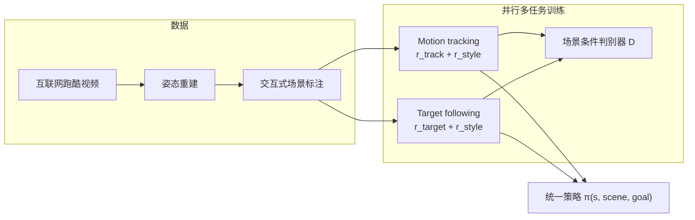

# HIL: Hybrid Imitation Learning（混合模仿学习）

**HIL** 将 **逐帧 motion tracking** 与 **AMP 式对抗模仿** 放在同一策略、同一观测空间里并行训练，使物理仿真角色既能精确学会跑酷参考动作，又能在新障碍布局中灵活组合 vault、plyo 等技能完成目标跟随任务。

## 英文缩写速查

| 缩写 | 英文全称 | 简要说明 |
|------|----------|----------|
| HIL | Hybrid Imitation Learning | 跟踪 + 对抗模仿的并行多任务框架 |
| AMP | Adversarial Motion Prior | 判别器提供 style reward 的运动先验 |
| AIL | Adversarial Imitation Learning | 用对抗信号匹配参考运动分布的模仿范式 |
| PSI | Perturbed State Initialization | 参考初始状态加扰动以提升过渡鲁棒性 |
| PD | Proportional-Derivative Control | 关节力矩由目标位置/速度误差计算 |
| SMPL | Skinned Multi-Person Linear Model | 论文采用的参数化人体网格与骨骼模型 |
| DTW | Dynamic Time Warping | 评估生成动作与参考时序对齐距离的指标 |

## 为什么重要

跑酷类 **人–场景交互** 同时需要：(1) 参考级动作保真；(2) 按障碍改技能与顺序。纯 tracking 难 OOD；纯 AMP 易 mode collapse。HIL 用**共享 style 判别器**把两路训练「桥接」起来，并发现**场景点云**可在无相位输入时充当**空间相位**。

## 主要技术路线

## 核心机制

### 1. 双模式并行

- **Tracking 模式**：最小化角色与参考在位置、旋转、速度、根高上的指数跟踪误差；叠加与 target 模式相同的 style reward。
- **Target following 模式**：AMP 目标点 \(g_t\) 沿障碍序列更新；任务奖励鼓励接近目标；判别器约束动作自然且**适配当前场景点云**。

### 2. 统一观测（无相位 / 无未来参考）

策略输入为角色状态、**agent-centric 场景表示**（点云）与目标位置。Tracking 与 following **共用**该空间，避免「两套行为模式」。

### 3. 场景条件判别器

\(D\) 接收过去 10 步状态转移 + 场景最近点；同时判断「像不像人」与「适不适合当前障碍」。消融表明去掉场景信息会降低技能–场景对齐度。

### 4. PSI 与 critic 任务指示

- **PSI**：参考初始状态扰动，改善技能衔接、减轻 mode collapse。
- **Critic task indicator \(k_t\)**：两模式奖励结构不同，需分开估值。

## 数据与评估

- 参考来自**互联网视频**（非动捕棚），场景几何靠标注工具对齐。
- 训练课为 5 障碍序列；评测加障碍位姿/尺度噪声，可泛化到更长序列；可与坐姿等日常动作混训。

## 常见误区

- **不是**人形机器人真机工作——面向 **SIGGRAPH 类物理角色动画**；与 [MTRG](./mtrg-reference-goal-driven-rl.md) 的 G1 跑酷是同一作者脉络的「仿真角色 → 人形泛化」演进。
- **仍依赖对抗训练**——相对 MTRG，硬件部署与调参成本更高。

## 关联页面

- [Reward Design](../concepts/reward-design.md) — tracking / style 多目标奖励分解
- [DeepMimic](./deepmimic.md) — tracking 分支的理论祖先
- [AMP & HumanX](./amp-reward.md) — style / 判别器奖励
- [MTRG](./mtrg-reference-goal-driven-rl.md) — 无对抗的参考塑形 + 目标泛化（人形）
- [HIL vs MTRG vs ZEST 跑酷路线对比](../comparisons/hil-vs-mtrg-vs-zest-parkour-imitation.md) — 三条路线选型
- [ZEST](./zest.md) — 工业侧极简 motion imitation 与 sim2real
- [Locomotion](../tasks/locomotion.md) — 跑酷与障碍穿越任务挂接

## 参考来源

- [HIL: Hybrid Imitation Learning of Diverse Parkour Skills from Videos](../../sources/papers/hil_hybrid_imitation_learning_arxiv_2505_12619.md)
- [arXiv:2505.12619v1](https://arxiv.org/abs/2505.12619v1)
- [演示视频](https://youtu.be/le4248gIMME)

## 推荐继续阅读

- [AMP 原始论文](https://arxiv.org/abs/2104.02180) — style reward 来源
- [MTRG 演示视频](https://youtu.be/9NamvWhtFPM) — 同人形跑酷主题的参考–目标解耦路线
