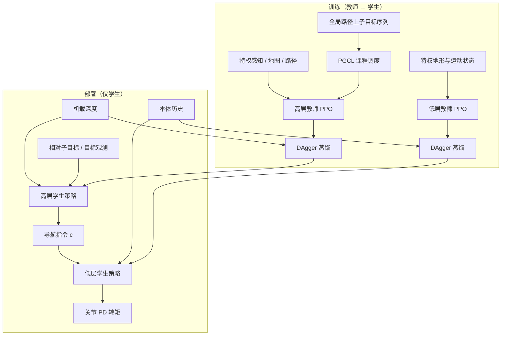

# HiPAN（Hierarchical Posture-Adaptive Navigation）

**HiPAN** 是面向**四足机器人**在**非结构化三维环境**（窄通道、限高、死胡同、半封闭房间）中的导航框架：部署时**不依赖显式三维地图**，仅用**机载深度**做感知，通过**分层强化学习**把“往哪走、身体缩多低”与“关节怎么动”拆开，并用 **Path-Guided Curriculum Learning（PGCL）** 让高层策略从短视界反应式行为过渡到长视界目标导向导航。

## 一句话定义

用高层策略在深度图像上生成**平面速度 + 体姿态（高度/横滚）**指令，由低层姿态自适应 locomotion 执行，再用**沿特权全局路径采样的子目标课程**训练高层，最后用 **DAgger** 把特权教师蒸馏成仅深度的学生策略。

## 为什么重要

- **算力与内存**：经典 mapping–planning 管线在资源受限平台上易累积感知误差且计算开销大；HiPAN 在部署端走“感知→指令→足式控制”的紧凑闭环。
- **3D 约束与导航耦合**：仅靠平面速度无法在限高/窄空间可靠通过；把**姿态自由度**纳入高层指令空间，使“找路”和“过得去”在同一接口里联合优化。
- **短视问题**：纯距离奖励的局部感知导航易陷入局部极小；PGCL 用**结构化子目标序列**提供任务相关的探索引导，而不是只有无方向的本征探索。

## 主要技术路线

1. **低层 posture-adaptive locomotion**：在特权地形与运动状态下用 PPO 训练教师，再蒸馏为仅本体历史 + 命令的学生（估计域潜变量与运动状态），输出关节增量经 PD 上力矩。
2. **高层局部感知导航**：教师用特权空间信息 + 嵌入的低层学生做闭环 PPO；学生仅用深度与相对子目标/目标，经 DAgger 模仿教师指令与空间潜变量。
3. **PGCL（Path-Guided Curriculum Learning）**：教师阶段沿全局路径生成子目标序列并从密到疏，扩展有效导航视界；地图与子目标不进入部署观测。
4. **Sim2Real 对齐**：域随机化 + 双阶段蒸馏，使机载深度与本体栈在仿真到真机间可迁移。

## 核心结构 / 机制

### 分层接口

低层命令向量 \(\boldsymbol{c} = [v_x, v_y, \omega_z, h, \theta_x]\)：前三项为机体坐标系平面速度，后两项为相对地面的目标体高与世界系横滚，用于钻缝、贴地等姿态调整。高层以固定频率更新 \(\boldsymbol{c}\)，低层输出关节目标（文中为 \(\Delta q\) 经 PD 转矩）。

### 训练范式（高低层对称）

- **教师**：特权状态 / 地形高度图等，PPO 训练。
- **学生**：本体历史（低层）或深度图像（高层），用 **DAgger** 回归教师动作及辅助隐变量（域潜变量、运动状态、空间感知潜变量等），便于 sim2real。
- **闭环训练**：高层 MDP 的转移中**嵌入低层学生策略**，使高层奖励反映真实跟踪误差与延迟。

### Path-Guided Curriculum Learning（PGCL）

在**教师训练阶段**沿特权全局路径按固定间距放置子目标；课程从密子目标开始，逐步稀疏直至仅保留终点。**地图与子目标不参与部署**，仅用于教师阶段的结构化监督与探索 shaping。

## 流程总览

## 常见误区或局限

- **PGCL 不是运行时规划器**：子目标与全局路径只在训练期作为特权信号；若误把“部署仍需要地图”当成方法前提，会误解系统边界。
- **与纯端到端导航的区别**：分层把低层巩固为可复用的足式控制器，高层专注语义较弱的“几何可行路径 + 姿态”，但接口设计（5 维命令）仍是强归纳偏置，换平台需重新训练低层。
- **仿真分布依赖**：环境用程序化生成（如 Wave Function Collapse 拼图式地形 + 随机障碍）；真机泛化仍需依赖域随机化与蒸馏链路的实际覆盖。

## 与其他页面的关系

- 与 **[Curriculum Learning](../concepts/curriculum-learning.md)**：PGCL 是**任务分解型**导航课程（子目标间距渐进），与地形难度课程互补。
- 与 **[Locomotion](../tasks/locomotion.md)**：低层本质是足式命令跟踪与姿态适应，属于 locomotion 在导航任务下的实例化。
- 与 **[Sim2Real](../concepts/sim2real.md)**、**[Privileged Training](../concepts/privileged-training.md)**、**[DAgger](./dagger.md)**：高低层均走 teacher–student 与蒸馏式闭合 sim2real 缺口。

## 关联页面

- [Locomotion](../tasks/locomotion.md)
- [Curriculum Learning](../concepts/curriculum-learning.md)
- [Sim2Real](../concepts/sim2real.md)
- [Privileged Training](../concepts/privileged-training.md)
- [Reinforcement Learning](./reinforcement-learning.md)
- [DAgger](./dagger.md)

## 参考来源

- [hipan（论文 ingest 档案）](../../sources/papers/hipan.md)

## 推荐继续阅读

- Jeong et al., *HiPAN: Hierarchical Posture-Adaptive Navigation for Quadruped Robots in Unstructured 3D Environments*（RA-L 2026，预印本：<https://arxiv.org/abs/2604.26504>）
- 项目页与实验视频：<https://sgvr.kaist.ac.kr/~Jeil/project_page_HiPAN/>
