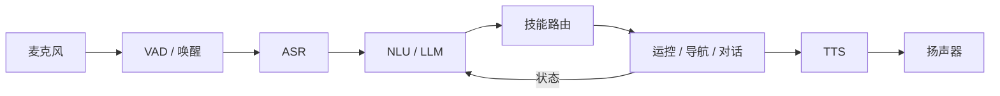

# 人形机器人智能语音交互

## 一句话定义

**人形智能语音交互**把 **语音识别、语言理解/大模型规划、技能或导航执行、语音合成** 串成可唤醒、可打断的闭环，使人形能用自然语言接受任务——课程第 8.2 节；Ch8 实践常与 [VLN](../tasks/vision-language-navigation.md) 组成「语音交互导航」。

## 英文缩写速查

| 缩写 | 英文全称 | 简要说明 |
|------|----------|----------|
| ASR | Automatic Speech Recognition | 语音 → 文本 |
| TTS | Text-to-Speech | 文本 → 语音 |
| NLU | Natural Language Understanding | 意图/槽位 |
| LLM | Large Language Model | 对话与任务规划 |
| VAD | Voice Activity Detection | 端点检测与打断 |
| VLN | Vision-Language Navigation | 视觉–语言导航下游 |
| Barge-in | Barge-in | 播放 TTS 时用户插话 |

## 为什么重要

- 「上大模型」若只有云端聊天窗口，没有 **ASR/TTS + 机器人动作 API**，不算系统课交付。
- 语音是非专业用户最自然的接口；必须与运控安全层共存（误唤醒不能导致冲刺）。
- 方法地图见 [大模型赋能人形](../overview/large-model-empowered-humanoids.md)。

## 主要技术路线

| 路线 | 理解层 | 执行层 | 适合 |
|------|--------|--------|------|
| 技能表 + 规则 NLU | 意图/槽位模板 | 预注册 API | 课程入门、可控 |
| LLM Tool-Calling | 多轮规划 | 白名单工具 | 复杂指令 |
| 语音 → VLN | 语言指令 | Nav2 / [NaVid](../entities/paper-vln-10-navid.md) | Ch8 实践 |
| 端到端语音策略（研究） | 音频条件策略 | 需强安全层 | 非课程默认 |

## 核心原理

### 关键设计点

1. **唤醒词 vs 持续听**：降低误触发；嘈杂场馆提高阈值。
2. **技能白名单**：LLM 只能调用已注册、已做限幅的动作（走、转、导航到点、挥手）。
3. **确认策略**：移动类指令二次确认或默认低速。
4. **Barge-in**：TTS 播放中检测人声，停止说话并重新识别。
5. **失败恢复**：ASR 低置信 → 「请再说一次」；技能失败 → 语音报错而非静默。

### 与导航的契约

| 用户话术 | 落地 |
|----------|------|
| 「去门口」 | 地标 → 位姿 → Nav2 / 行走速度接口 |
| 「向前走两米」 | 相对位移技能（需里程计） |
| 「看着黄球走过去」 | VLN / 检测 + 伺服，而非纯语音 |

底层接口见 [G1 软件栈](../entities/unitree-g1-software-stack.md)、[ROS 2 基础](../concepts/ros2-basics.md)。

## 工程实践

### 最小可运行系统（课程）

| 模块 | 可选实现 |
|------|----------|
| ASR | Whisper / 云 API |
| NLU | 正则槽位 或 小 LLM |
| TTS | 本地 eng/中文 TTS |
| 总线 | ROS 2 action / 宇树 SDK 服务 |
| 状态机 | idle → listening → acting → speaking |

### 延迟预算（经验）

| 段 | 目标量级 |
|----|----------|
| VAD+ASR | < 1 s（短指令） |
| NLU/LLM | < 1–2 s（本地小模型更稳） |
| 首包 TTS | < 0.5 s |
| 总和 | 对话体感 < 3 s 为佳 |

### 安全清单

- 急停硬件优先于语音。
- 移动中忽略「加速」类未确认指令。
- 记录审计日志（文本+技能）便于追责与调试。

## 局限与风险

- 工厂/赛场噪声使 ASR 掉字；回声消除与麦阵很关键。
- LLM 幻觉会生成不存在技能——必须接地白名单。
- **误区**：用开放互联网搜索当工具而不做过滤——人形上风险更高。
- 隐私：云 ASR 上传音频需合规。

## 关联页面

- [大模型赋能人形](../overview/large-model-empowered-humanoids.md)
- [Vision-Language Navigation](../tasks/vision-language-navigation.md)
- [NaVid](../entities/paper-vln-10-navid.md)
- [G1 软件服务栈](../entities/unitree-g1-software-stack.md)
- [人形系统课程策展](../entities/humanoid-system-curriculum.md)
- [人形语音交互流水线](../queries/humanoid-voice-interaction-pipeline.md) — 本方法的逐环工程落地（选型/坑/首查项）

## 参考来源

- [深蓝学院人形系统课程大纲](../../sources/courses/shenlan_humanoid_system_theory_practice.md)

## 推荐继续阅读

- Whisper / piper 等开源 ASR·TTS 组合示例
- 各家机器人「语音技能」中间件设计（技能清单 + 确认策略）
