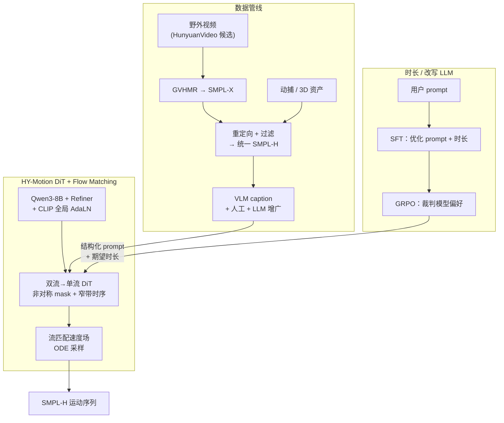

# HY-Motion 1.0（文本→3D 人体运动的规模化流匹配 DiT）

**HY-Motion 1.0**（Tencent Hunyuan 3D Digital Human Team，arXiv:2512.23464）面向 **文本描述 + 期望时长** 生成 **SMPL-H** 骨架上的 **3D 人体运动片段**。论文主张的差异化点在于：在 **人体 T2M** 领域首次把 **DiT + 流匹配** 推到 **>1B 参数**，并用 **「大规模预训练 → 高质量微调 →（DPO + Flow-GRPO）」** 的全阶段训练把 **指令跟随** 与 **运动质量** 同时拉高；配套数据管线把 **野外视频（GVHMR→SMPL-X）**、**动捕** 与 **3D 美术动作** 统一到同一表示与清洗规范。

## 一句话定义

**十亿级 DiT 流匹配生成器 + 独立时长/改写 LLM + 人类偏好与 Flow-GRPO 细化**，在统一 SMPL-H 数据与多级动作分类上实现开源 SOTA 级文本驱动人体运动合成。

## 为什么重要？

- **Scaling 证据**：把 **流匹配 + Transformer 扩散骨干** 在人体运动域做到 **B 级参数**，为「T2M 是否吃 scaling law」提供了正面样本，可与机器人侧 [Diffusion-based Motion Generation](./diffusion-motion-generation.md)、VLA 动作头等路线对照。
- **数据工程可复用**：从 **千万级视频候选** 到 **>3000h** 可用动作、再到 **~400h** 精修子集的路径（检测、重建、重定向、脚滑/异常过滤、VLM caption + 人工校验 + LLM 释义），与 **Sim2Real / 动捕资产入库** 的管线思维相通。
- **对齐栈完整**：在监督之外显式引入 **DPO（人类成对偏好）** 与 **Flow-GRPO（显式奖励）**，对应「似然最优 ≠ 观感最优」的常见生成模型痛点。
- **与机器人链路的接口**：输出为 **SMPL-H 时间序列**，便于经 [GMR](./motion-retargeting-gmr.md) 等管线映射到人形/游戏引擎执行器（仍需单独处理接触、平衡与执行器动力学）。

## 主要技术路线

1. **数据优先的 scaling**：海量视频 → 单人多段候选 → **GVHMR** 三维重建 → **SMPL-H 统一 + 强过滤** → VLM/人工/LLM 文本闭环，支撑 **>3000h** 预训练与 **~400h** 精修微调（与 [Contact Dynamics](../concepts/contact-dynamics.md) 所强调的足端物理不同，本工作优先覆盖与文本对齐的 **运动语义**）。
2. **生成骨干**：**DiT 双流–单流混合** + **流匹配速度场**（数学背景见 [Probability Flow](../formalizations/probability-flow.md)）+ **非对称跨模态注意力** 与 **窄带时序窗**，把 **Qwen3** 词级条件与 **CLIP** 全局条件分层注入。
3. **对齐与产品化接口**：**DPO** 吸收人类成对判断 → **Flow-GRPO** 用可微/可评分的显式目标继续细化；另训 **时长预测 + 提示改写 LLM** 把随意用户语言映射到训练域内的结构化指令与 clip 长度。

## 核心结构

### 1. 数据与标注

| 阶段 | 内容 |
|------|------|
| 采集 | 野外高质量视频（与 HunyuanVideo 管线衔接）、~500h 动捕与 3D 资产 |
| 重建 | 视频侧用 **GVHMR** 估计 **SMPL-X** 轨迹 |
| 统一 | 全量 **重定向到 SMPL-H（22 关节体，无手部）**；去重、姿态/速度/位移异常、静态段、脚滑等过滤 |
| 规范 | **30 fps**；**≤12s** 切段；canonical 坐标（Y-up、起点原点、初始朝 +Z） |
| 文本 | **VLM** 生成初稿 + 关键词；高质量子集 **人工纠错**；**LLM** 结构化与 **多措辞增广** |
| 分类 | 六级 **>200** 叶类别，顶层 6 大类（Locomotion / Sports / Fitness / Daily / Social-Leisure / Game character） |

### 2. 运动表示（每帧 201 维）

根平移、全局朝向（**6D 旋转**）、**21** 个关节局部旋转（各 6D）、**22** 个关节局部位置；与 **DART** 等动画友好表示更接近，**刻意不采用 HumanML3D 主流 263 维格式**，且 **不显式建模足接触 / 速度通道** 以换训练收敛。

### 3. HY-Motion DiT 主干

- **双流 → 单流**：先独立处理运动 latent 与文本 token，经 **联合注意力** 交互，再在单流中 **拼接** 后做深层融合（含并行 **空间/通道注意力** 设计）。
- **文本条件分层**：**Qwen3-8B** 提供 **token 级**语义；经 **Bidirectional Token Refiner** 缓解因果 LLM 特征对非自回归扩散的上下文不足；**CLIP-L** 提供 **全局**向量，与 **时间步嵌入** 一并通过 **AdaLN** 注入。
- **归纳偏置**：**非对称跨模态 mask**（运动可看全文文本，文本不看运动，避免噪声回灌）；运动支 **121 帧窄带**时序注意力（30 fps 下强调局部动力学）；**RoPE** 施加在 **文本+运动拼接序列** 上统一相对位置编码。
- **生成目标**：**流匹配** + **最优传输线性桥**（常数目标速度场），推理为 **ODE** 数值积分（如 Euler）。

### 4. 时长预测与提示改写

独立 **Qwen3-30B-A3B**：**SFT** 在「合成随意用户 prompt → 优化 prompt + 时长」三元组上监督；**GRPO** 阶段用更强模型作 **裁判** 强化 **语义忠实** 与 **时长物理可信**。

### 5. 训练阶段

1. **预训练**：全量 **>3000h** $\mathcal{D}_{\text{all}}$，标准流匹配损失，建立宽覆盖运动先验（允许噪声带来的高频抖动、脚滑等残留）。
2. **高质量微调**：**~400h** $\mathcal{D}_{\text{HQ}}$，学习率 **0.1×** 预训练，压artifact 并强化细粒度指令（如左右手区分）。
3. **RL 对齐**：先用 **DPO** 内化 **人类成对偏好**（从约 4 万对中筛 **9228** 高信息对）；再用 **Flow-GRPO** 优化 **显式物理/语义奖励**（流匹配模型上的 **组内相对优势** 归一化变体）。

## 流程总览（Mermaid）

## 常见误区

- **≠ 可直接驱动实机足式控制**：论文语境是 **数字人 / 动画级** 生成；落地机器人需 **物理约束、接触规划与低层跟踪**，参见 [Diffusion-based Motion Generation](./diffusion-motion-generation.md) 中的分布偏移讨论。
- **表示与 HumanML3D 不兼容**：若要对齐经典 T2M 基准，需要 **显式转换** 或重新训练评估头，不能假设 263 维接口即插即用。

## 关联页面

- [Diffusion-based Motion Generation](./diffusion-motion-generation.md) — 机器人侧扩散/流式轨迹生成的对照入口
- [GENMO（统一人体运动估计与生成）](./genmo.md) — 另一套「人体扩散大模型」多模态条件设计对照
- [Awesome Text-to-Motion（Zilize）](../entities/awesome-text-to-motion-zilize.md) — T2M 文献与数据集拓扑索引
- [Probability Flow](../formalizations/probability-flow.md) — 流匹配与连续归一化流基础
- [GMR: 通用动作重定向](./motion-retargeting-gmr.md) — 从人体 SMPL 系运动到机器人骨架的常见工程落点

## 参考来源

- [sources/papers/hy_motion_arxiv_2512_23464.md](../../sources/papers/hy_motion_arxiv_2512_23464.md)
- [sources/repos/tencent_hunyuan_hy_motion_1_0.md](../../sources/repos/tencent_hunyuan_hy_motion_1_0.md)

## 推荐继续阅读

- [HY-Motion 1.0 论文（arXiv:2512.23464）](https://arxiv.org/abs/2512.23464)
- [GitHub：Tencent-Hunyuan/HY-Motion-1.0](https://github.com/Tencent-Hunyuan/HY-Motion-1.0)
- [Hugging Face：tencent/HY-Motion-1.0](https://huggingface.co/tencent/HY-Motion-1.0)
