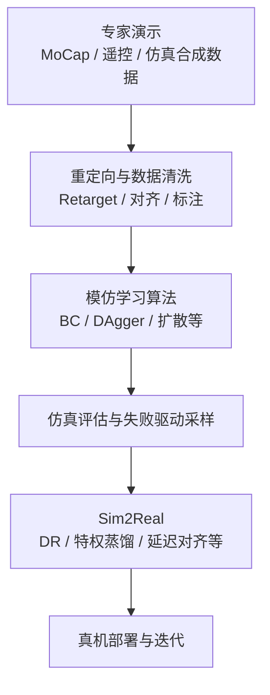

# Imitation Learning (IL, 模仿学习)

**模仿学习 (Imitation Learning)**：通过专家演示数据（**行为克隆**、**DAgger** 等），让机器人学会从状态到动作的映射，核心是“抄”。

## 一句话定义

让机器人看人类/专家怎么做，它就模仿着做。常用的核心算法包括 **DAgger (Dataset Aggregation)**、**行为克隆 (Behavior Cloning, BC)** 等。

## 为什么重要

- 纯 RL sample efficiency 低，训练慢。
- 很多任务难以定义 reward。
- 专家演示（行为克隆）提供了高质量数据，可以快速初始化策略。

## 从演示到部署的流程总览



## 主要分类

### 1. 行为克隆 (Behavior Cloning, BC)

最简单的模仿学习 (IL)：把专家数据当监督学习做。参见 [Behavior Cloning with Transformer](./bc-with-transformer.md)。

### 2. DAgger (Dataset Aggregation)
...
有效缓解行为克隆的分布偏移问题。

### 3. DMP (Dynamic Movement Primitives)

轨迹级模仿学习的经典工具，见 [Dynamic Movement Primitives (DMP)](./dmp.md)。它通过二阶微分方程描述运动，具有良好的自适应性。

### 3. GAIL（Generative Adversarial Imitation Learning）

用 GAN 思想：

- 判别器：区分专家数据 vs 策略数据
- 生成器（策略）：试图骗过判别器

让策略在 reward signal 上接近专家，不需要显式 reward。

### 4. 基于重建的方法

先从演示中提取隐表示或技能 latent，再用于控制。

代表：ASE, CALM, Motion Encoder

## 和强化学习的关系

| | 模仿学习 | 强化学习 |
|--|---------|---------|
| 数据来源 | 专家演示 | 环境交互 |
| 样本效率 | 高 | 低 |
| 可超越专家 | 难 | 可以 |
| Reward 设计 | 不需要 | 需要 |
| 适用范围 | 有专家数据的任务 | 任意可定义 reward |

常见组合策略：
- **IL 初始化 + RL 微调**：先用 IL 训一个不错的初始策略，再用 RL 探索超越专家
- **IL + RL 混合**：如 GAIL 本身就是 IL 和 RL 的混合

## 在人形机器人中的应用

典型 pipeline：

```
专家演示（MoCap/遥控/CLAW合成）→ 动作重定向（Retarget）→ 模仿学习训练（robot_lab/legged_gym）→ Sim2Real部署
```

网络结构（层数、宽度、是否判别器 / Transformer / chunk）在论文 Method 中通常有明确表格；可按 [人形与腿式策略的网络架构](../concepts/humanoid-policy-network-architecture.md) 对照阅读。

代表工作：
- [deepmimic](deepmimic.md)：基于轨迹跟踪的显式模仿
- BeyondMimic：强调精确物理建模与失败驱动采样的模仿学习基座
- HumanX：引入接触图 (Contact Graph) 与多教师蒸馏，解决风格模仿与外力估计
- Any2Track：结合历史编码器与世界模型，实现对动态扰动的自适应动作模仿
- AMS (Adaptive Motion Synthesis)：通过物理可行性过滤与混合奖励机制，生成并学习平衡动作
- Switch：引入增强技能图与缓冲节点，实现敏捷技能间的 100% 稳健切换
- HAIC：引入世界模型的教师-学生两阶段训练，用于物体交互任务
- [ase](ase.md)：对抗技能嵌入
- CALM：latent 方向控制
- CLAW：宇树 G1 的模块化语言-动作数据生成管线
- HTD：在人形接触丰富型移动操作中，把未来手部力与触觉 latent 预测作为行为克隆辅助目标，解决“有触觉输入但策略未必会用触觉”的问题
- [HumanNet](../entities/humannet.md)：互联网级 **人中心** 视频语料（论文宣称约百万小时）与交互导向标注管线，可作为「人类侧大规模演示」与 VLA 持续预训练的数据基础设施参照（与真机日志互补，不等价替代物理闭环）

## 常见问题

- **Retarget 误差**：MoCap 动作不一定适配机器人身体结构
- **分布偏移**：训练分布和真实部署差异
- **技能组合**：如何把多个独立技能串成复杂长序列

## 参考来源
- [KungFuAthleteBot](../../sources/papers/kung_fu_athlete_bot.md)

- Ross et al., *A Reduction of Imitation Learning and Structured Prediction to No-Regret Online Learning* — DAgger 原论文
- Chi et al., *Diffusion Policy: Visuomotor Policy Learning via Action Diffusion* — 生成式 IL 代表工作
- [sources/papers/imitation_learning.md](../../sources/papers/imitation_learning.md) — DAgger / ACT / Diffusion ingest 摘要
- [sources/papers/humanoid_touch_dream.md](../../sources/papers/humanoid_touch_dream.md) — HTD / Touch Dreaming ingest 摘要
- [sources/papers/humannet.md](../../sources/papers/humannet.md) — HumanNet 百万小时人中心视频与 VLA 受控预训练叙事
- [sources/papers/learn_weightlessness.md](../../sources/papers/learn_weightlessness.md) — Learn Weightlessness (WM) ingest 摘要
- [sources/blogs/claw_unitree_g1_language_annotated_motion_data.md](../../sources/blogs/claw_unitree_g1_language_annotated_motion_data.md) — CLAW 数据生成管线资料
- [sources/repos/robot_lab.md](../../sources/repos/robot_lab.md) — robot_lab RL 训练框架资料
- [Xbotics-Embodied-Guide](../../sources/repos/xbotics-embodied-guide.md) — 任务驱动的工程实践路径与 LeRobot 应用
- [Imitation Learning 论文导航](../../references/papers/imitation-learning.md) — 论文集合
- [机器人论文阅读笔记：DeepMimic](https://imchong.github.io/Humanoid_Robot_Learning_Paper_Notebooks/papers/01_Foundational_RL/DeepMimic_Example-Guided_Deep_RL_of_Physics-Based_Character_Skills/DeepMimic_Example-Guided_Deep_RL_of_Physics-Based_Character_Skills.html)
- [机器人论文阅读笔记：ASE](https://imchong.github.io/Humanoid_Robot_Learning_Paper_Notebooks/papers/01_Foundational_RL/ASE_Adversarial_Skill_Embeddings_for_Large-Scale_Motion_Control/ASE_Adversarial_Skill_Embeddings_for_Large-Scale_Motion_Control.html)
- [机器人论文阅读笔记：CALM](https://imchong.github.io/Humanoid_Robot_Learning_Paper_Notebooks/papers/01_Foundational_RL/CALM_Conditional_Adversarial_Latent_Models_for_Directable_Virtual_Characters/CALM_Conditional_Adversarial_Latent_Models_for_Directable_Virtual_Characters.html)
- [机器人论文阅读笔记：Diffusion Policy](https://imchong.github.io/Humanoid_Robot_Learning_Paper_Notebooks/papers/01_Foundational_RL/Diffusion_Policy/Diffusion_Policy.html)

## 关联页面
- [深度学习基础](../concepts/deep-learning-foundations.md)

- [Reinforcement Learning](./reinforcement-learning.md)
- [Whole-Body Control](../concepts/whole-body-control.md)
- [Locomotion](../tasks/locomotion.md)
- [Sim2Real](../concepts/sim2real.md)
- [Foundation Policy（基础策略模型）](../concepts/foundation-policy.md)
- [Behavior Cloning](./behavior-cloning.md) — 最基础的离线监督式 IL 基线
- [CLAW (宇树 G1 全身动作数据生成管线)](./claw.md) — 通过 MuJoCo 仿真和组合原子动作快速生成带语言标签的专家数据
- [Humanoid Transformer with Touch Dreaming](./humanoid-transformer-touch-dreaming.md) — 用未来触觉 latent 预测增强人形接触丰富型操作的行为克隆策略
- [robot_lab](../entities/robot-lab.md) — 提供高效 IL/RL 任务开发环境的扩展框架
- [LeRobot](../entities/lerobot.md) — Hugging Face 开发的具身智能全栈框架
- [DAgger](./dagger.md) — 用专家回标策略访问到的状态，缓解 covariate shift
- [VLA](./vla.md) — 把语言、视觉与动作统一进多模态模仿学习 / foundation policy 路线
- [HumanNet](../entities/humannet.md) — 大规模人中心视频语料与跨本体迁移的数据侧参照
- [RL vs Imitation Learning](../comparisons/rl-vs-il.md)（两大策略学习路线的系统性对比）
- [Motion Retargeting](../concepts/motion-retargeting.md) — MoCap 数据需经过 Motion Retargeting 才能作为 IL 的参考轨迹
- [MimicKit](../entities/mimickit.md) (Xue Bin Peng 团队开发的模块化运动控制框架)
- [ProtoMotions](../entities/protomotions.md) (NVIDIA 开发的高性能仿真与控制框架，支持超大规模并行训练)
- [BeyondMimic](./beyondmimic.md) — 强调精确物理建模的人形动作模仿框架
- [SMP](./smp.md) (基于得分匹配的运动先验)
- [ADD](./add.md) (对抗性微分判别器，消除运动伪影)
- [LCP](./lcp.md) (Lipschitz 约束策略，提升控制鲁棒性)
- [AWR](./awr.md) (优势加权回归，简单高效的离策学习)
- [DeepMimic](./deepmimic.md) (经典的显式轨迹跟踪模仿学习)
- [Learn Weightlessness](../../sources/papers/learn_weightlessness.md) — 针对非自稳定运动的失重模仿机制
- [ASE](./ase.md) (对抗性技能嵌入)
- [Any2Track](./any2track.md) — 结合历史编码器与世界模型的自适应动作模仿
- [AMP Reward (HumanX)](./amp-reward.md) — 引入接触图与判别器奖励的风格模仿
- [AMS](./ams.md) — 物理可行性过滤与混合奖励机制
- [HAIC](./haic.md) — 基于世界模型的教师-学生训练范式

## 推荐继续阅读

- [Imitation Learning 论文导航](../../references/papers/imitation-learning.md)
- [Diffusion Policy (Blog)](https://diffusion-policy.cs.columbia.edu/)（当前 IL 方向最活跃的生成式路线）
- Ross et al., *A Reduction of Imitation Learning and Structured Prediction to No-Regret Online Learning*（DAgger 原论文）
- Peng et al., *AMP: Adversarial Motion Priors for Style-Preserving Physics-Based Humanoid Motion Synthesis*（IL + RL 融合路线）

## Weightlessness Mechanism (WM)

针对非自稳定（non-self-stabilizing, NSS）运动（如坐下、躺下、靠墙），研究表明，过度严格的轨迹跟踪会阻碍机器人与环境建立稳定的接触。**Learn Weightlessness** (Xin et al., 2026) 提出通过模仿人类在 NSS 运动中的“失重”状态——选择性地放松特定关节，从而允许被动的身体-环境接触，最终实现运动的稳定。

该方法设计了：
1. **失重状态自动标注策略**：从单演示数据中自动标注“失重”标签。
2. **失重机制 (Weightlessness Mechanism, WM)**：通过网络输出动态决定哪些关节需要放松以及放松的程度（即输出 PD 增益的调节系数），从而在执行目标运动时实现有效的环境交互。

WM 无需针对特定任务进行微调，且能在不同环境配置（如不同高度的椅子、不同倾角的床）中展现出强泛化能力。
