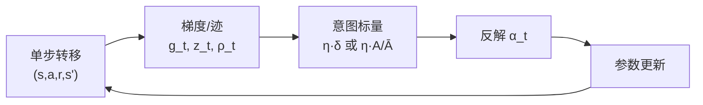

# Intentional Updates for Streaming RL（意图更新与流式强化学习）

意图更新（intentional updates）指：不显式固定「参数空间步长」，而是先规定**当前这一步在关心的输出量**（价值预测、动作 log-probability 等）上希望达到的变化，再用局部线性近似**反解**标量学习率 $\alpha_t$，使深度 RL 在**流式设定**（连续单样本、无 replay buffer、无 minibatch 平均）下仍能获得可控的每步更新幅度。数学上仍是在 [MDP](../formalizations/mdp.md) 上做控制与预测；bootstrap 目标与误差的收缩可对照 [Bellman 方程](../formalizations/bellman-equation.md) 视角理解。

## 一句话定义

别问「权重走了多远」，问「价值/策略输出这一步想改多少」——用输出单位的意图反推步长，缓解流式深度 RL 里梯度尺度乱跳带来的不稳定。

## 为什么重要

- 机器人仿真里主流 pipeline 依赖 **大批并行环境 + PPO/SAC 的 minibatch**，隐式用批量平均压低梯度方差；若关心 **真机或边跑边学、严格单样本更新**（无 replay），同一套固定学习率往往脆。
- 与 **NLMS（Normalized Least Mean Squares）** 同族：在自适应滤波里用归一化步长控制**输出误差**的收缩比例，而不是只缩放权重向量。
- 与 **PPO / TRPO** 的「限制策略变化」目标同向，但本文给出的是**在线、无批**的轻量代理：用采样动作的 $\Delta\log\pi$ 控制局部行为变化，而不是依赖大批量 KL 估计。

## 主要技术路线

1. **价值预测（policy evaluation）**：半梯度 TD($\lambda$) + eligibility traces，用 **Intentional TD** 把「当前 TD 误差在近期各状态预测上的折扣 RMS 变化」锁到与 $|\delta_t|$ 成比例；配合 RMSProp 式 $\boldsymbol{\rho}_t$ 处理各层梯度尺度差。
2. **离散动作控制**：在 Q 参数化上套用同一意图模式得到 **Intentional Q($\lambda$)**。
3. **连续策略优化**：likelihood-ratio 方向 + **Intentional Policy Gradient**，用 $\Delta\log\pi$ 意图提供与信任域同向的流式约束；优势尺度与 [GAE](./gae.md) 所在的多步信用分配语境衔接。
4. **稳健性细节**：对 $\delta_t$、$A_t$ 的 clip、分母 $\epsilon$-floor、Cauchy–Schwarz 保守界等工程处理与官方 [Intentional_RL](../../sources/repos/intentional_rl.md) 算法伪代码一致。

与纯**函数逼近**稳定性相关的一般讨论，可对照 [深度学习基础](../concepts/deep-learning-foundations.md) 中的非线性表示与梯度病态问题。

## 流式设定与问题陈述

**流式 RL**：按时间顺序处理转移 $(s_t,a_t,r_t,s_{t+1})$，不保存历史 transition 供重复采样（可与 on-policy 不同：这里强调 **无 replay 的纯在线**）。此时 successive per-sample 梯度在范数与方向上变化剧烈，固定 $\alpha$ 易导致过冲/欠冲交替，训练失败；文献中也把深度 RL 在此设定下的困难概括为 **stream barrier** 类现象。

单步更新的抽象形式：

$$
\mathbf{w}_{t+1} = \mathbf{w}_t + \alpha_t\, \mathbf{d}_t
$$

其中方向 $\mathbf{d}_t$ 来自 TD 或策略梯度规则；**意图更新**只负责选 $\alpha_t$，使标量目标 $y_t(\mathbf{w})$ 近似满足 $y_t(\mathbf{w}_{t+1}) \approx y_t(\mathbf{w}_t) + \Delta_t$。

## 核心机制（三条算法线）

### 1. Intentional TD / Intentional Q-learning

- **意图（价值）**：令当前预测沿一步更新近似按固定比例 $\eta$ 吃掉 TD 误差：$V_{\mathbf{w}_{t+1}}(s_t) \approx V_{\mathbf{w}_t}(s_t) + \eta\,\delta_t$（Q 学习时对 $Q(s_t,a_t)$ 同理）。
- **步长（无 trace、一阶近似）**：当更新方向与 $\nabla V_{\mathbf{w}_t}(s_t)$ 对齐时，$\alpha_t \propto \eta / \|\nabla V_{\mathbf{w}_t}(s_t)\|_2^2$，梯度平坦处步长自动变大、陡峭处变小。
- **对角预条件（RMSProp 风格）**：各坐标梯度尺度差几个数量级时，用 $\boldsymbol{\rho}_t$ 做逐维缩放，再在缩放后的内积上解 $\alpha_t$。
- **Eligibility traces TD($\lambda$)**：单步更新会通过 $\mathbf{z}_t$ 牵动**历史上多个状态**的预测，意图需定义为**折扣加权的近期预测 RMS 变化**与 $|\delta_t|$ 成比例；由此得到的保守公式避免「用 $\langle \boldsymbol{\rho}_t \mathbf{z}_t, \mathbf{z}_t\rangle$  naive 归一化」导致 trace 越长更新反而越小的错误缩放。

### 2. Intentional Policy Gradient

- **意图（策略）**：无与 bootstrap target 对齐的标量误差；改为控制采样动作上 **log-probability 的增量** $\Delta\log\pi_t$，使其与 advantage 成比例，并用运行尺度 $\bar{A}_t$ 归一化 $|A_t|$，让长期典型的策略位移幅度稳定在超参 $\eta$ 附近。
- **与信任域的关系**：小步下，状态条件 KL 与 $\mathbb{E}[(\Delta\log\pi)^2]$ 同阶；控制 $\Delta\log\pi$ 是 PPO 式「别一次改太狠」的流式廉价代理（非精确 KL 投影）。

### 3. 实现共性（论文 Algorithm 1–3）

维护 trace $\mathbf{z}_t$、二阶矩向量 $\boldsymbol{\nu}_t$、折扣累积 $\bar{\sigma}_t$ 等统计量；每步计算信号（$\delta_t$ 或 $A_t$）、预条件方向 $\boldsymbol{\rho}_t \mathbf{z}_t$，再用对应意图公式求 $\alpha_t$。可对 $\delta_t$ / $A_t$ 做 **clip** 以抑制罕见大 TD 异常值。

## 流程总览（流式一步）

## 与其他路线的关系

| 维度 | 大批 PPO/SAC + replay | Intentional streaming |
|------|----------------------|------------------------|
| 方差抑制 | minibatch / replay 平均 | 输出空间步长 + 对角归一 + trace 保守界 |
| 策略约束 | KL / clip 在批上估计 | 采样 $\Delta\log\pi$ 意图 |
| 非平稳目标 | 批内近似 i.i.d. | 强调 **稳定跟踪** 而非固定分布不动点 |

与 [LWD](./lwd.md) 等 **offline-to-online** 框架不同：LWD 仍依赖（车队级）replay；本文聚焦 **完全不存 transition** 的极端流式设定，解决的是优化器层面的每步尺度问题，而不是数据飞轮工程。

## 常见误区

- **误区：意图更新替换了 TD 或策略梯度的方向。** 实际上只替换**标量步长**；方向仍由半梯度 TD、likelihood-ratio PG、trace 与 RMSProp 预条件决定。
- **误区：trace 下把 TD(0) 的步长公式直接套在 $\mathbf{z}_t$ 上。** 论文指出 naive 扩展会破坏与 $\lambda$ 一致的误差传播尺度；必须用聚合意图式（论文式 (9)(12) 一类）。

## 在机器人研究中的位置

- **仿真主训**：多数团队仍用并行环境与 replay；意图更新不是默认替换项，而是 **流式 / 极低内存 / 理论对照** 场景的工具箱。
- **边部署边学**：若系统约束禁止存 replay（隐私、存储、硬实时），可参考该线的**步长构造**与 **clip + 对角预条件** 实践。
- **与 Sim2Real**：不直接解决域隙，但降低「单步更新炸掉价值/策略头」的风险，有利于长程在线微调稳定性（需与任务层保守探索与安全滤波配合）。

## 参考来源

- [sources/papers/intentional_streaming_rl.md](../../sources/papers/intentional_streaming_rl.md) — 论文 ingest 档案（摘录与 wiki 映射）
- [sources/repos/intentional_rl.md](../../sources/repos/intentional_rl.md) — 官方代码仓库归档
- Sharifnassab et al., *Intentional Updates for Streaming Reinforcement Learning* — arXiv:2604.19033v1，<https://arxiv.org/pdf/2604.19033v1>

## 关联页面

- [Reinforcement Learning](./reinforcement-learning.md)
- [Policy Optimization](./policy-optimization.md)
- [Online RL vs Offline RL](../comparisons/online-vs-offline-rl.md)
- [PPO vs SAC](../comparisons/ppo-vs-sac.md)
- [Generalized Advantage Estimation (GAE)](./gae.md)
- [MDP](../formalizations/mdp.md)
- [Bellman 方程](../formalizations/bellman-equation.md)
- [深度学习基础](../concepts/deep-learning-foundations.md)

## 推荐继续阅读

- Sutton & Barto, [*Reinforcement Learning: An Introduction*](http://incompleteideas.net/book/the-book-2nd.html) — TD($\lambda$) 与 eligibility traces 标准参考
- Schulman et al., [*Proximal Policy Optimization Algorithms*](https://arxiv.org/abs/1707.06347) — 批式信任域与 clip 的经典对照
- Elsayed et al., *Streaming Deep Reinforcement Learning* — 与「stream barrier」相关的先行讨论（见 arXiv:2604.19033 引用语境）
