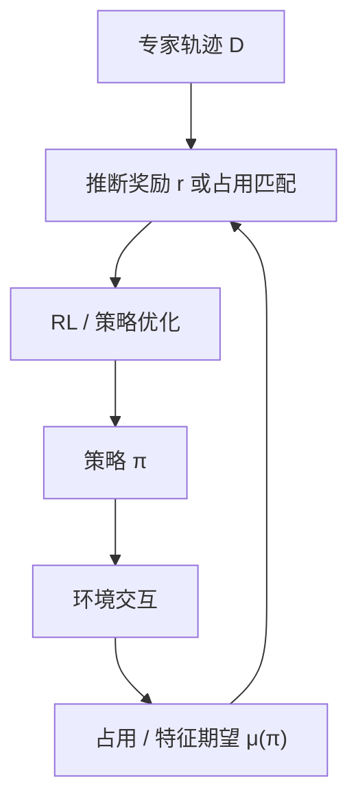
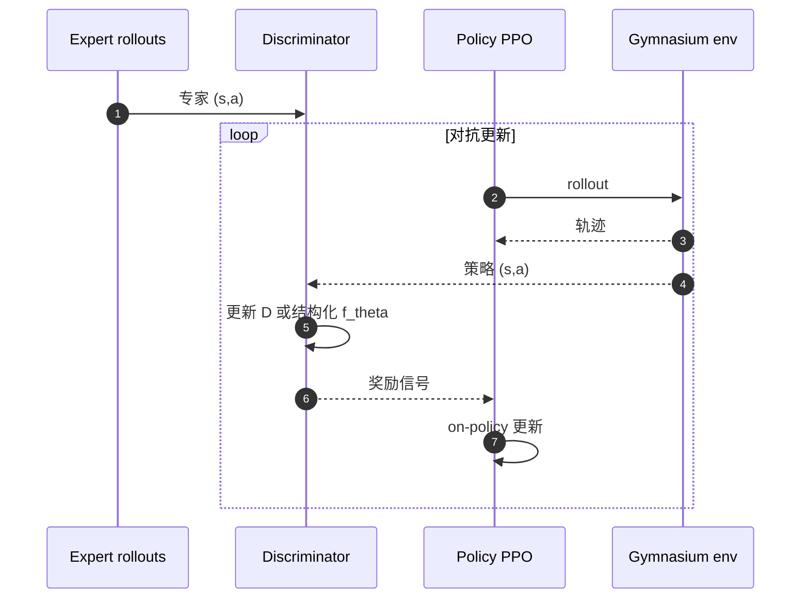

# Inverse Reinforcement Learning（IRL, 逆强化学习）

**逆强化学习**：在 [MDP](../formalizations/mdp.md) 已知或可交互、奖励未知时，从专家（近）最优行为反推 $r$，再把 $r$ 交给 [强化学习](./reinforcement-learning.md) 得到策略。它不是行为克隆的变体，而是「演示 → 奖励 → 策略」的间接模仿。

## 一句话定义

给定专家怎么做，推断他在优化什么奖励；学到的 $r$ 可以再优化、换动力学，而不只是复述专家动作。

## 英文缩写速查

| 缩写 | 英文全称 | 简要说明 |
|------|----------|----------|
| IRL | Inverse Reinforcement Learning | 从演示推断奖励函数的问题与算法族 |
| IOC | Inverse Optimal Control | 控制论侧的逆最优控制，与 IRL 同源 |
| MaxEnt | Maximum Entropy IRL | 用最大熵选定轨迹分布，处理噪声与次优演示 |
| GAIL | Generative Adversarial Imitation Learning | 对抗占用匹配；最优时判别器不可当奖励复用 |
| AIRL | Adversarial Inverse Reinforcement Learning | 结构化判别器，目标是可迁移的 disentangled 奖励 |
| GCL | Guided Cost Learning | 未知动力学下用策略优化做采样式深度 IOC |
| AMP | Adversarial Motion Prior | 人形/角色控制里 GAIL 式风格奖励的工程后代 |
| BC | Behavior Cloning | 直接监督 $s\mapsto a$，不恢复 $r$ |

## 为什么重要

- **奖励往往比策略更难写、却更可迁移。** 公路驾驶、精细操作、「像人」的全身运动都是多项权衡；人能示范，却给不出稳定的数值 $r$。Abbeel & Ng (2004) 把这件事写成学徒学习的动机，至今仍是机器人 IRL 的入口叙事。
- **直接模仿有覆盖边界。** [BC](./behavior-cloning.md) 在专家状态分布上拟合动作，部署一偏就 compounding error；[DAgger](./dagger.md) 用在线回标补分布，但仍需要专家。IRL 学的是轨迹级目标，理论上可在未见状态上由 RL 再规划。
- **「学奖励」和「学策略」不是一回事。** GAIL 证明可以绕过显式 IRL 内环去做占用匹配；AIRL 证明若目标是 **换环境再优化**，必须把奖励从塑形项和优势函数里拆出来。人形栈里的 [AMP](./amp-reward.md) 站在 GAIL 这一侧：要风格信号，不要可迁移任务奖励。
- **站内缺口。** IL / RL / AMP 页都提到 GAIL，但没有一页讲 IRL 的退化性、特征期望匹配与 MaxEnt。本页补这条主线。

## 主要技术路线

### 问题形式化

MDP 去掉奖励后记为 MDP$\setminus R$。专家给出轨迹（或策略）。IRL 求 $r$，使得专家在 $r$ 下（近）最优：

$$r^* \in \arg\max_{r} \; \mathbb{E}_{\tau\sim\pi_E}\Big[\sum_t \gamma^t r(s_t,a_t)\Big] - \max_{\pi} \mathbb{E}_{\tau\sim\pi}\Big[\sum_t \gamma^t r(s_t,a_t)\Big]$$

Russell (1998) 提出问题；Ng & Russell (2000) 给出有限状态 LP、线性函数近似、以及只观测有限轨迹三种算法。

### 退化性：许多奖励解释同一策略

$r\equiv 0$ 总是解。Ng, Harada & Russell (1999) 进一步给出策略不变的塑形类：

$$\hat r(s,a,s') = r(s,a,s') + \gamma\Phi(s') - \Phi(s)$$

未知动力学时，这是保持最优策略不变的变换类。IRL 若随便拟合，学到的常常是 **被当前 $T$ 塑过形的优势/价值**，换动力学就失效。这是 AIRL 要 disentangle 的对象，也是 [奖励设计](../concepts/reward-design.md) 里 potential-based shaping 的同一公式。

### 特征期望匹配（学徒学习）

Abbeel & Ng (2004) 假设 $r(s)=w\cdot\phi(s)$，比较策略与专家的

$$\mu(\pi)=\mathbb{E}\Big[\sum_{t=0}^{\infty}\gamma^t\phi(s_t)\Big]$$

**不必恢复真实 $w^*$。** 只要 $\|\mu(\tilde\pi)-\mu_E\|_2\le\varepsilon$，则对任意 $\|w\|_1\le 1$ 的线性奖励，回报差距 $\le\varepsilon$。工程含义：匹配占用/特征统计，就能在「专家所关心的那组特征」上接近专家，哪怕 $w$ 不唯一。

### 最大熵：选定一条轨迹分布

特征匹配仍有多解。Ziebart et al. (2008) 在匹配约束下最大化熵：

$$P(\tau) \propto \exp\big(R(\tau)\big) = \exp\Big(\sum_t r(s_t,a_t)\Big)$$

全局归一化给出噪声演示上的良定义似然，并支持从部分轨迹推断目的地（出租车导航）。最大因果熵（Ziebart 2010）把同一思想接到随机策略，成为后续对抗 IRL 的概率底座。

### 深度与对抗：未知动力学

| 方法 | 学什么 | 动力学 | 机器人含义 |
|------|--------|--------|------------|
| Deep MaxEnt (2015) | 神经网络代价 | 仍需可解占用 | 证明深度函数近似可行，规模不够 |
| GCL (2016) | 非线性代价 + 策略 | 未知；策略当采样器 | 真机力矩操作上的采样式 IOC |
| GAIL (2016) | 策略（占用匹配） | model-free 交互 | 高维控制模仿强；**奖励不可复用** |
| AIRL (2018) | 结构化 $r(s)$ + 价值塑形 | model-free 交互 | 换动力学再优化时优于 GAIL/GCL |

GAIL 把「IRL 再 RL」压缩成 GAN：判别器看 $(s,a)$ 来自专家还是策略。最优时 $D\approx 1/2$，不能当新任务的 $r$。AIRL 把判别器写成

$$D_\theta(s,a)=\frac{\exp\{f_\theta(s,a)\}}{\exp\{f_\theta(s,a)\}+\pi(a|s)}$$

并令 $f_\theta(s,a)=r_\theta(s)+\gamma V_\phi(s')-V_\phi(s)$，让 $V$ 吸收塑形，留下更接近状态奖励的 $r_\theta(s)$。

### 流程总览



BC 走 `D → π` 的捷径；IRL 多一圈 `D → r → π`，贵在内环 RL，换来可再优化的目标。GAIL 把内环藏进对抗更新，外观仍是模仿 Runner，但不再输出可迁移 $r$。

## 工程实践

### 怎么选：BC / DAgger / IRL / AMP

| 目标 | 优先 | 不要误用 |
|------|------|----------|
| 尽快复现演示动作 | [BC](./behavior-cloning.md) / [Diffusion Policy](./diffusion-policy.md) | 为「学奖励」上 IRL 内环 |
| 纠部署分布偏移，且请得动专家 | [DAgger](./dagger.md) | 用离线 IRL 代替在线回标 |
| 要 **可迁移 / 可再优化** 的任务奖励 | AIRL / MaxEnt（有模型时） | 把 GAIL 判别器当 $r$ 部署到新动力学 |
| 只要「像 MoCap」的风格项，任务奖励另写 | [AMP](./amp-reward.md) | 指望 AMP 恢复任务意图 |
| 奖励能手写且仿真便宜 | 直接 [RL](./reinforcement-learning.md) | 用 IRL 给本可手写的项 |

2024–2026 操作主线是 BC / ACT / Diffusion，不是 IRL。IRL 仍出现在：**意图推断**、**奖励迁移**、对抗风格先验（AMP 族）、以及把世界模型当奖励的工作（索引级节点 [IRL-VLA](../entities/paper-sa-2508-06571-irl-vla-training-an-vision-language-action-polic.md)）。

### 可运行入口（步骤 2.5）

优先 [HumanCompatibleAI/imitation](https://github.com/HumanCompatibleAI/imitation)（MIT，PyTorch，Gymnasium）：

```text
pip install imitation
python -m imitation.scripts.train_rl with pendulum ...
python -m imitation.scripts.train_adversarial gail with pendulum demonstrations.path=...
python -m imitation.scripts.train_adversarial airl with pendulum demonstrations.path=...
```

模块对照：`algorithms.mce_irl`（最大因果熵，**仅离散**）、`algorithms.gail`、`algorithms.airl`。文档与 CLI 见 [repos 归档](../../sources/repos/humancompatibleai-imitation.md)。

论文官方仓仅作溯源，不推荐新实验：

- GAIL：[openai/imitation](https://github.com/openai/imitation) MIT，**已归档**（2018）
- AIRL：[justinjfu/inverse_rl](https://github.com/justinjfu/inverse_rl) MIT，TF1 时代（2018）
- GCL：无独立官方仓；[cbfinn/gps](https://github.com/cbfinn/gps) 是 GPS 不是 GCL

### 源码运行时序图

对应 `imitation.scripts.train_adversarial` 的 GAIL/AIRL 闭环（节点对齐 README / `algorithms.gail` / `algorithms.airl`）：



GAIL 的奖励来自无结构 $D$；AIRL 从 $f_\theta$ 取 $r$，并单独更新 $V_\phi$。MCE-IRL 不走对抗，而是在离散占用上做似然，见 `algorithms.mce_irl`。

### 调试时看什么

- **特征 / 占用差距** $\|\mu(\pi)-\mu_E\|$：学徒学习的合法停机条件，不是「奖励长得像专家口头描述」。
- **判别器准确率**：长期停在 0 或 1 说明对抗崩了；GAIL 收敛时本应靠近 0.5。
- **原环境回报 vs 迁移回报**：只有后者才能声称「学到了奖励」。AIRL 论文的卖点是换 $T$ 再优化，不是原 MDP 上压过 GAIL。
- **奖励是否吃进动力学**：若 $r(s,a)$ 在新 $T$ 下立刻鼓励模仿旧优势，就是塑形纠缠，不是任务奖励。

## 局限与风险

- **内环 RL 贵。** 经典 IRL 每更新一次 $r$ 都要解一遍 MDP。对抗法把内环摊进策略梯度，但不消除交互成本。
- **专家次优与覆盖不足。** MaxEnt 容忍噪声，不创造未见技能；演示没去过的区域，$r$ 外推无保证。
- **把 GAIL 当 IRL。** 占用匹配成功 ≠ 学到奖励。新场景、新动力学、新初始分布时，应换 AIRL 或显式 MaxEnt，或干脆重新 BC。
- **不是 2026 操作默认栈。** 高维视觉动作更常走生成式 BC。IRL 用在「需要 $r$ 本身」的地方：迁移、解释、与任务奖励拼接的风格项。
- **奖励黑客仍在。** 学到的 $r$ 同样可被钻空；只是空从手写项换成了演示统计的漏洞。

## 关联页面

- [Imitation Learning](./imitation-learning.md) — BC / DAgger / GAIL 总览；本页补「先学 $r$」那一支
- [Behavior Cloning](./behavior-cloning.md) — 直接 $s\mapsto a$，不恢复奖励
- [DAgger](./dagger.md) — 在线补分布，不推断 $r$
- [Behavior Cloning Loss](../formalizations/behavior-cloning-loss.md) — BC 的数学缺陷为何导向 IRL
- [Reinforcement Learning](./reinforcement-learning.md) — IRL 内环与学成后的再优化
- [Reward Design](../concepts/reward-design.md) — 手写 $r$ 与从演示学 $r$ 对照；含同一套势函数塑形
- [AMP Reward](./amp-reward.md) — 对抗风格奖励，GAIL 在运动控制中的后代
- [RL vs IL](../comparisons/rl-vs-il.md) — 两条主干；IRL 是中间层
- [RL Runner](../concepts/rl-runner.md) — Imitation Runner 上的 GAIL/AIRL 循环
- [过程奖励建模](../concepts/progress-reward-modeling.md) — 另一种学奖励：进度/偏好，而非专家最优似然
- [IRL-VLA](../entities/paper-sa-2508-06571-irl-vla-training-an-vision-language-action-polic.md) — 用奖励世界模型训 VLA 的策展索引节点
- [Gymnasium](../entities/gymnasium.md) — `imitation` 库的环境 API

## 参考来源

- [IRL 一手论文索引](../../sources/papers/inverse_reinforcement_learning_primary_refs.md) — Russell 1998 → Ng 2000 → Abbeel 2004 → MaxEnt → GCL / GAIL / AIRL
- [HumanCompatibleAI/imitation 仓库归档](../../sources/repos/humancompatibleai-imitation.md) — 现代可运行实现与开源核查
- [Imitation Learning 论文摘录](../../sources/papers/imitation_learning.md) — BC / DAgger 对照

## 推荐继续阅读

- Ng & Russell, *Algorithms for Inverse Reinforcement Learning*（ICML 2000）— 问题与 LP：[作者 PDF](https://people.eecs.berkeley.edu/~russell/papers/ml00-irl.pdf)
- Ziebart et al., *Maximum Entropy Inverse Reinforcement Learning*（AAAI 2008）— [作者 PDF](https://ai.stanford.edu/~amaas/papers/amaas_aaai.pdf)
- Fu, Luo & Levine, *AIRL*（ICLR 2018）— [arXiv:1710.11248](https://arxiv.org/abs/1710.11248)
- [imitation 文档](https://imitation.readthedocs.io/en/latest/) — GAIL / AIRL / MCE-IRL API
