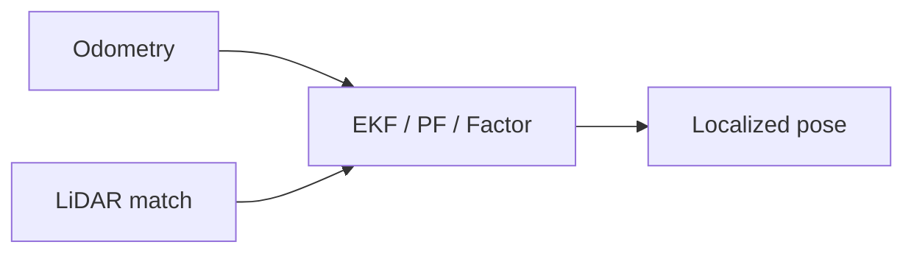

# 里程计与激光雷达融合定位

## 一句话定义

**里程计–激光融合定位**把 **高频相对运动估计（odom）** 与 **激光观测（scan / 点云）** 在统一滤波器或因子图中融合，得到比单源更稳的 2D/3D 位姿——对应课程第 3.4 节。

## 英文缩写速查

| 缩写 | 英文全称 | 简要说明 |
|------|----------|----------|
| Odom | Odometry | 轮速/关节积分得到的相对位姿 |
| LiDAR | Light Detection and Ranging | 激光测距传感器 |
| EKF | Extended Kalman Filter | 常见松耦合融合滤波器 |
| LIO | LiDAR-Inertial Odometry | 激光–惯性紧/松耦合里程计 |
| ICP | Iterative Closest Point | 点云/扫描配准 |
| AMCL | Adaptive Monte Carlo Localization | 粒子滤波地图定位（Nav 常用） |

## 为什么重要

- 纯里程计会漂移；纯激光在退化走廊/高速运动易丢匹配；融合是 Nav2 / 人形巡航的默认工程答案。
- 与 [FAST-LIO](../entities/fast-lio.md) 等 **LIO** 路线对照：课程若用 2D 雷达 + 腿/轮 odom，更接近经典 EKF/AMCL；3D Mid360 类则常走 LIO。
- 滤波器形式见 [EKF](../formalizations/ekf.md) 与 [传感器融合](../concepts/sensor-fusion.md)。

## 主要技术路线

| 路线 | 融合对象 | 典型栈 |
|------|----------|--------|
| 2D EKF / AMCL | 轮/腿 odom + 激光似然 | Nav2 + slam_toolbox 地图 |
| Scan-to-map 匹配 | 当前扫描 ↔ 静态栅格 | ICP / correlative scan match |
| LIO（激光–惯性） | LiDAR + IMU | [FAST-LIO](../entities/fast-lio.md) 等 |
| 因子图平滑 | 多传感器因子 | LIO-SAM 等后端 |

## 核心原理

1. **预测**：用 odom（或 IMU）传播位姿与协方差。
2. **观测**：scan-to-map / scan-to-scan 得到相对位姿或地图似然。
3. **更新**：EKF / 粒子滤波 / 因子图融合；输出供全局规划使用的 `map→base`。

## 工程实践

- 2D 课设：`slam_toolbox` 建图 → AMCL/定位模式 + odom；见 [导航栈](../overview/navigation-slam-autonomy-stack.md)。
- 3D：优先评估 [LiDAR/VIO 选型](../comparisons/lidar-slam-lio-vio-selection.md)。
- 人形注意：足式 odom 比轮式噪声大，需更大过程噪声或接触检测门控。

## 局限与风险

- 外参（雷达到 base）标定错误会表现为「融合后更抖」。
- 动态行人未剔除时，scan matching 会拉偏位姿（接 [动态障碍滤波](../concepts/dynamic-obstacle-filtering.md)）。

## 关联页面

- [Sensor Fusion](../concepts/sensor-fusion.md)
- [EKF](../formalizations/ekf.md)
- [人形系统课程策展](../entities/humanoid-system-curriculum.md)

## 参考来源

- [深蓝学院人形系统课程大纲](../../sources/courses/shenlan_humanoid_system_theory_practice.md)
- [PythonRobotics 归档](../../sources/repos/python_robotics.md)

## 推荐继续阅读

- PythonRobotics Localization / SLAM 章节示例
