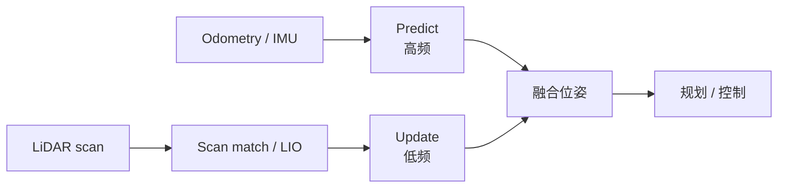

# 里程计与激光雷达融合定位

## 一句话定义

**里程计–激光融合定位**用 **高频相对运动（轮式/腿式 odom 或 IMU）** 做短时预测，用 **激光扫描匹配或 LIO** 提供绝对/半绝对校正，在滤波器或因子图中融合出稳定的 `map→base` 位姿——课程第 3.4 节。

## 英文缩写速查

| 缩写 | 英文全称 | 简要说明 |
|------|----------|----------|
| Odom | Odometry | 相对位姿积分，高频易漂 |
| LiDAR | Light Detection and Ranging | 2D/3D 激光测距 |
| EKF | Extended Kalman Filter | 松耦合融合常用形式 |
| LIO | LiDAR-Inertial Odometry | 激光–惯性里程计 |
| AMCL | Adaptive Monte Carlo Localization | 粒子滤波地图定位 |
| ICP | Iterative Closest Point | 点云/扫描配准 |
| Scan Matching | Scan Matching | 扫描对地图或帧间配准 |

## 为什么重要

- **单源都不够**：纯 odom 积分漂移；纯激光在长走廊、高速、退化几何下匹配失败。融合是 Nav2 巡航与人形带雷达作业的默认答案。
- **课程选型分叉**：2D 雷达 + 底盘/腿 odom → EKF/AMCL；Mid360 类 3D → 更常走 [FAST-LIO](../entities/fast-lio.md) 等 LIO（见 [选型对比](../comparisons/lidar-slam-lio-vio-selection.md)）。
- **下游消费者**：全局 [A\*](./a-star.md)、局部 [DWA](./dwa.md)、探索 [TARE](../entities/tare-planner.md) 都假设定位协方差可控。

## 主要技术路线

| 路线 | 融合对象 | 典型栈 |
|------|----------|--------|
| 2D EKF 松耦合 | 轮/腿 odom + 激光位姿观测 | 自研 EKF / robot_localization |
| AMCL 粒子滤波 | odom 运动模型 + 激光似然 | [Nav2](../entities/navigation2.md) |
| Scan-to-map | 当前扫描 ↔ 静态栅格 | [slam_toolbox](../entities/slam-toolbox.md) 定位模式 |
| LIO | LiDAR + IMU（紧/松） | [FAST-LIO](../entities/fast-lio.md)、LIO-SAM |
| 因子图 | 多传感器因子 | 后端平滑、回环 |

## 核心原理

### 松耦合 EKF 模板

状态常取平面位姿 \(x=(p_x,p_y,\theta)\)（或含速度）：

1. **预测**：用 odom 增量 \(\Delta\) 传播 \(\hat{x}\)、过程噪声 \(Q\)（腿式 \(Q\) 宜大于轮式）。
2. **观测**：scan matching 得 \(z\) 与观测噪声 \(R\)；或直接用似然场梯度。
3. **更新**：标准 [EKF](../formalizations/ekf.md) 增益；马氏距离门控拒野值匹配。

### 2D vs 3D 注意点

| 维度 | 2D 教学栈 | 3D LIO 栈 |
|------|-----------|-----------|
| 地图 | 占据栅格 | 点云/体素/ikd-Tree |
| 退化 | 长廊、对称房间 | 少结构、雨雾 |
| 人形特点 | 足式 odom 抖动大 | 需外参与时间同步更严 |

更广的传感器叙事见 [传感器融合](../concepts/sensor-fusion.md)。

## 工程实践

### 课程 3.x 推荐闭环

1. Ch3.2 用 [slam_toolbox](../entities/slam-toolbox.md) / Cartographer 建静态图（空场或开 [动态滤波](../concepts/dynamic-obstacle-filtering.md)）。
2. Ch3.3 切定位模式（AMCL 或 toolbox 定位）。
3. Ch3.4 打开 odom–激光融合，对比「仅 odom / 仅激光 / 融合」三条轨迹。

### 标定与同步清单

| 项 | 要求 |
|----|------|
| 雷达到 `base_link` 外参 | 平移/航向误差会表现为融合后「更抖」 |
| 时间戳 | 激光与 odom 需同一时钟域 |
| TF 树 | `map→odom→base` 标准树，避免多父节点 |
| 足式 odom | 增大 \(Q\) 或接触检测门控更新 |

### 调试指标

| 指标 | 健康 | 异常 |
|------|------|------|
| 创新序列 | 近似白噪声 | 系统性偏置 → 外参/地图错 |
| `map` 下轨迹闭合 | 回起点误差小 | 仅 odom 则随距离增大 |
| 匹配成功率 | 稳定高 | 动态污染或退化几何 |

## 局限与风险

- **错误外参比「不融合」更糟**：会把激光观测当错误方向拉扯。
- **动态行人**：匹配拉偏 → 先滤波再定位（见 [动态障碍滤波](../concepts/dynamic-obstacle-filtering.md)）。
- **误区**：把 LIO 输出直接当「全局地图定位」——无先验图/回环时仍是里程计意义下的位姿。
- 人形晃动导致扫描拖影，需运动畸变补偿（LIO 常见，2D 简易栈易忽略）。

## 关联页面

- [EKF](../formalizations/ekf.md)
- [传感器融合](../concepts/sensor-fusion.md)
- [LiDAR / LIO / VIO 选型](../comparisons/lidar-slam-lio-vio-selection.md)
- [导航·SLAM 栈总览](../overview/navigation-slam-autonomy-stack.md)
- [人形系统课程策展](../entities/humanoid-system-curriculum.md)

## 参考来源

- [深蓝学院人形系统课程大纲](../../sources/courses/shenlan_humanoid_system_theory_practice.md)
- [PythonRobotics 归档](../../sources/repos/python_robotics.md)
- [FAST-LIO 归档](../../sources/repos/fast_lio.md)

## 推荐继续阅读

- Thrun, Burgard, Fox — *Probabilistic Robotics*（定位与 scan matching 章节）
- PythonRobotics Localization / SLAM 示例
