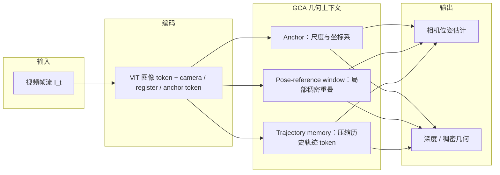

# LingBot-Map (Streaming 3D Reconstruction Foundation Model)

**LingBot-Map** 是一种新型的 3D 基础模型，旨在解决从连续视频流中进行高效、鲁棒的**流式 3D 重建**问题。

## 一句话定义

LingBot-Map 采用前馈式 Transformer 架构，在单一框架内用 **Geometric Context Attention（GCA）** 显式维护 **锚点上下文、位姿参考窗口、轨迹记忆**，将坐标接地、局部稠密几何与长程漂移校正统一到可学习的注意力掩码中；推理侧结合 **Paged KV Cache（FlashInfer）**，在官方设定下报告约 **20 FPS**（518×378）并支持 **>10,000 帧** 量级的稳定流式推理（仍受训练时视频 RoPE 长度与工程 keyframe/window 策略约束）。

## 为什么重要

传统的 SLAM 和 3D 重建系统通常依赖于复杂的全局优化（如 Bundle Adjustment）或易受长程漂移影响。LingBot-Map 的重要性在于：

1. **实时性**：前馈因果推理 + 高效 KV 管理，面向在线应用（机器人、AR、车端感知管线中的几何模块）。
2. **结构化流式状态**：把经典 SLAM「参考系 / 局部重叠 / 全局地图」三类需求映射为 **anchor / pose-reference window / trajectory memory**，用端到端注意力替代部分手工后端，同时控制每帧上下文规模。
3. **开源栈完整**：官方仓库提供 **Viser** 交互 demo、**长视频离线渲染**（`demo_render/batch_demo.py`）、**Hugging Face / ModelScope** 权重与演示数据集，便于复现与下游集成讨论。

## 流程总览（数据与控制流）



## 主要技术路线（文字版）

```text
连续视频流 (Video Stream)
          ↓
  ViT 特征（DINOv2 初始化）+ 与 VGGT 系一致的 Frame / Cross-frame 交替块
          ↓
  Geometric Context Attention（GCA）
  [ Anchor + Pose-Reference Window + Trajectory Memory ]
          ↓
  相机头 + 深度头 → 流式位姿与稠密几何；Paged KV（FlashInfer）支撑长序列缓存更新
```

## 核心机制：Geometric Context Attention（GCA）

论文将流式几何上下文拆为三类互补角色（与仓库 README 的「anchor context / pose-reference window / trajectory memory」表述一致）：

- **Anchor context**：用少量起始帧固定**尺度与坐标系**；流式设定下无法依赖离线方法的全局点云归一化。
- **Pose-reference window**：保留最近若干帧的**完整 image token**，提供稠密视觉重叠以稳定局部配准；训练中对窗口内帧对施加**相对位姿损失**以强化局部轨迹一致。
- **Trajectory memory**：对更早帧丢弃高维 image token，仅保留少量与位姿/轨迹相关的紧凑 token，并施加时序位置编码，用于**抑制长程漂移**。

**Paged KV Cache**：GCA 将每帧新增 token 量控制在远小于「因果全历史 attention」的增长率；实现上采用 **FlashInfer** 的 paged 布局，减少滑动窗口与轨迹淘汰导致的整块缓存重分配开销（论文 §3.4 给出与 PyTorch 基线的 FPS 对比叙述）。

## 工程部署要点与局限（以官方 README 为准）

- **训练 RoPE 与 KV 长度**：README 说明训练使用约 **320** 个视图上的 video RoPE；当 KV 缓存中存留的视图超过该范围时，质量可能下降，需通过 **`--keyframe_interval`** 仅缓存关键帧，或切换到 **`--mode windowed`** 滑动窗口（并配合 **`--overlap_keyframes`** 保持跨窗对齐）。
- **最远距离与状态重置**：方法默认不做状态重置；超过训练分布中最长距离时可能需要显式重置或窗口化，若出现位姿坍塌应优先尝试 windowed / 调整 keyframe。
- **依赖栈**：交互 demo 依赖 **PyTorch**；推荐组合与 **NVIDIA Kaolin** 预编译轮绑定（README 强调 **torch 2.8.0 + cu128** 以简化离线渲染管线）；长序列 demo 数据集见 Hugging Face **`robbyant/lingbot-map-demo`**。
- **媒体通稿数字**：第三方新闻稿中的倍数对比应以**论文表格与官方基准脚本**复核，避免单独依赖 PR 叙述。

## 与其他方法的关系

### 与传统 SLAM 的对比

- **传统 SLAM**：显式特征匹配、回环、位姿图与后端优化模块耦合强。
- **LingBot-Map**：以前馈网络为主，将多类几何上下文管理收进 **GCA**；仍可从 SLAM 原则理解其状态设计，但减少了对部分手工组件的依赖。

### 与 VLA / 空间推理任务的关系

- 可为 [VLA (Vision-Language-Action)](./vla.md) 或 [3D 空间 VQA](../concepts/3d-spatial-vqa.md) 讨论提供**在线度量几何**先验：语义–语言层仍需与几何模块分工或融合。
- 与 [SceneVerse++](../entities/sceneverse-pp.md) 等「数据与多任务 3D 监督」路线互补：后者偏数据集与任务覆盖，LingBot-Map 偏**流式重建模型**。

## 关联页面

- [VLA (Vision-Language-Action)](./vla.md)
- [State Estimation (状态估计)](../concepts/state-estimation.md)
- [3D 空间 VQA](../concepts/3d-spatial-vqa.md)
- [SceneVerse++（数据集与 3D-VLM）](../entities/sceneverse-pp.md)
- [Unified Multimodal Tokens (统一 Token)](./unified-multimodal-tokens.md)
- [SE(3) Representation (位姿表示形式化)](../formalizations/se3-representation.md)
- [Extended Kalman Filter (EKF)](../formalizations/ekf.md)

## 参考来源

- [LingBot-Map 仓库](../../sources/repos/lingbot-map.md)
- [LingBot-Map 论文摘录（arXiv:2604.14141）](../../sources/papers/lingbot_map_arxiv_2604_14141.md)
- [LingBot-Map 官方项目页](../../sources/sites/lingbot-map-technology-robbant.md)
- [Business Wire 发布稿（媒体参考）](../../sources/sites/businesswire-lingbot-map-2026-04-16.md)

## 推荐继续阅读

- [Geometric Context Transformer for Streaming 3D Reconstruction（arXiv:2604.14141）](https://arxiv.org/abs/2604.14141)
- [LingBot-Map 项目页](https://technology.robbyant.com/lingbot-map)
- [Robbyant/lingbot-map（官方代码）](https://github.com/Robbyant/lingbot-map)
- [robbyant/lingbot-map-demo（演示数据，Hugging Face）](https://huggingface.co/datasets/robbyant/lingbot-map-demo/tree/main)
- [VGGT（几何骨干相关）](https://github.com/facebookresearch/vggt)
