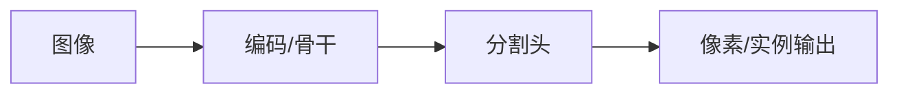

# Mask R-CNN

## 一句话定义

Mask R-CNN 在 Faster R-CNN 上增加并行掩码分支与 RoI Align，成为实例分割的长期标准两阶段框架。

## 英文缩写速查

| 缩写 | 英文全称 | 简要说明 |
|------|----------|----------|
| Mask R-CNN | Mask Region-based CNN | 检测+实例掩码 |
| RoI Align | RoI Align | 消除量化误差的区域特征 |
| InstSeg | Instance Segmentation | 实例分割任务 |
| AP | mask AP | 实例指标 |
| FPN | Feature Pyramid Network | 多尺度特征 |

## 为什么重要

- 课程 4.2 的 CNN 分割主线节点，为理解 SETR/SegFormer 提供对照。
- 机器人侧仍大量使用 U-Net/Mask R-CNN 类结构做缺陷、可抓取与语义图层。

## 主要技术路线

| 路线 | 机制 | 说明 |
|------|------|------|
| Mask R-CNN | Faster + 并行 mask 头 | 实例分割标准 |
| RoI Align | 双线性对齐 | 消除量化误差 |
| 扩展 | Cascade / PointRend 等 | 边界与精度增强 |

## 核心原理

在两阶段检测头旁并行小型 FCN 预测每 RoI 的二值掩码；RoI Align 避免 RoI Pool 的取整错位。

## 工程实践

| 项 | 建议 |
|----|------|
| 数据 | ADE20K/Cityscapes/自有掩码；注意类别映射 |
| 损失 | 交叉熵 / Dice / 辅助头按论文配置 |
| 部署 | 测全分辨率延迟；机载可降输入尺寸 |

## 局限与风险

CNN 分割受感受野与多尺度模块设计约束；开放集与提示分割需看 SAM/SEEM。标注噪声会直接体现在边界指标上。

## 关联页面

- [分割任务分类](../concepts/image-segmentation-taxonomy.md)
- [SETR](../entities/setr.md)
- [SegFormer](../entities/segformer.md)
- [Transformer CV 课程策展](../entities/transformer-cv-curriculum.md)
- [机器人视觉感知栈选型闭环知识链](../queries/robot-perception-stack-selection-loop.md) — 两阶段实例分割标准框架，②层「是否需要实例粒度」的判据

## 参考来源

- [Transformer 视觉应用课程大纲](../../sources/courses/transformer_cv_applications_syllabus.md)

## 推荐继续阅读

- [原论文](https://arxiv.org/abs/1703.06870)
