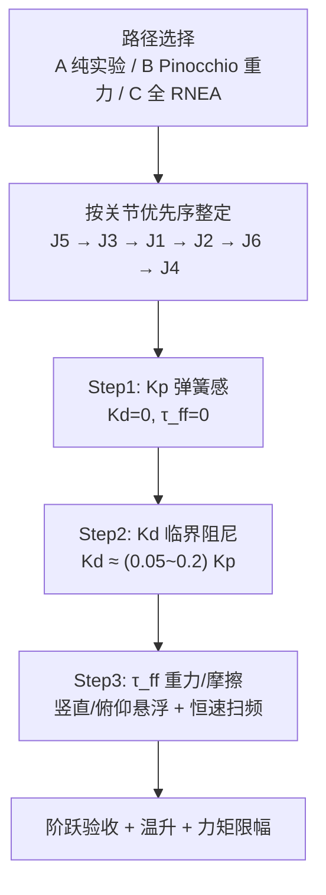

# MIT 关节阻抗模式参数整定

**MIT 模式**（开源四足/部分协作臂驱动器中的 **紧凑阻抗帧** 语义，见 [电机驱动器底软通信协议总览](../overview/motor-drive-firmware-bus-protocols.md)）在关节侧实现：

$$\tau = K_p (q_{des}-q) + K_d (\dot q_{des}-\dot q) + \tau_{ff}$$

$K_p,K_d$ 塑造 **虚拟弹簧–阻尼**；$\tau_{ff}$ 承担重力、摩擦与（可选）惯性前馈。本页归纳 **多关节机械臂** 上可复现的整定顺序与验收标准（源自清洁臂 6-DOF 实操文）。

## 一句话定义

先让 $\tau_{ff}$ 扛稳 **重力与摩擦**，再用 $K_p,K_d$ 把关节阶跃响应调到 **无超调、无振荡**；重载竖直/俯仰关节优先，且 **不同关节不得共用同一组增益**。

## 英文缩写速查

| 缩写 | 英文全称 | 简要说明 |
|------|----------|----------|
| MIT | Massachusetts Institute of Technology | 此处指 Cheetah/legged 生态的紧凑关节阻抗控制语义 |
| PD | Proportional–Derivative | 位置误差与速度误差的线性反馈 |
| RNEA | Recursive Newton–Euler Algorithm | 逆动力学，$g(q)=\text{RNEA}(q,0,0)$ 即重力项 |
| FOC | Field-Oriented Control | 底层电流环，MIT 模式仍依赖力矩可写 |
| URDF | Unified Robot Description Format | Pinocchio 重力前馈所需的连杆惯性描述 |

## 为什么重要

- 上层 [阻抗控制](../concepts/impedance-control.md) / 导纳贴合任务依赖 **底层 $K_p,K_d$ 已临界阻尼**，否则接触力波动大、温升高。
- **重力未补偿** 时 PD 必须用过大 $K_p$「硬扛自重」，易饱和、发热，且与 [重力补偿](../concepts/gravity-compensation.md) 理论分工相悖。
- Sim2Real 与真机 bring-up 中，MIT 帧与 [私有 CAN 协议](../overview/motor-drive-firmware-bus-protocols.md) 的 **模式字与力矩限幅** 必须一并核对。

## 流程总览

## 主要技术路线

- **A 纯实验整定**：$K_d=0,\tau_{ff}=0$ 找 $K_p$ → 临界阻尼 $K_d$ → 分关节标定重力/摩擦；不依赖 URDF，适合 bring-up。
- **B Pinocchio 半模型（推荐）**：$\tau_{ff}$ 重力用 [RNEA](../formalizations/articulated-body-algorithms.md) / [Pinocchio](../entities/pinocchio.md) `rnea(q,0,0)`；摩擦仍恒速实验；$K_p$ 可低于 A。
- **C 全模型前馈**：实时全逆动力学 + 小增益 PD；低速接触任务复杂度高、收益有限。

## 参数分工

| 项 | 作用 | 整定要点 |
|----|------|----------|
| $K_p$ | 虚拟刚度 | 增大至明显「弹簧感」但不松手即抖 |
| $K_d$ | 虚拟阻尼 | 拍击连杆，应一次回位无来回摆 |
| $\tau_{ff}$ 重力 | 抵消 $g(q)$ | J3 升降、J5/J6 俯仰 **必做**；B 路径用 [Pinocchio](../entities/pinocchio.md) `rnea(q,0,0)` |
| $\tau_{ff}$ 摩擦 | 库仑+粘滞 | 多档恒速正反转，拟合 $f_c,f_v$（见 [Joint Friction Models](../concepts/joint-friction-models.md)） |
| $q_{des},\dot q_{des}$ | 轨迹 | 由 IK/差分提供；软限位与急停需独立守护 |

### 六关节差异（量级示例，须按本体重标）

| 关节 | 几何类型 | 整定侧重 | $K_p$ 参考量级（文内） |
|------|----------|----------|------------------------|
| J1 大臂旋转 | 竖直轴，重惯量 | 大 $K_p$、摩擦 $\tau_{ff}$ | 200–500 Nm/rad |
| J2 小臂旋转 | 竖直轴，耦合 | 略增 $K_d$ 抑 J1 耦合 | 100–300 Nm/rad |
| J3 升降 | 平移竖直 | **重力 $\tau_{ff}$ 关键** | 50–150 N/mm |
| J4 腕旋 | 轻载 | 增益可低 | 20–80 Nm/rad |
| J5 大俯仰 | 水平轴，大力臂 | 重力补偿精度 | 100–300 Nm/rad |
| J6 小俯仰 | 水平轴，微调 | 响应快，$K_d$ 不宜过大 | 50–150 Nm/rad |

**J5/J6 平行近距**：工具重力对 J5 的耦合力矩需 **整体建模**（J5+J6+工具对 J5 轴），J6 只补偿自身+工具段。

## 三条整定路径

| 路径 | 适用 | 要点 |
|------|------|------|
| **A 纯实验** | 无动力学背景、快速 bring-up | 全程 $K_p,K_d,\tau_{ff}$ 手感+阶跃；约 1–2 h/关节 |
| **B 半模型（推荐）** | 有 URDF / Pinocchio | 重力用 RNEA；摩擦仍实验；$K_p$ 可比 A 略小 |
| **C 全模型** | 高精度动态前馈 | 实时全 RNEA；低速接触任务 **收益有限**，复杂度高 |

### 分阶段在线调度（文内）

| 阶段 | $K_p$ | $K_d$ | 目的 |
|------|-------|-------|------|
| 快速趋近 | 高 | 临界阻尼 | 轨迹精度 |
| 柔性逼近 | 中 | 略增 | 减冲击 |
| 恒力贴合 | 中低 | 略增 | 导纳调节空间 |
| 退出 | 恢复高 | 临界阻尼 | 安全离开接触 |

$\tau_{ff}$ 若查表，应对角度 **插值平滑** 或 50–100 ms 一阶低通，避免力矩阶跃。

## 验收清单（节选）

| 项 | 通过标准 |
|----|----------|
| 空载阶跃 | 无超调、无振荡；稳态误差 $<0.05°$ |
| 重力悬浮 | J3/J5/J6 松手不下滑（主要靠 $\tau_{ff}$） |
| 摩擦补偿 | 低速 1°/s 无爬行 |
| 整臂轨迹 | 螺旋/弓字误差 $<0.2°$（文内清洁任务） |
| 温升 | 连续 30 min 关节电机 $<60°C$ |

**安全**：硬件急停、力矩 **80% 额定** 自动降 $K_p$、软限位停止 $q_{des}$ 更新。

## 常见误区

- **全臂一组 $K_p,K_d$** — 负载与传动差异要求 **分关节表**。
- **先调轻关节再调 J5/J3** — 重关节振荡会破坏已调参数；应 **先重后轻**。
- **把 PD 当重力补偿** — 长期大 $K_p$ 导致电流与发热；应把 $g(q)$ 放进 $\tau_{ff}$。

## 与其他页面的关系

- [Impedance Control（阻抗控制）](../concepts/impedance-control.md) — 任务空间虚拟弹簧–阻尼理论
- [Gravity Compensation](../concepts/gravity-compensation.md) — $g(q)$ 与 RNEA
- [PID Control](../methods/pid-control.md) — 无 $\tau_{ff}$ 时的简化关节伺服
- [Joint Actuator Parameter Identification](../methods/joint-actuator-parameter-identification.md) — 摩擦/惯量辨识与 MIT 整定互补

## 推荐继续阅读

- [Pinocchio 快速上手](../queries/pinocchio-quick-start.md)
- MIT 紧凑帧与总线：[motor-drive-firmware-bus-protocols.md](../overview/motor-drive-firmware-bus-protocols.md)

## 参考来源

- [MIT模式参数整定的完整方法（微信公众号）](../../sources/blogs/wechat_mit_mode_parameter_tuning_2026-10-01.md)
