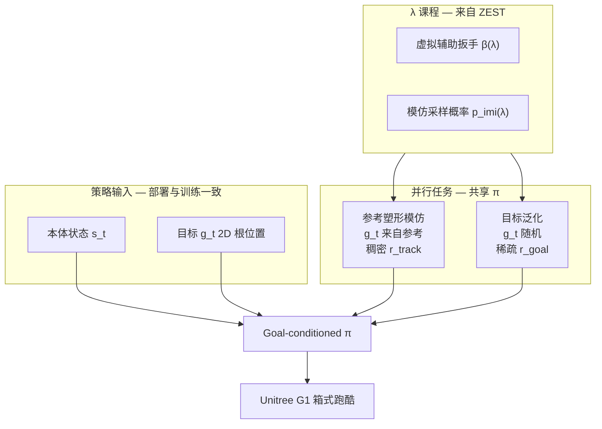
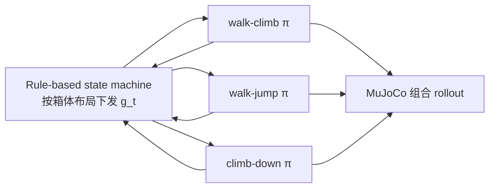

# MTRG / GfR: Multi-Task Reference and Goal-Driven RL

**GfR**（[Generalizing from References](https://jiashunwang.github.io/GfR/)，**RSS 2026**）提出多任务 RL 范式，把参考运动当作**行为塑形先验**而非部署时约束。本库方法页以 **MTRG**（Multi-Task Reference and Goal-Driven RL）作导航标签，与官方项目名 **GfR** 指同一工作：一个策略只观察当前状态与 **2D 目标位置**，在训练中同时接受**稠密模仿奖励**与**稀疏目标奖励**，从而学会可复用、可转向、可应对 OOD 初始条件的人形跑酷技能。

## 英文缩写速查

| 缩写 | 英文全称 | 简要说明 |
|------|----------|----------|
| GfR | Generalizing from References | 官方项目名（RSS 2026 主页） |
| MTRG | Multi-Task Reference and Goal-Driven RL | 本库方法导航标签；与 GfR 同指 arXiv:2602.20375 |
| RL | Reinforcement Learning | PPO 训练 G1 全身策略 |
| MDP | Markov Decision Process | 共享观测/动作、分任务奖励的建模方式 |
| PD | Proportional-Derivative Control | 残差动作映射为关节目标再算力矩 |
| OOD | Out-of-Distribution | 训练分布外的初始位姿、距离与箱高 |
| PPO | Proximal Policy Optimization | Isaac Lab 中的 on-policy 优化器 |
| MoCap | Motion Capture | walk-jump / climb 等技能的参考来源 |

## 为什么重要

人形跑酷需要**像人**又**能改**。纯 tracking（含 [ZEST](./zest.md) 式部署时跟参考）在初始位姿偏离演示时常「硬跟参考」导致失败；纯任务 RL 动作难看。[HIL](./hil-hybrid-imitation-learning.md) 用对抗缓解但难上硬件。MTRG 用**更简单的多任务奖励分解**达到：nominal 与 beyond-nominal 成功率均优于 ZEST mocap 与 tabula rasa（论文 Table I）。

## 主要技术路线

## 核心机制

### 1. 参考不进策略

模仿任务中参考只定义 **goal 与 tracking reward**；策略**看不到**轨迹、相位或未来姿态。泛化任务中 goal 完全随机——迫使同一 \(\pi(s,g)\) 学会「冲目标」而非「播片」。

### 2. 残差动作且无参考前馈

\(\bm{q}^{cmd}=\bar{\bm{q}}+\bm{\Sigma}\bm{a}_t\)，**不**把参考关节角作为 PD 前馈，以便泛化时偏离参考。

### 3. 与 ZEST 共享的 \(\lambda\) 课程

标量难度 \(\lambda\) 同时控制：(a) 基座辅助扳手幅度；(b) 模仿 vs 泛化任务采样比例；(c) 初始状态/目标随机化范围。对 box-climb 等高动态技能收敛关键。

### 4. 非对称 critic

Critic 见 task indicator 与接触力、辅助扳手等特权信息，仅用于 value 估计。

## 实验要点（G1）

| 技能 | 泛化行为示例 |
|------|----------------|
| walk-jump | 远则先走再跳，近则直接起跳 |
| walk-climb | 左右腿领先自适应攀爬 |
| climb-down | 单脚蹬箱调整重心再下 |

- **长程组合**：**rule-based state machine** 按箱体布局下发任务级 goal，串联 walk-climb / walk-jump / climb-down 三策略完成多箱跑酷（真机 Fig. 5；MuJoCo Fig. 4）。
- **MuJoCo sim-to-sim**：Isaac Lab 训练策略不经重训即在 MuJoCo 中组合执行，验证跨物理引擎鲁棒性。
- **对比**：ZEST mocap 在 beyond-nominal 上 walk-jump success **0.17** vs GfR/MTRG **0.62**（论文 Table I）。

## 长程技能组合与 sim-to-sim

部署时策略仅见 \((s_t, g_t)\)，长程跑酷由**上层规则状态机**提供分段 goal，而非在策略内维护参考相位：

- **真机**：同一组合策略可顺序执行跳—下攀—走—攀等，无需为每段精细 reset（论文 Fig. 5）。
- **sim-to-sim**：三技能策略在 MuJoCo 中串联「走—攀—下—走—跳—再攀」，证明技能在**不同初始配置与目标**下可复用（Fig. 4）。

## 框架扩展（多技能 + 感知）

论文 §III-E 展示同一训练范式可**最小改动**扩展：

- **one-hot 技能嵌入**：单策略执行多类技能，条件于技能 ID。
- **elevation map**：将高度图作为外感受输入，适配更复杂地形。

核心多任务目标与 \(\lambda\) 课程**无需重写**——适合作为「可复用低层技能库」基础，再叠加上层规划或感知栈。

## 与 HIL / ZEST 的分工

| 方法 | 场景 | 参考角色 | 对抗 | 真机 |
|------|------|----------|------|------|
| [HIL](./hil-hybrid-imitation-learning.md) | 物理角色动画 | tracking + AMP 并行 | 是 | 否 |
| [ZEST](./zest.md) | 多形态硬件模仿 | 部署时下一步参考 | 否 | 是 |
| **MTRG** | G1 箱式跑酷 | 仅训练奖励塑形 | 否 | 是（MoCap 全局位姿） |

## 常见误区

- **不是** ZEST 的简单超集——部署时**不需要**参考轨迹；与 ZEST「极简 tracking 接口」是互补路线。
- **感知**：硬件实验依赖 MoCap 全局位姿反馈；论文讨论可扩展机载外感受，但当前 box 技能未给箱体精确位姿。

## 关联页面

- [ZEST](./zest.md) — assistive wrench 课程与 tracking 基线
- [HIL](./hil-hybrid-imitation-learning.md) — 对抗式混合模仿对照
- [HIL vs MTRG vs ZEST 跑酷路线对比](../comparisons/hil-vs-mtrg-vs-zest-parkour-imitation.md) — 三条路线选型
- [DeepMimic](./deepmimic.md) — 显式 tracking 传统
- [Curriculum Learning](../concepts/curriculum-learning.md)
- [Humanoid Locomotion](../tasks/humanoid-locomotion.md)
- [Unitree G1](../entities/unitree-g1.md)

## 参考来源

- [Generalizing from References using a Multi-Task Reference and Goal-Driven RL Framework](../../sources/papers/mtrg_reference_goal_driven_rl_arxiv_2602_20375.md)
- [GfR 项目页（RSS 2026）](../../sources/sites/gfr-project.md)
- [arXiv:2602.20375](https://arxiv.org/abs/2602.20375)
- [GfR 主页](https://jiashunwang.github.io/GfR/)
- [演示视频](https://youtu.be/9NamvWhtFPM)

## 推荐继续阅读

- [GfR 项目页](https://jiashunwang.github.io/GfR/) — 长程组合、MuJoCo 与感知扩展视频

- [ZEST 论文](https://arxiv.org/abs/2602.00401) — 辅助扳手与跨形态 tracking 细节
- [HIL 演示](https://youtu.be/le4248gIMME) — 同作者早期混合模仿与场景点云设计
