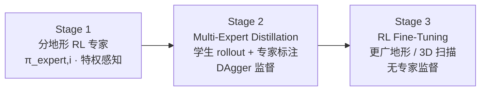

# Multi-Expert Distillation（多专家蒸馏）

**Multi-Expert Distillation** 是足式/人形 **感知 locomotion 与跑酷** 中的主流 **技能合成** 范式：先为 **不同地形、障碍或技能** 训练 **独立专家策略** $\{\pi_{\text{expert},i}\}$（通常带 **特权感知** 与较易探索的奖励/课程），再用 **[DAgger](./dagger.md) 式在线聚合** 把专家动作蒸馏进 **单一学生** $\pi_{\text{student}}$（**可部署传感器**）；必要时加 **转移数据**、**PPO 微调** 或 **重复 fine-tune** 以恢复任务性能与泛化。

## 一句话定义

**「分而训之、合而用之」：** 专家负责把各子任务训到上限，学生负责在真机观测下 **隐式识别情境并复现对应专家行为**，从而避免端到端 RL 在多模态地形上的 **模式坍缩**。

## 英文缩写速查

| 缩写 | 英文全称 | 简要说明 |
|------|----------|----------|
| MED | Multi-Expert Distillation | 多专家策略蒸馏为单一策略的总称（文献常直呼 multi-expert distillation） |
| DAgger | Dataset Aggregation | 学生 rollout、专家回标、数据集聚合再监督训练 |
| RLFT | RL Fine-Tuning | 蒸馏后在更广地形上用 RL 继续优化（Parkour in the Wild 等） |
| TS | Teacher-Student | 特权教师向可部署学生迁移的 broader 框架 |
| MoE | Mixture of Experts | 运行时门控多专家；与「蒸馏进单网」是不同合成路线 |
| PPO | Proximal Policy Optimization | 专家训练与蒸馏后微调的最常用 RL 后端 |

## 为什么重要

- **探索可分解：** 攀爬、跨沟、踏石、窄缝等 **单任务 RL** 比「一次训全地形」更易收敛；专家可各自使用 **专用课程与奖励微调**（PITW 低墙专家甚至 **warm-start 自 climb 专家**）。
- **部署接口统一：** 真机只需 **一个策略 + 机载深度/本体**，无需运行时 **技能 ID、状态机或高层 router**（对比分层 ANYmal Parkour）。
- **感知 gap 显式处理：** 专家常用 **高程图/height scan**，学生用 **深度 + RNN**；蒸馏阶段强制学 **$o_{\text{deploy}}\mapsto a$** 而非复制特权特征（[Parkour in the Wild](../entities/paper-parkour-in-the-wild.md)、[RPL](../entities/paper-rpl-robust-humanoid-perceptive-locomotion.md)）。
- **可扩展：** [Parkour in the Wild](../entities/paper-parkour-in-the-wild.md) 展示 **蒸馏 foundation → RLFT → 再加地形重复 FT**，作为 legged **「foundation policy」** 增量扩展路线。

## 核心原理

### 标准三阶段（PITW 范式）

1. **Expert training：** $\pi_{\text{expert},i}$ 在 terrain $i$ 上 RL 至可用成功率；感知可为 **elevation map、height scan、特权物理**。
2. **Distillation：** 混合地形并行 env；学生 $\pi_{\text{student}}(o_{\text{student}})$ 执行动作，记录 $(o_{\text{student}}, \pi_{\text{expert},i}(o_{\text{expert}}))$；监督损失常為 **MSE / BC**；迭代多 epoch（Algorithm 1 风格）。
3. **Optional RLFT / transition：** 纯蒸馏在多模态上 **平均专家** 导致单地形性能下降（PITW Table 4：踏石 73%→98.8%）；加 **任务奖励 RL**、**transition group**（[LightLP](../entities/paper-light-loco-parkour.md)）或 **DAgger+PPO 混合**（[PHP](../entities/paper-hrl-stack-22-perceptive_humanoid_parkour.md)、[LadderMan](../entities/paper-ladderman-humanoid-perceptive-ladder-climbing.md)）。

### 学生必须学的两件事

[Rudin et al., PITW](https://arxiv.org/abs/2505.11164) 形式化强调：

- **情境识别：** $o_{\text{student}}\mapsto i$（何种地形/技能）
- **动作匹配：** $\pi_{\text{student}}(o_{\text{student}})\approx\pi_{\text{expert},i}(o_{\text{expert}})$

因此学生网络常含 **记忆（LSTM/GRU）** 与 **多相机 CNN**，以处理 **部分可观测** 与 **模态迁移**。

## 主要技术路线与代表工作

| 路线 | 代表 | 专家数/类型 | 学生感知 | 蒸馏后处理 |
|------|------|-------------|----------|------------|
| **四足 wild 泛化** | [Parkour in the Wild](../entities/paper-parkour-in-the-wild.md) | 9 地形 RL | 4×深度 + LSTM | RLFT + 3D 扫描 |
| **四足跑酷** | [Robot Parkour](../entities/paper-robot-parkour-learning.md) | 5 技能（软→硬课程） | 循环深度 | 深度噪声/延迟 sim2real |
| **人形全身跑酷** | [LightLP](../entities/paper-light-loco-parkour.md) | loco + 多 skill teacher | height-scan → GRU 深度 | transition RL + FT |
| **人形多向行走** | [RPL](../entities/paper-rpl-robust-humanoid-perceptive-locomotion.md) | 4 类地形专家 | 多视角深度 Transformer | DFSV/RSM |
| **WBC scaling** | [Humanoid-GPT](../entities/paper-humanoid-gpt.md)、[Athena-WBC](../entities/paper-athena-wbc-humanoid-longtail.md) | 能力/语义专家 | 统一 student 观测 | RLFT / Grad-CAPS 等 |

完整一手索引见 [sources/papers/multi_expert_distillation_locomotion.md](../../sources/papers/multi_expert_distillation_locomotion.md)。

## 工程实践

1. **专家粒度：** 按 **地形类型**（PITW、RPL）或 **障碍技能**（Robot Parkour、LightLP）划分；过细 → 蒸馏数据不平衡，过粗 → 专家自身难训。
2. **并行仿真分配：** 每 env 绑定 terrain $i$ 与 $\pi_{\text{expert},i}$；学生 **统一 rollout** 覆盖 **混合状态分布**（PITW §2.2）。
3. **动作噪声：** 蒸馏 rollout 对 $a_{\text{student}}$ 加高斯噪声，减轻过拟合、为 RLFT 铺垫（PITW）。
4. **感知处理对齐：** 专家→学生常伴随 **模态切换**；须 **配对 sim2real 深度退化**（边缘丢失、孔洞、blur）。
5. **蒸馏 alone 不够时：** 加 **PPO 项**（PHP、LadderMan）、**transition 数据集**（LightLP 无 transition 可 **0%**）、或 **RLFT**（PITW Parkour line 5.8%→98.5%）。
6. **Critic warm-up：** RLFT 前 **冻 actor 训 critic**，避免 foundation 被早期差 critic 拉垮（PITW §2.3）。

## 局限与风险

- **多模态平均：** 纯 BC/DAgger 在 **互斥技能** 间易 **折中**（SciRob 2023 ANYmal Parkour Discussion：Barkour 蒸馏版可弱于分层）。
- **专家维护成本：** 每新技能需 **完整 expert 管线**（课程、奖励、特权）；PITW 承认单 expert **调参冗长**。
- **切换边界：** loco↔技能、技能↔技能 需 **显式 transition 数据或 RL**（LightLP Table VII）。
- **无 skill label 的双刃剑：** 部署简洁，但 **调试时难定位** 学生激活了哪条专家流形。
- **开源缺口：** PITW、LightLP 等 **确认未开源**；复现依赖 **自研仿真与深度管线**。

## 与相近范式的选型

| 维度 | Multi-Expert Distillation | 分层 router / MoE | 单策略 end-to-end RL |
|------|---------------------------|-------------------|----------------------|
| 训练 | 专家 + 蒸馏 (+ RLFT) | 高层选择 + 低层 expert | 一次 PPO |
| 部署 | **单网络** | 常需 **router + 多策略** 或 MoE | 单网络 |
| 扩展新技能 | 新 expert + 再蒸馏/FT | 新 expert + 改 router 数据 | 常 **重训或灾难遗忘** |
| 典型风险 | 蒸馏平均化 | router 局部最优、离散切换 | 探索坍缩到子集地形 |

## 常见误区

- **误区 1：多专家蒸馏 = MoE。** MoE 是 **运行时加权/路由**；蒸馏是 **把多策略压进单策略**，推理无 expert 分支。
- **误区 2：DAgger 足够，不必 RLFT。** 复杂组合地形与 **未见 3D 扫描** 上，PITW 等显示 **RLFT 关键**。
- **误区 3：专家与学生必须同观测。** 主流做法恰恰是 **故意不同**（特权→深度），蒸馏学 **映射** 而非特征复制。
- **误区 4：蒸馏可跳过 transition。** 全身跑酷 **loco↔技能** 边界需 **额外数据或 RL**（LightLP）。

## 参考来源

- [multi_expert_distillation_locomotion.md](../../sources/papers/multi_expert_distillation_locomotion.md) — 一手资料谱系索引
- [parkour_in_the_wild_arxiv_2505_11164.md](../../sources/papers/parkour_in_the_wild_arxiv_2505_11164.md) — **Multi-Expert Distillation** 标题出处（IJRR / arXiv:2505.11164）
- [hmi_p130_robot-parkour-learning.md](../../sources/papers/hmi_p130_robot-parkour-learning.md) — CoRL 2023 五技能 DAgger 蒸馏
- [light_loco_parkour_light_origins_2026.md](../../sources/papers/light_loco_parkour_light_origins_2026.md) — 人形 multi-expert DAgger + transition
- [rpl_arxiv_2602_03002.md](../../sources/papers/rpl_arxiv_2602_03002.md) — 分地形专家 → 深度 DAgger
- [ross_dagger_aistats_2011.md](../../sources/papers/ross_dagger_aistats_2011.md) — DAgger 原论文

## 关联页面

- [DAgger](./dagger.md) — 算法底座与 locomotion 案例列表
- [Teacher-Student 与 DAgger 训练](./teacher-student-dagger-training.md) — 两阶段 IL 框架
- [Privileged Training](../concepts/privileged-training.md) — 专家侧特权观测
- [人形策略网络架构 · Multi-expert / MoE](../concepts/humanoid-policy-network-architecture.md) — 与 MoE 路由对照
- [深度感知 locomotion 路线](../../roadmap/depth-perceptive-locomotion.md)
- [Parkour in the Wild](../entities/paper-parkour-in-the-wild.md) — 方法命名 flagship 论文
- [Robot Parkour Learning](../entities/paper-robot-parkour-learning.md) — 四足蒸馏先例（开源）
- [Light-Loco-Parkour](../entities/paper-light-loco-parkour.md) — 人形无技能标签蒸馏
- [RPL](../entities/paper-rpl-robust-humanoid-perceptive-locomotion.md) — 多向深度蒸馏

## 推荐继续阅读

- [Parkour in the Wild（arXiv:2505.11164）](https://arxiv.org/abs/2505.11164) — 三阶段管线与 Table 4 消融
- [Robot Parkour Learning PDF（CoRL 2023）](https://robot-parkour.github.io/resources/Robot_Parkour_Learning.pdf) — §3.2 蒸馏细节
- [ANYmal Parkour（SciRob 2023）](https://doi.org/10.1126/scirobotics.adi7566) — 分层 vs 蒸馏讨论
- [Ross et al., DAgger（AISTATS 2011）](https://arxiv.org/abs/1011.0686) — 在线聚合理论
