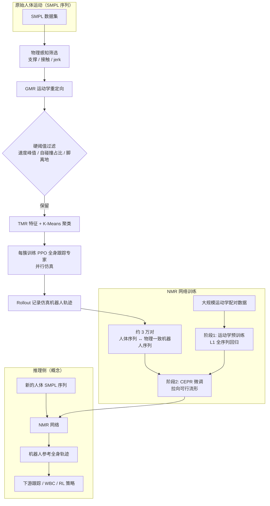

# NMR（神经运动重定向与人形全身控制）

**NMR（Neural Motion Retargeting）** 面向「人体 SMPL（或同类）序列 → 人形机器人可执行全身轨迹」：不把重定向当成孤立的逐帧几何优化，而是用**可扩展的监督数据 + 时序网络**直接学习跨具身的运动映射，使下游 **whole-body tracking / 控制**更容易收敛。

## 为什么重要

- **优化式重定向的天花板**：IK / GMR 类方法在非凸景观下对初始化敏感，动态动作上易出现关节跳变、自穿模与脚滑；人体估计噪声会被刚性传播。
- **数据瓶颈的拆解方式**：用仿真里训练好的 **分簇 RL 跟踪专家**把「有缺陷的运动学参考」拉回到**动力学生效**的轨迹上，再把这些 rollout 当作神经网络的**物理锚定监督**，避免只用劣质优化结果当标签。
- **与跟踪层衔接**：论文强调高质量参考能**加速下游全身控制策略**学习，把「重定向」从纯几何前处理推进到**对控制样本效率友好**的模块。

## 主要技术路线

| 模块 | 作用 |
|------|------|
| **物理感知筛选** | 从大规模 SMPL 库中剔除明显违背支撑、接触与平滑性假设的片段。 |
| **GMR 运动学初值** | 用现成优化重定向生成机器人侧初轨迹，再经速度/自碰撞/离地等规则过滤。 |
| **运动聚类 + 分簇 RL 专家** | 用运动–文本对齐表征（文中基于 **TMR**）做特征，K-Means 分簇；每簇训练 PPO 跟踪策略，在并行仿真中跟踪参考并记录真实机器人状态。 |
| **配对数据集（CEPR 输出）** | 得到约 3 万条 **(人体序列, 仿真物理一致机器人序列)**，作为高质量微调监督。 |
| **NMR 网络** | ResNet1D 编码 + **双向自注意力 Transformer**（整段并行，非自回归）+ Conv 解码，L1 回归机器人运动表示。 |
| **两阶段训练** | 大规模运动学数据预训练 → CEPR 数据物理微调。 |

## 流程总览（Mermaid）

下列流程图概括 **CEPR 数据构造** 与 **NMR 训练–部署** 的主干（细节与超参以论文为准）。

## 与优化式重定向（如 GMR）的关系

- **不是简单替代 GMR**：CEPR 仍以 GMR 产出作为**中间监督与覆盖度来源**，再用 RL+仿真做**物理修补**；NMR 最终目标是**快速推断**、全局时序一致与对输入噪声更稳的映射。
- **与「跳过重定向、直接 tracking」路线的对比**：类似 [ExoActor](./exoactor.md) 中「人体轨迹 → SONIC」强调下游通用跟踪器；NMR 则显式学习 **SMPL→机器人** 的时序映射，并用物理 rollout 定义「何为好的配对」。两条路线可放在同一决策空间里对比：**数据从哪来、误差从哪修、部署算力预算是多少**。

## 常见局限与阅读时注意点

- **仿真锚定偏差**：RL 专家与奖励定义决定「物理真值」的形状；sim-to-real 间隙仍会传导到网络输出。
- **聚类与专家数量**：簇数与训练成本折中；分布外动作仍可能超出专家覆盖。
- **表示与任务范围**：论文以 G1 与全身动态技能为主，上肢细操作、手部灵巧度等需单独评估。

## 与 ReActor（双层 RL 重定向）的对照

两者都把**物理仿真里的 RL 跟踪**当作获得「少伪影、可执行」机器人运动的关键杠杆，但组织方式不同：

- **NMR / CEPR**：先用 GMR 等得到运动学序列，再用**分簇 RL 专家**批量 rollout 构造**静态配对数据集**，最后训练**独立神经网络**做推断；推断阶段不再显式交替优化重定向参数。
- **ReActor**：用**双层优化**把**参数化参考** \(\mathbf{p}\) 与**单一跟踪策略** \(\phi\) 放在同环更新，上层通过**结构化近似梯度**回传误差，更偏「算法—优化」叙事，并报告四足等强异构形态。

工程选型可粗略按 **部署是否需要毫秒级前向网络**、**数据是否已固定为大规模离线库**、以及**是否要把“参考形变”本身当可微/可优化对象长期联合训练** 来权衡两条路线。

## 关联页面

- [Motion Retargeting（动作重定向）](../concepts/motion-retargeting.md) — 问题定义与常见流水线。
- [GMR（通用动作重定向）](./motion-retargeting-gmr.md) — NMR 数据管线中的运动学前端。
- [ReActor（物理感知 RL 运动重定向）](./reactor-physics-aware-motion-retargeting.md) — 双层联合优化参考与跟踪策略的对照路线。
- [SONIC（规模化运动跟踪）](./sonic-motion-tracking.md) — 另一类「人体/参考 → 人形执行」的大规模跟踪基线视角。
- [Whole-Body Control](../concepts/whole-body-control.md) — 下游 QP / 分层控制与参考跟踪接口。
- [Unitree G1](../entities/unitree-g1.md) — 论文实验平台。
- [Imitation Learning](./imitation-learning.md) — 高质量参考轨迹对模仿学习与 RL 奖励设计的意义。

## 推荐继续阅读

- 论文主页：<https://nju3dv-humanoidgroup.github.io/nmr.github.io/>
- arXiv：<https://arxiv.org/abs/2603.22201>

## 参考来源

- [neural_motion_retargeting_nmr（本入库摘录）](../../sources/papers/neural_motion_retargeting_nmr.md)
- [reactor_rl_physics_aware_motion_retargeting（对照阅读：双层 RL 重定向）](../../sources/papers/reactor_rl_physics_aware_motion_retargeting.md)
