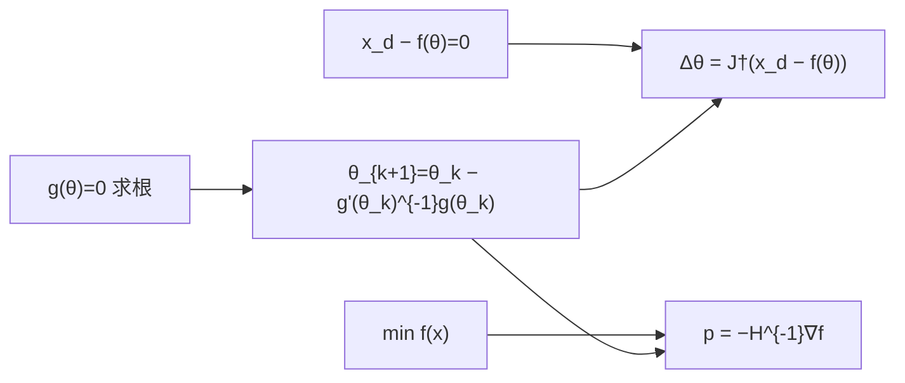

# Newton's Method / Newton–Raphson（牛顿–拉夫森法）

**牛顿–拉夫森法（Newton–Raphson method）**：对可微 $g(\theta)=0$，在当前点用 **一阶 Taylor 展开** 线性化并解修正量；标量式为经典 NR 迭代，向量式即 **Jacobian 伪逆** 数值 [逆运动学](../formalizations/inverse-kinematics.md)。在优化里令 $g=\nabla f$，同一思想给出 **Hessian 牛顿步** $p=-(\nabla^2 f)^{-1}\nabla f$。

## 英文缩写速查

| 缩写 | 英文全称 | 简要说明 |
|------|----------|----------|
| NR | Newton–Raphson Method | 线性化迭代求根；名自 Raphson (1690) 与 Newton 流数法 |
| IK | Inverse Kinematics | 末端目标 → 关节角；NR 的向量形态 |
| Jacobian | Robot Jacobian | $\partial f/\partial\theta$，NR 在 IK 中的系数矩阵 |
| Hessian | Hessian Matrix | $\nabla^2 f$；优化牛顿步的曲率矩阵 |
| DLS | Damped Least Squares | 奇异点附近给 $JJ^\top$ 加阻尼，NR 的工程稳定化 |
| NLP | Nonlinear Programming | 无约束/约束非线性规划 |
| LM | Levenberg-Marquardt | 阻尼牛顿在最小二乘上的变体 |
| GN | Gauss-Newton | 最小二乘的 Hessian 近似 |

## 为什么重要

- **IK 默认数值核：** 无 Pieper 闭式解时，控制器每周期用 NR + $J^\dagger$ 把 SE(3) 误差映回 $\Delta\theta$；初值热启动决定收敛到哪一个解支。
- **优化母型：** 理解 NR 后，[Gauss-Newton](./gauss-newton.md)、[LM](./levenberg-marquardt.md)、[截断牛顿](./truncated-newton.md) 都是「线性化 + 解线性系统」在不同问题结构上的变体。
- **历史可考：** Joseph Raphson 1690 年 *Analysis æquationum universalis* 是方法名的直接一手来源；机器人教材 *Modern Robotics* §6.2 给出可复现算例。

## 主要技术路线

### 1. 标量求根（§6.2.1 表述）

对 $g:\mathbb{R}\to\mathbb{R}$，在 $\theta_k$ 处

$$
g(\theta)\approx g(\theta_k)+\frac{\partial g}{\partial\theta}(\theta_k)(\theta-\theta_k).
$$

令右式为零并解 $\theta$：

$$
\theta_{k+1}=\theta_k-\left(\frac{\partial g}{\partial\theta}(\theta_k)\right)^{-1} g(\theta_k).
$$

重复至 $|g(\theta_k)|$ 或相对变化低于阈值。

### 2. 向量求根 → 数值 IK

正运动学 $x=f(\theta)$，目标 $x_d$，定义 $g(\theta)=x_d-f(\theta)$。Taylor 一阶截断：

$$
J(\theta_k)\,\Delta\theta = x_d - f(\theta_k), \qquad \Delta\theta = J^\dagger(\theta_k)\bigl(x_d-f(\theta_k)\bigr),
$$

$\theta_{k+1}=\theta_k+\Delta\theta$。SE(3) 目标 $T_{sd}$ 时，用 body twist $V_b=\log(T_{bs}^{-1}T_{sd})$ 与 **body Jacobian** $J_b$，更新 $\theta_{k+1}=\theta_k+J_b^\dagger V_b$（见 *Modern Robotics* §6.2.2）。

### 3. 与优化牛顿步

无约束最小化 $f(x)$：牛顿方向 $p_k=-(\nabla^2 f(x_k))^{-1}\nabla f(x_k)$ 即解 $\nabla^2 f(x_k)\,p=-\nabla f(x_k)$——与 NR 解 $J\Delta\theta=-g$ 同型。强凸邻域 **二次收敛**；非凸 Hessian 不定需阻尼或信赖域（见 [线搜索](./line-search-steepest-descent.md)、[LM](./levenberg-marquardt.md)）。

## 算例：Modern Robotics Example 6.1（平面 2R 数值 IK）

一手教材 *Modern Robotics* **Example 6.1**（Ch 6, p. 231–232）：两连杆各 **1 m**，body Jacobian NR 求目标位姿对应关节角。

| 量 | 数值 |
|----|------|
| 目标关节角 $\theta_d$ | $(30^\circ,\,90^\circ)$ |
| 对应末端 $(x,y)$ | $(0.366,\,1.366)$ m |
| 初值 $\theta_0$ | $(0^\circ,\,30^\circ)$ |
| 容差 | $\|\omega_b\|<0.001$ rad，$\|v_b\|<10^{-4}$ m |

**迭代表（摘录教材 Table，仅平面分量 $(\omega_{zb},v_{xb},v_{yb})$）：**

| $i$ | $(\theta_1,\theta_2)$ | 末端 $(x,y)$ m | $V_b=(\omega_{zb},v_{xb},v_{yb})$ | $\|\omega_b\|$ | $\|v_b\|$ |
|-----|------------------------|----------------|-----------------------------------|---------------|----------|
| 0 | $(0.00^\circ,\,30.00^\circ)$ | $(1.866,\,0.500)$ | $(1.571,\,0.498,\,1.858)$ | 1.571 | 1.924 |
| 1 | $(34.23^\circ,\,79.18^\circ)$ | $(0.429,\,1.480)$ | $(0.115,\,-0.074,\,0.108)$ | 0.115 | 0.131 |
| 2 | $(29.98^\circ,\,90.22^\circ)$ | $(0.363,\,1.364)$ | $(-0.004,\,0.000,\,-0.004)$ | 0.004 | 0.004 |
| 3 | $(30.00^\circ,\,90.00^\circ)$ | $(0.366,\,1.366)$ | $(0.000,\,0.000,\,0.000)$ | 0.000 | 0.000 |

**读法：** 第一步把初值沿 screw 轴大幅拉向目标（故 $v_{xb}>0$ 尽管目标在 $-\hat x_b$ 侧）；**三步** 即满足容差。多解时收敛到离 $\theta_0$ 最近 basin 内的根；初值落在「平台区」可能不收敛（教材 Figure 6.7 说明）。

**标量玩具例（求 $\sqrt{2}$）：** 解 $g(x)=x^2-2=0$，$g'(x)=2x$，NR 为 $x_{k+1}=x_k-(x_k^2-2)/(2x_k)=\tfrac12(x_k+2/x_k)$。$x_0=1$ 时 $x_1=1.5$，$x_2\approx1.4167$，二次收敛至 $\sqrt{2}$——与 Raphson 原典代数求根精神一致。

## 工程实践

| 场景 | 用法 |
|------|------|
| 实时 IK | 上一周期 $\theta_d$ 作 $\theta_0$；$T_{sd}$ 慢变 |
| 奇异 / 冗余 | $J^\dagger$ 或 [DLS](../formalizations/inverse-kinematics.md) 替代 $J^{-1}$ |
| 有小闭式解 | 闭式解作 NR 初值，修正机构误差 |
| TrajOpt / NLP | 全 Hessian 牛顿或 [GN](./gauss-newton.md) / [L-BFGS](./l-bfgs.md) |
| 库函数 | *Modern Robotics* `IKinBody(Blist,M,T,thetalist0,eomg,ev)` |

## 局限与风险

- **局部收敛：** 初值须落在目标解的 basin 内；远距离目标或多解时可能发散或收敛到「错误」支。
- **Jacobian 奇异：** $J$ 秩亏时须伪逆 / DLS / 零空间，否则步长爆炸。
- **优化语境：** 非凸 Hessian 不定时裸牛顿可能上升；需修正或转 LM。
- **算力：** 稠密 $n\times n$ Hessian 分解 $O(n^3)$；高维用 GN、截断牛顿或拟牛顿。

## 关联页面

- [Inverse Kinematics](../formalizations/inverse-kinematics.md) — DLS、零空间与 NR 并列的数值 IK 工程表
- [Robot Jacobian](../formalizations/robot-jacobian.md) — NR 系数矩阵
- [Modern Robotics 教材](../entities/modern-robotics-book.md) — Ch 6 完整推导
- [Gauss-Newton](./gauss-newton.md) · [Levenberg-Marquardt](./levenberg-marquardt.md) · [Truncated Newton](./truncated-newton.md)
- [Second-Order Optimizers 对比](../comparisons/second-order-optimizers.md)

## 参考来源

- [Newton–Raphson 一手资料汇编](../../sources/papers/newton_raphson_method_primary_refs.md) — Raphson (1690)、MR Example 6.1
- [Modern Robotics 教材归档](../../sources/papers/modern_robotics_textbook.md) — Ch 6.2
- [Second-Order Optimizers 论文摘录](../../sources/papers/second_order_optimizers.md)
- [数值优化基础课程](../../sources/courses/numerical_optimization_foundations_robotics.md) — 第 1 章阻尼牛顿

## 推荐继续阅读

- Lynch & Park, *Modern Robotics* [PDF §6.2](https://hades.mech.northwestern.edu/images/7/7f/MR.pdf) — NR 与 Example 6.1
- Raphson (1690), *Analysis æquationum universalis* — [e-rara 扫描](https://doi.org/10.3931/e-rara-13516)
- Nocedal & Wright, *Numerical Optimization* Ch 1–2
