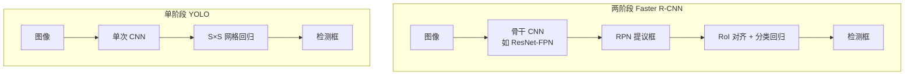

# 目标检测（Object Detection）

## 一句话定义

**目标检测**在给定图像中同时回答 **「有什么物体」** 与 **「在哪里（边界框）」**；在机器人中它为 **抓取、导航、人机交互** 提供 **物体级语义与几何锚点**。

## 英文缩写速查

| 缩写 | 英文全称 | 简要说明 |
|------|----------|----------|
| mAP | mean Average Precision | 检测精度标准指标 |
| R-CNN | Regions with CNN features | 区域 CNN 两阶段检测开山工作 |
| RPN | Region Proposal Network | Faster R-CNN 中的可学习提议子网 |
| YOLO | You Only Look Once | 单次回归实时检测范式 |
| IOU | Intersection over Union | 框重叠率，训练与评估核心量 |
| NMS | Non-Maximum Suppression | 去重后处理 |
| FPN | Feature Pyramid Network | 多尺度特征金字塔 |

## 为什么重要

- **操作前置：** 抓取管线常依赖 **6DoF 位姿估计** 或 **候选框**（见 [Manipulation](../tasks/manipulation.md)）；检测质量直接决定后续规划可否启动。
- **实时闭环：** 移动机器人、足球人形（[Humanoid Soccer](../tasks/humanoid-soccer.md)）需要 **>10–30 FPS** 感知；[YOLO v1](../entities/paper-yolo-unified-realtime-detection.md) 确立了 **单次回归** 的可行路线。
- **与分类/分割分工：** 检测输出 **稀疏实例框**；语义分割给 **逐像素类**；实例分割二者兼有——机器人任务按 **延迟与输出形式** 选型。

## 主要技术路线

### 两阶段：区域提议 + 分类

| 阶段 | 代表 | 特点 |
|------|------|------|
| R-CNN | Girshick et al. | Selective Search 提议 → CNN 特征 → SVM；慢 |
| Fast R-CNN | 共享卷积特征 | 比 R-CNN 快，仍依赖外部提议 |
| Faster R-CNN | RPN + RoI | 端到端训练，**ResNet-FPN** 骨干常见；精度高、延迟较大 |

**机器人语境：** 离线标注、高精度抓取、算力充足的服务器侧感知。

### 单阶段：密集预测 / 回归

| 方法 | 核心思想 | 典型性能（论文时代） |
|------|----------|----------------------|
| [YOLO v1](../entities/paper-yolo-unified-realtime-detection.md) | S×S 网格一次回归 | 63.4 mAP @ **45 FPS** |
| SSD | 多尺度 default boxes | 精度与速度折中 |
| RetinaNet | Focal loss 平衡难易样本 | 单阶段逼近两阶段精度 |

**机器人语境：** 机载实时 **球体/障碍/人** 检测；后续 YOLOv5–v8、TensorRT 加速为工程主流。

### 流程总览

## 误差画像与组合

YOLO v1 误差分析（相对 Fast R-CNN）：
- **定位错误** 占比最高——小目标、密集场景尤甚。
- **背景误报** 显著更少——全图上下文的优势。
- **组合策略：** YOLO 对 Fast R-CNN 重打分可 **+3.2 mAP**，利用互补误差结构。

## 常见误区或局限

- **误区：「mAP 高就等于机器人能用。」** 实机还需考虑 **相机标定、延迟、类别开放集、遮挡与运动模糊**。
- **误区：「只换最新 YOLO 就够。」** 数据分布（仿真纹理 vs 真机）、**输入分辨率与 NMS 阈值** 往往比架构版本更敏感。
- **局限：** 纯 2D 框不提供 **完整 6DoF**；操作常需级联 **深度/点云/位姿网络**。

## 关联页面

- [视觉骨干（概念）](../concepts/vision-backbones.md)
- [CNN vs ViT 视觉骨干（对比）](../comparisons/cnn-vs-vit-backbones.md)
- [ResNet（论文实体）](../entities/paper-resnet-deep-residual-learning.md)
- [YOLO v1（论文实体）](../entities/paper-yolo-unified-realtime-detection.md)
- [Manipulation（任务）](../tasks/manipulation.md)
- [Humanoid Soccer（任务）](../tasks/humanoid-soccer.md)
- [Booster RoboCup Demo](../entities/booster-robocup-demo.md)
- [Visual Servoing（方法）](./visual-servoing.md)
- [Query：目标检测模型选型](../queries/object-detection-model-selection.md)

## 参考来源

- [YOLO v1 论文摘录（arXiv:1506.02640）](../../sources/papers/yolo_arxiv_1506_02640.md)
- [ResNet 论文摘录（arXiv:1512.03385）](../../sources/papers/resnet_arxiv_1512_03385.md)
- [经典视觉骨干与检测文献簇](../../sources/papers/vision_backbone_detection_classics.md)

## 推荐继续阅读

- [YOLO 论文 PDF](https://arxiv.org/pdf/1506.02640.pdf)
- [Faster R-CNN](https://arxiv.org/abs/1506.01497)
- [Ultralytics YOLO 文档](https://docs.ultralytics.com/)（工程后继）
