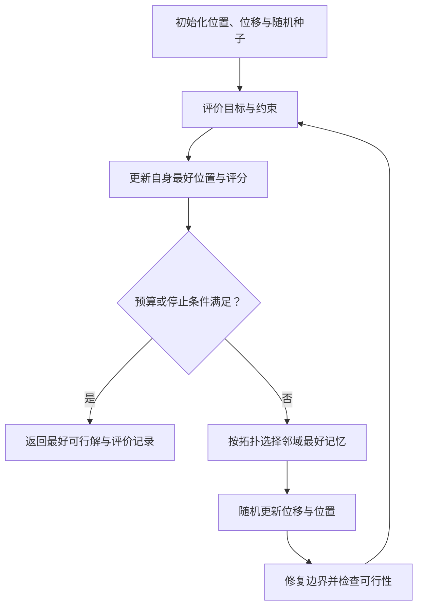
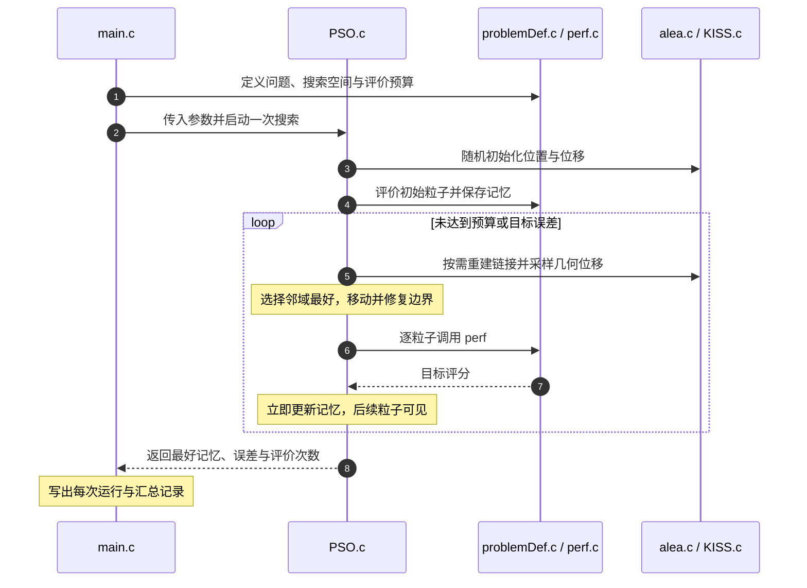

# Particle Swarm Optimization（粒子群优化，PSO）

**PSO 用一群候选参数“各自试、记住最好结果、参考同伴继续移动”，只需目标函数评分，不需要目标梯度。** 粒子的位置是待优化的参数向量，不是必须真实移动的机器人；速度是参数空间的位移。

## 英文缩写速查

| 缩写 | 英文全称 | 简要说明 |
|---|---|---|
| PSO | Particle Swarm Optimization | 粒子群优化 |
| pbest | Personal Best | 某粒子迄今评分最好的位置 |
| gbest | Global Best | 全群历史最好位置；仅在全局拓扑中供所有粒子参考 |
| lbest | Local Best | 信息邻域内的历史最好位置，不是局部极小值的数学证明 |
| SPSO | Standard Particle Swarm Optimisation | 用于比较算法的明确版本基线 |
| NFE | Number of Function Evaluations | 函数评价次数，比单独比较迭代次数更公平 |
| GA | Genetic Algorithm | 遗传算法；交叉 / 变异 / 选择的机制不同于基本 PSO |

## 为什么重要

- 适合仿真器只返回一个分数、无法可靠求梯度的参数搜索。
- 核心状态少，容易构造随机搜索之外的黑箱基线；但“容易写”不等于容易得到稳健结果。
- 是 [AutoPSO](../entities/paper-autopso.md) 的基础：AutoPSO 搜的是 PSO 更新组件，本页解释被自动组装的基本算法。

## 一手资料与发展脉络

| 时间 | 原始资料 | 应当从中读什么 |
|---|---|---|
| 1995-10 | Eberhart / Kennedy，*A New Optimizer Using Particle Swarm Theory*，MHS'95 | 两种范式与局部信息；[DOI](https://doi.org/10.1109/MHS.1995.494215) |
| 1995 | Kennedy / Eberhart，*Particle Swarm Optimization*，ICNN'95 | 从社会模拟到参数搜索；[DOI](https://doi.org/10.1109/ICNN.1995.488968) |
| 1998 | Shi / Eberhart，*A Modified Particle Swarm Optimizer* | 惯性权重及其调度；[DOI](https://doi.org/10.1109/ICEC.1998.699146) |
| 2002 | Clerc / Kennedy，*The Particle Swarm—Explosion, Stability, and Convergence in a Multidimensional Complex Space* | 粒子轨迹稳定性与收缩；[DOI](https://doi.org/10.1109/4235.985692) |
| 2012 报告，讨论 2006–2011 版本 | Maurice Clerc，*Standard Particle Swarm Optimisation* | 标准实现的差异，不是某个通用三项公式的别名；[HAL](https://hal.science/hal-00764996) |

日期按论文 / 报告而非数据库收录时间；两篇 1995 论文都值得保留。全文访问方式与本次核查层级见[一手资料归档](../../sources/papers/pso_foundations_1995_2012.md)。

## 核心机制

### 1）每个粒子到底保存什么

最小化 $f(x)$，共有 $N$ 个粒子，参数维数为 $D$：

- $x_i^t\in\mathbb R^D$：第 $i$ 个候选参数，$t$ 是迭代索引。
- $v_i^t\in\mathbb R^D$：上次参数位移；不是物理速度或控制输出。
- $p_i^t$：该粒子历史最低目标值对应的位置，并保存 $f(p_i^t)$。
- $b_i^t$：其信息邻域内最好记忆；全局版本为所有粒子共享的 $g^t$。

初始化先评价所有位置，再令 $p_i^0=x_i^0$；**最好位置与其评分一起存**。目标变化或有噪声时，旧评分不一定能与新评分直接比较。

### 2）惯性权重形式：不是把梯度换个名字

常见连续 PSO（1998 惯性形式）的坐标更新：

$$
v_{i,d}^{t+1}=w_t v_{i,d}^t
 +c_1 r_{1,i,d}^t(p_{i,d}^t-x_{i,d}^t)
 +c_2 r_{2,i,d}^t(b_{i,d}^t-x_{i,d}^t),
\qquad
x_{i,d}^{t+1}=x_{i,d}^t+v_{i,d}^{t+1}.
$$

$d$ 是维度索引；$r_1,r_2$ 是每粒子、每坐标、每次更新重新采样的独立 $U(0,1)$ 随机数；$c_1,c_2$ 是非负加速系数；$w_t$ 是惯性权重。三项分别保留旧位移、回到自身好经验、参考邻域好经验。它们**不是** $\nabla f$，不保证每个粒子的当前分数单调改善；静态、确定性目标下，保存的历史最好分数才不增。

**一维读法：** $f(x)=x^2$，某粒子当前 $x=2$、旧位移 $v=0$、自身历史最好 $p=1$、邻域最好 $b=0$；取 $c_1=c_2=1$、$r_1=r_2=0.5$，则新位移 $-1.5$、新位置 $0.5$，评分从 4 变为 0.25。这只是一次更新示例，不是收敛证明。

### 3）收缩因子形式：参数不能串用

常见收缩式写成：

$$
v_i^{t+1}=\chi\left[v_i^t+
 \phi_1 r_1\odot(p_i^t-x_i^t)+
 \phi_2 r_2\odot(b_i^t-x_i^t)\right],
\quad
\chi=\frac{2\kappa}{\left|2-\phi-\sqrt{\phi^2-4\phi}\right|},
\quad \phi=\phi_1+\phi_2>4.
$$

$\odot$ 是逐坐标乘法；$0<\kappa\le1$ 控制收缩。示例取 $\kappa=1$、$\phi_1=\phi_2=2.05$，得到 $\chi\approx0.7298$。换到上面的惯性写法时，应为 $w=\chi$、$c_1=\chi\phi_1$、$c_2=\chi\phi_2$（约 1.496），**不是**只把 $w$ 设为 0.7298 而保留两个 2.05。

Clerc / Kennedy 分析的是粒子动力学；不能将这组系数解读为任意目标的全局最优保证，也不能自动套给不同拓扑 / 边界 / 随机规则的实现。

## 流程总览

下面是**同步惯性 PSO 的教学骨架**，不是 SPSO-2011 C 包的逐行复刻。

初始化与后续每轮使用一致的评分规则。一般约束问题必须额外保存“最好可行解”；若从未找到可行解，应返回失败 / 不可行报告，而不是声称已得到可部署参数。

## 主要技术路线

| 路线 | 变化 | 复现时不能省略 |
|---|---|---|
| 全局 gbest | 全群共享最好记忆 | 传播快，但可能损失多样性、早熟停滞 |
| 局部 lbest | 使用环形等信息邻域 | 邻域是通信规则，不保证是搜索空间最近邻 |
| 惯性权重 | 旧位移乘 $w_t$ | 固定值 / 调度、随机数与速度上限 |
| 收缩式 | 整个更新乘 $\chi$ | 方程与系数成套，不能与惯性式机械混搭 |
| SPSO-2011 | 几何式采样、随机信息链接 | 不是上面的逐维惯性公式；顺序更新与可选项见源码 |

离散 / 多目标任务需要专门的编码、更新或档案管理；不能把连续变量简单取整就默认获得正确离散算法。

## 源码运行时序图

对齐 [Particle Swarm Central 的历史 C ZIP](../../sources/repos/standard_pso_2011.md)：这是作者来源的 SPSO-2011 参考代码，不是虚构的 1995 GitHub 仓库。

实际包的 `main.c` 直接 include 多个 `.c`；编译需 GSL 头文件与链接库，不应重复编译被 include 的文件。输出会覆盖当前目录同名 `f_run.txt` 等文件。本次只下载、核对哈希和源码，没有编译或复现其基准结果。

## 工程实践：怎样才算公平的黑箱基线

以下为面向机器人项目的**工程归纳**，不是奠基论文已验证的真机方案。

1. **定义参数与单位：** 用有界、归一化的参数表示；明确最小化 / 最大化。碰撞、稳定性、扭矩等约束单独记录，只有参数上下界远远不够。
2. **固定预算与版本：** 记录粒子数、拓扑、随机种子、系数方程、边界与速度处理，以及同步 / 顺序更新；同样迭代数但粒子数不同不是同样计算量。
3. **计算代价：** 每粒子每完整同步代评价一次，含初始化约为 $N(T+1)$ 次。基础 gbest 向量更新 / 状态存储为 $O(ND)$，但目标评估、邻域检索或源码的稠密链接矩阵可增加代价。
4. **处理噪声：** 对同一参数重复 rollout，统一环境种子或随机条件；复核精英的均值 / 方差，避免一次偶然高分永久支配记忆。测试集不得参与搜索。
5. **报告多次运行：** 同时给出 NFE、墙钟时间、成功 / 可行率及分位数，不只展示最好一次；与随机搜索、[CMA-ES](./cma-es.md) 或合适的梯度法在同一预算下比较。

### 机器人里的放置位置

| 场景 | 可搜索的参数 / 目标 | 不能由 PSO 自动保证 |
|---|---|---|
| 离线系统辨识 | 摩擦、阻尼等参数；仿真与观测的轨迹误差 | 参数可辨识性、模型正确性；仍需[实验设计](../concepts/system-identification.md) |
| 仿真控制整定 | 一组有界控制增益；跟踪与能耗评分 | 真机稳定、力矩安全与延迟鲁棒性 |
| 轨迹参数搜索 | 低维样条参数；长度、平滑与碰撞代价 | 连续时间碰撞可行性与动力学约束 |
| 优化器设计 | 如 [AutoPSO](../entities/paper-autopso.md) 搜 PSO 组件 | 内层评分之外的跨任务泛化 |

基础 PSO 不宜被直接当作有严格时限和硬安全要求的高频控制器；在线使用必须另证最坏耗时、可行性和 fallback。原论文的“机器人任务学习”提议与现代部署验证应分开。

## 常见误区与选型边界

- **PSO 等于 GA：** 都可用群体评分，但基本 PSO 是记忆与位移更新，不靠交叉 / 变异繁殖。
- **gbest 是真实全局最优：** 它只是当前搜索见过的最好解；早熟与停滞仍可能发生。
- **粒子群就是多机器人协同：** 优化粒子通常是参数向量；与多机器人通信控制不是同一问题，也不是粒子滤波的后验状态估计。
- **小速度 / 稳定轨迹就是找到最优：** 可能只是在非最优区域停滞，必须检查任务分数与多次重启结果。
- **罚函数足够就安全：** 有限罚权重不保证硬约束；边界截断也只能处理盒约束。参见[约束优化](../concepts/constrained-optimization.md)。
- **黑箱算法总比梯度好：** 有可靠梯度和结构时优先利用结构；PSO / CMA-ES 是无梯度时的候选，不是普适赢家。昂贵评估或高维问题需先考虑预算、降维与代理模型。

## 关联页面

- [AutoPSO](../entities/paper-autopso.md) — 基础方法之上的双层自动设计。
- [CMA-ES](./cma-es.md) — 更新高斯分布与协方差，区别于粒子个体记忆。
- [数值优化方法选型](../queries/numerical-optimization-method-selection.md) — 黑箱群体搜索与利用梯度 / 动力学结构的方法分流。
- [约束优化](../concepts/constrained-optimization.md)、[系统辨识](../concepts/system-identification.md) — 可行性与目标设计。

## 参考来源

- [PSO 奠基论文与标准报告](../../sources/papers/pso_foundations_1995_2012.md) — 四篇原始研究与 Clerc 技术报告，包含核查层级。
- [Particle Swarm Central](../../sources/sites/particle_swarm_central.md) — 资料站与源码开放状态。
- [SPSO-2011 C 源码核查](../../sources/repos/standard_pso_2011.md) — ZIP 哈希、文件入口、参数与顺序更新。

## 推荐继续阅读

- [1995 ICNN 论文原文镜像](https://staff.washington.edu/paymana/swarm/kennedy95-ijcnn.pdf)
- [Clerc 标准报告原文镜像](https://mat.uab.cat/~alseda/MasterOpt/SPSO_descriptions.pdf)
- [Particle Swarm Central 程序目录](https://www.particleswarm.info/Programs.html)
