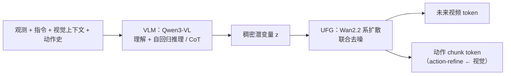

# Pelican-Unified 1.0（统一具身智能 UEI）

Pelican-Unified 1.0 将 Qwen3-VL 的语义理解与链式推理末态 \(z\)，与 Wan 系扩散 UFG 耦合，使未来视频与动作块在同一去噪轨迹中联合生成。

**Pelican-Unified 1.0** 是 X-Humanoid 团队围绕 **统一具身智能（Unified Embodied Intelligence, UEI）** 提出的具身基础模型：用单一 VLM 同时承担 **场景–指令–历史** 的语义整合与 **可监督链式推理**，再把推理压缩为稠密潜变量 **\(z\)**，由 **Unified Future Generator（UFG）** 在 **同一扩散过程** 中联合解码 **未来视频** 与 **下一动作块**，从而让「理解—推理—想象—执行」在 **梯度层面** 互相约束，而不是四个独立专家的输出拼接。

> 论文题录为 *Pelican-Unified*；部分材料写作 *Pelican-Unify*，本页以 arXiv 标题为准。

## 一句话定义

把具身智能建模成 **单训练对象** 的闭环：**共享语义空间里的理解与语言推理** → **稠密循环状态 \(z\)** → **条件扩散同时roll未来像素与动作**，并用 **action-refine** 让动作读出前回看已想象的视觉 token。

## 为什么重要

- 为「**统一**」给出可操作的三分解：**统一理解**、**统一推理**、**统一生成**（见下），便于和纯 VLA、仅联合视频–动作而无显式推理链的 WAM 变体对照。
- 在公开叙述中，同一 checkpoint 同时参与 **VLM 基准**、**WorldArena（世界建模）** 与 **RoboTwin（操作）** 等异构评测，支撑「不牺牲专才强度」的经验主张（具体数字以论文表格为准）。
- 工程上把 **Qwen3-VL-4B** 与 **Wan2.2-5B** 级视频扩散骨干 **端到端耦合**，是观察 **多模态损失如何共塑 \(z\)** 的参考实现之一。

## 主要技术路线

- **统一理解 + 统一推理（VLM）**：以 [Foundation Policy（基础策略模型）](../concepts/foundation-policy.md) 语境下的多模态骨干为容器，把观测、语言与动作史压入共享语义空间，并以可监督 CoT 收口为稠密 **\(z\)**（与 [Cross-modal Attention](../formalizations/cross-modal-attention.md) 中的「视–语对齐」读法相容，但本模型额外强调 **\(z\) 对生成的硬条件化**）。
- **统一生成（UFG）**：在 **\(z\)** 条件下用扩散同时去噪 **未来视频 token** 与 **动作 chunk token**，并在读出前做 **action-refine**；训练上对齐 [Generative World Models](./generative-world-models.md) 的「像素动力学」工具箱，但把控制与想象锁在同一反传图里。
- **与 WAM 分类的接点**：整体落在 [World Action Models（WAM）](../concepts/world-action-models.md) 的 **Joint** 族一侧——联合未来与动作——并显式插入 **语言推理状态** 作为枢纽变量。

## 核心结构

### 三统一（论文范式）

1. **统一理解**：观测、自然语言指令、视觉上下文与动作历史进入 **同一语义空间**，减少感知–语言–控制分编码带来的语义断裂。
2. **统一推理**：链式思考不是脱离物理后果的独白，而是 **可监督、与任务与动作选择对齐** 的过程；**末隐状态投影为 \(z\)**，直接规定「应想象何种未来、应执行何种动作」。
3. **统一生成**：**未来视频与低层动作** 来自 **同一 denoising 轨迹**、同一 **\(z\)** 条件；动作在最终读出前通过 **action-refine** 对想象视觉 token 再做注意力汇聚，使执行与像素级想象对齐。

### 流程总览

### 与相邻范式的分界

| 范式 | Pelican-Unified 相对位置 |
|------|---------------------------|
| **反应式 VLA** | 本模型显式引入 **面向未来的视频分支** 与 **共享 \(z\)**，训练目标不限于 \(p(a\mid o,l)\) 边缘 |
| **Cascaded WAM** | 非「世界模型先 rollout、再外挂策略」两阶段商品化拼接；**推理潜变量与联合扩散**耦合更紧 |
| **Joint WAM** | 与「共享模型联合预测未来与动作」同族；附加亮点是 **VLM CoT → \(z\)** 作为可解释、可监督的 **循环状态** |
| **Being-H0.7 类潜空间世界–动作** | 同为「世界信号训练时参与、部署可减轻像素 roll」讨论族；Pelican 更强调 **扩散联合生成 + VLM 推理枢纽** |

## 局限与阅读注意

- **系统复杂度与推理成本**：VLM 前向 + 扩散视频–动作联合解码，对 **闭环频率与边缘部署** 不友好，需结合异步 chunk、蒸馏或小步数扩散等工程手段（本页不替论文声称已解决）。
- **可复现依赖**：骨干分别初始化自 **Qwen3-VL** 与 **Wan2.2** 生态，训练数据与算子细节需以原文与后续开源发布为准。
- **评测口径**：跨 VLM / 世界模型 / 操作三套基准的「单模型」叙述，应回到各基准 **任务定义与协议** 再解读，避免跨域简单排名化。

## 与其他页面的关系

- [World Action Models（WAM）](../concepts/world-action-models.md) — 联合未来–动作的文献坐标与 Cascaded/Joint 分类。
- [VLA](./vla.md) — 视觉–语言–动作主线；Pelican 可视为在 VLA 语义骨干上 **显式闭合世界想象分支** 的一条架构支线。
- [Generative World Models](./generative-world-models.md) — 视频级未来预测工具箱与工程张力（物理一致性、延迟）。
- [Being-H0.7](./being-h07.md) — 潜空间世界–动作先验的另一工程路径，对照「像素 roll 与否」与表示压缩取舍。
- [StarVLA](./star-vla.md) — 同 **Qwen3-VL** 生态的极简 VLA 参照，对比「何时值得叠 UFG」。

## 参考来源

- [Pelican-Unified 1.0 技术报告（arXiv:2605.15153）](../../sources/papers/pelican_unified_uei_arxiv_2605_15153.md)
- [World Action Models 综述（arXiv:2605.12090）](../../sources/papers/world_action_models_survey_2605.md)

## 关联页面

- [World Action Models（WAM）](../concepts/world-action-models.md)
- [VLA](./vla.md)
- [Generative World Models](./generative-world-models.md)
- [Being-H0.7](./being-h07.md)

## 推荐继续阅读

- Dai et al., *Pelican-Unified 1.0: A Unified Embodied Intelligence Model (UEI) for Understanding, Reasoning, Imagination and Action* — [arXiv:2605.15153](https://arxiv.org/abs/2605.15153) · [PDF](https://arxiv.org/pdf/2605.15153.pdf)
- Wang et al., *World Action Models: The Next Frontier in Embodied AI* — [arXiv:2605.12090](https://arxiv.org/abs/2605.12090)
