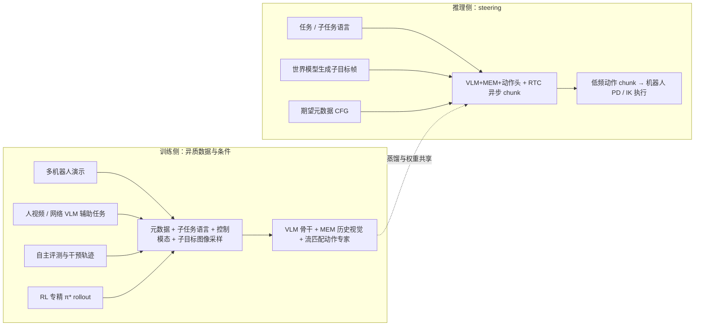

# π₀.7（Pi-zero 0.7）通才 VLA

**π₀.7** 是 Physical Intelligence 在 2026 年公开的**通才机器人基础策略（VLA）**：在保留 π 系 **flow matching 动作头**与 **MEM 式历史视觉**的前提下，把「数据规模」与「**可条件化的执行方式**」绑在一起——用统一的**多模态提示结构**告诉模型**做什么**以及**以何种策略/质量/速度去做**，从而能同时吃下高质量演示、带标注的次优自主数据、跨机器人形态日志、人视频与网络辅助任务，并在多项 dexterous 任务上达到此前需要 **RL 专精（π*₀.₆）** 才能拿到的成功率与吞吐，同时在官方实验中展示**组合式任务指令**与**跨本体零样本迁移**的早期迹象。

## 一句话定义

把 VLA 的提示从「一句任务语言」扩展为**语言子任务 + 片段元数据 + 控制模态 +（可选）视觉子目标**的可 dropout 上下文，用同一通才模型吸收异质数据并在测试时继续 steer 行为。

## 为什么重要

- **异质数据 ≠ 直接混合**：多机器人、多风格、不同质量的数据 naive 合并常导致策略对多模态行为取平均；π₀.₇ 用**显式条件**把不同执行模式变成提示空间中的不同模式，而不是互相污染。
- **把 RL 专精「蒸馏进通才」**：团队将 Recap / π*₀.₆ 路线产生的自主 rollout 作为训练源，通过元数据区分「高表现专精行为」，使单一 π₀.₇ 在洗衣、浓缩咖啡、折箱等任务上对标或超过任务专训 RL 策略的归一化吞吐（官方博客图表叙事）。
- **组合泛化与跨本体**：博客与论文均强调在**未见厨电组合操作**、**语言分步 coaching**、以及**未见本体上的折衣**等设置上的定性/定量证据——这是机器人基础模型是否具备「LLM 式组合性」的关键压力测试之一。

## 主要技术路线

### 提示里有什么

- **任务语言**与**子任务语言**（可由人 coaching 或高层语言策略给出）。
- **片段元数据**：如整体速度、质量评分、是否失误等，用于标定演示或 rollout 的「档次」。
- **控制模态标签**：关节空间 vs 末端执行器空间等，对齐不同控制接口的数据。
- **视觉子目标图像**：刻画当前子步骤末态布局；训练时混合**真未来帧**与**世界模型生成图像**，测试时可由轻量生成模型在线刷新。

训练时对上述分量做**随机 dropout**，迫使模型在缺失部分条件时仍能工作；推理时则可按需启用子目标或 **CFG**（论文对元数据 CFG 给出中等强度系数）以拉高成功率或执行速度。

### 流程总览（训练数据 ↔ 推理闭环）

**读图要点**：左侧强调「**同一提示 schema**」是合并异质数据源的前提；右侧强调测试时可以用**世界模型**补全视觉子目标，用**元数据 + CFG** 拉高「做得快 / 做得好」的偏好，并与 **RTC** 异步推理兼容（论文给出延迟仿真与异步子目标刷新策略）。

## 与 π₀、MEM 与 LWD 的关系

- **[π₀（Pi-zero）](./π0-policy.md)**：π₀.₇ 继承 π 系 **VLM + flow matching 连续动作** 的基本范式，但把研究重心移到**提示工程化的多模态条件**与**跨源数据对齐**。
- **MEM 历史视觉**：π₀.₇ 明确建立在 **π₀.₆-MEM** 一脉的历史帧编码之上，并加入子目标图像与新的本体状态 tokenization。
- **[LWD](./lwd.md)**：同属「部署/评测产生的经验如何回到通才模型」语境；LWD 用 **offline-to-online RL** 显式优化价值，而 π₀.₇ 此文侧重用**条件模仿 + 蒸馏**吸收大量自主与次优轨迹——二者可并列阅读以理解工业界两条「闭环数据」路线。

## 常见误区

- **误区 1：视觉子目标只是测试时技巧。** 论文强调训练–测试在子目标上的联合分布设计（真帧采样区间、生成图像混合、dropout 比例），否则世界模型图像与策略训练分布错配会伤害泛化。
- **误区 2：通才必然弱于专精。** 在官方报告的若干 dexterous 任务上，单一 π₀.₇ 的归一化吞吐与成功率可以对齐或超过 **π*₀.₆** 专精策略；代价是系统复杂度转移到**数据标注、提示与推理管线**。
- **误区 3：组合泛化已被完全解决。** 博客中的厨电案例表明，**零样本长指令**仍可能不完整成功，**分步语言 coaching** 或学习高层策略生成子任务可显著提升表现——组合能力更像「出现迹象」而非已闭合问题。

## 参考来源

- [sources/papers/pi07.md](../../sources/papers/pi07.md) — 本次 ingest 的论文 + 博客统一归档
- Physical Intelligence, *$\pi_{0.7}$ : a Steerable Generalist Robotic Foundation Model with Emergent Capabilities*, arXiv:2604.15483 — <https://arxiv.org/abs/2604.15483>
- Physical Intelligence, *π0.7: a Steerable Model with Emergent Capabilities*（博客）— <https://www.pi.website/blog/pi07>

## 关联页面

- [π₀ (Pi-zero) 策略模型](./π0-policy.md) — π 系前代 flow-matching VLA 基线
- [VLA（Vision-Language-Action）](./vla.md) — 通才策略模型族谱与工程瓶颈
- [Foundation Policy（基础策略模型）](../concepts/foundation-policy.md) — 与 RT-2、Octo 等并列的代表模型视角
- [World Action Models（WAM）](../concepts/world-action-models.md) — 当子目标由世界模型在线给出时，与「未来观测–动作联合建模」讨论相邻
- [Action Chunking](./action-chunking.md) — 与 RTC、异步推理配套的低层执行接口
- [LWD（Learning while Deploying）](./lwd.md) — 另一条把车队经验喂回通才 VLA 的 RL -centric 路线

## 推荐继续阅读

- Black et al., *π₀: A Vision-Language-Action Flow Model for General Robot Control* — <https://arxiv.org/abs/2410.24164>（π 系方法学前身）
- Physical Intelligence 博客《Recap / π*₀.₆ 专精策略》— <https://www.pi.website/blog/pistar06>（RL 专精与吞吐优化叙事，π₀.₇ 蒸馏源之一）
- Physical Intelligence, *HiRobot* — <https://www.pi.website/research/hirobot>（博客中用于自动生成子任务语言的高层策略参照）
