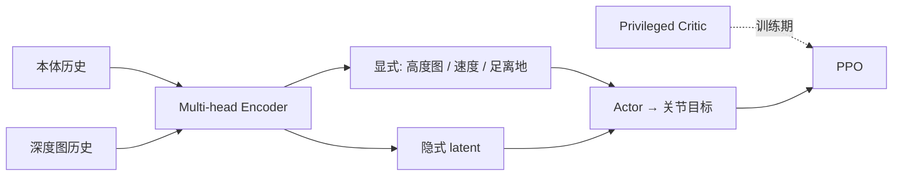

# PIE：感知一阶段鲁棒行走（隐式–显式学习）

**PIE**（*Parkour with Implicit-Explicit Learning Framework for Legged Robots*，ZJU，IEEE RA-L 2024，[arXiv:2408.13740](https://arxiv.org/abs/2408.13740)）是**单阶段**视觉跑酷框架：Actor 仅用深度图与本体历史；Estimator 多头输出**显式**物理量（高度图、基座速度、足端离地）与**隐式**环境 latent，与 PPO 联合训练。RoboParty 飞书 Know-How 将其列为「**PIE 感知一阶段鲁棒行走**」教学模块。

## 一句话定义

不拆 teacher–student 两阶段，让深度+本体在训练期直接为最终动作服务，同时维护可解释的显式地形估计与压缩的隐式环境表征。

## 英文缩写速查

| 缩写 | 英文全称 | 简要说明 |
|------|----------|----------|
| PIE | Parkour with Implicit-Explicit Learning | 本文框架名 |
| RL | Reinforcement Learning | 单阶段 PPO 训练 |
| VAE | Variational Autoencoder | 隐式环境表征常用组件 |
| Sim2Real | Simulation to Real | 论文报告零样本真机跑酷 |
| AMP | Adversarial Motion Prior | 可与运动先验结合（社区复现路线） |
| MPC | Model Predictive Control | 模型基线对照，非 PIE 组件 |

## 为什么重要

- **相对盲走 DreamWaQ**：显式高度图提供**前瞻**，减少「先撞再改」的楼梯/缺口失败。
- **相对 Extreme Parkour 两阶段蒸馏**：单阶段避免 student 只模仿 teacher 行为、视觉表征约束不足。
- **工程教学价值**：飞书把 PIE 与 DreamWaQ、Attention 落足并列为感知 loco 三条线。

## 核心原理

- **显式头：** 可监督回归，便于调试与 sim2real 诊断。
- **隐式头：** 捕捉摩擦、材质等难显式建模因素。
- **部署：** 仅深度 + 本体 + 估计器 + Actor。

## 主要技术路线

| 路线 | 代表链接 | 说明 |
|------|----------|------|
| 单阶段估计 | [Terrain Adaptation](../concepts/terrain-adaptation.md) | 感知–本体融合 |
| 特权训练 | [Privileged Training](../concepts/privileged-training.md) | 非对称 critic |
| 对照 | [Extreme Parkour](../entities/extreme-parkour.md) | 两阶段视觉跑酷 |

## 工程实践

1. 从 LeggedGym / parkour 开源栈理解两阶段视觉跑酷基线。
2. 将 Estimator 回归损失与 PPO 策略损失**同阶段**优化（飞书强调与两阶段对比）。
3. 人形迁移：改观测维度、足端几何与奖励；勿直接照搬四足高度图分辨率。

## 局限与风险

- **深度质量敏感**：快速运动、强光、运动模糊会削弱估计（论文针对低成本相机设计）。
- **跑酷域与日常行走**：奖励与地形分布偏极限障碍；办公室平地需重训或微调。
- **原文验证平台为四足**：人形需重新验证质心高度与接触序列。

## 关联页面

- [DreamWaQ](./dreamwaq.md)、[DreamWaQ++](../entities/dreamwaq-plus.md) — 盲走与多模态扩展
- [Extreme Parkour](../entities/extreme-parkour.md) — 两阶段视觉跑酷对照
- [AME 论文](../entities/paper-ame-attention-based-map-encoding.md) — Attention 地形编码姊妹线
- [Know-How 技术地图](../overview/humanoid-motion-control-know-how-technology-map.md)

## 参考来源

- [pie_arxiv_2408_13740.md](../../sources/papers/pie_arxiv_2408_13740.md)
- [humanoid_motion_control_know_how.md](../../sources/papers/humanoid_motion_control_know_how.md)

## 推荐继续阅读

- [arXiv:2408.13740](https://arxiv.org/abs/2408.13740)
- [Privileged Training](../concepts/privileged-training.md) — 非对称 AC 与估计器谱系
