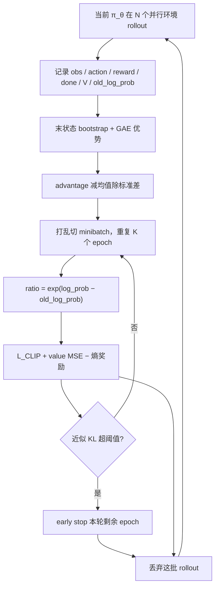

# PPO（Proximal Policy Optimization）

**PPO（近端策略优化）**：用 **clip 代理目标** 限制每次策略更新中新旧策略概率比的偏离幅度，在保持 TRPO 级别更新稳定性的同时，把实现复杂度降到一阶优化器即可训练，是机器人 RL 中使用最广的 on-policy 算法。

## 一句话定义

每步更新只允许策略"小步走"——把新旧策略的概率比裁剪在 $[1-\varepsilon, 1+\varepsilon]$ 内，避免一次更新走太远把已学到的行为搞崩。

## 英文缩写速查

| 缩写 | 英文全称 | 简要说明 |
|------|----------|----------|
| PPO | Proximal Policy Optimization | clip 约束的 on-policy 策略梯度算法 |
| TRPO | Trust Region Policy Optimization | PPO 前身，用 KL 硬约束限制更新幅度 |
| GAE | Generalized Advantage Estimation | PPO 计算优势函数的标准配套 |
| KL | Kullback–Leibler Divergence | 度量新旧策略分布差异，用于早停与自适应 lr |
| IS | Importance Sampling | 用旧策略样本估计新策略期望，产出 ratio |
| AC | Actor-Critic | Actor 出动作、Critic 估价值；部署通常只留 Actor |

## 为什么重要

- 机器人控制是**连续高维**动作空间（30+ 关节力矩），PPO 直接输出连续动作分布，天然适配。
- 相比 TRPO 的二阶 KL 约束，PPO 只需一阶 SGD/Adam + 简单 clip，**工程实现门槛低**，是 [Isaac Gym / Isaac Lab](../entities/isaac-gym-isaac-lab.md)、legged_gym 等仿真栈的默认算法。
- 在 [大规模并行仿真](../tasks/locomotion.md) 下样本利用率虽不如 off-policy，但凭海量并行环境把"低样本效率"换成"墙钟时间短"，成为人形/足式 locomotion 训练的事实标准。
- 高维人形/灵巧手任务上，[FlashSAC](./flashsac.md) 等 scaling 式 off-policy 方法已在墙钟与渐近性能上挑战 PPO 默认地位（项目页 TL;DR：「If you're using PPO, try FlashSAC!」）。

## 主要技术路线

PPO 要解的矛盾：[On-policy Runner](../concepts/rl-runner.md) 采来的数据，策略一更新就会过期；但仿真/真机采样昂贵，一批数据只更新一次太浪费。做法是：**采一批当前策略的 rollout，在数据还可信时有限复用 $K$ 个 epoch，再用 clip / KL 把更新锁在「旧估计仍大致靠谱」的范围内，然后丢掉重采。**

`old_log_prob` 必须在**采样当下**当作常数存下。REINFORCE「采一次更一次」时，重算与否数值相同；PPO 对同一批反复更新，$\theta$ 一直在变，ratio 必须拿当前带梯度的 `log_prob` 去减这条 detached 基准。实现里写成 `exp(log_prob - old_log_prob)`，避免两个极小概率直接相除下溢。

### 1. Clip 代理目标

PPO 的核心是裁剪后的代理目标。记概率比 $r_t(\theta) = \frac{\pi_\theta(a_t|s_t)}{\pi_{\theta_\text{old}}(a_t|s_t)}$，则：

$$
L^{CLIP}(\theta) = \mathbb{E}_t\left[\min\big(r_t(\theta)\hat{A}_t,\ \text{clip}(r_t(\theta),\,1-\varepsilon,\,1+\varepsilon)\,\hat{A}_t\big)\right]
$$

- $\hat{A}_t$ 为优势估计（通常由 [GAE](./gae.md) 给出）；$\varepsilon$ 常取 0.1~0.2。
- 取 $\min$ 使目标成为真实目标的**悲观下界**：优势为正时，提高该动作概率的奖励被 $1+\varepsilon$ 封顶；优势为负时，压低该动作的惩罚在 $1-\varepsilon$ 处封顶。两种情况都是：**朝有利方向走过头就不再给额外收益，梯度归零。**
- **常见误区：clip 不是硬 KL 约束，也不保证新旧策略一定接近。** 它没有像 [TRPO](./policy-optimization.md) 那样显式限制 KL；理论上某些样本的 ratio 仍可出界，只是那些样本不再贡献梯度。它是信赖域思想的**廉价一阶近似**——丢掉二阶 Fisher / 共轭梯度，换来 minibatch SGD 与多 epoch。

训练框架默认做梯度下降，因此代码里最小化的是 $-L^{CLIP}$（再叠加价值损失与熵项）。监控时把 clip fraction（batch 中 ratio 触发裁剪的比例）和近似 KL 当仪表盘：过高说明更新太猛，接近 0 说明几乎没在学。

### 2. 优势估计与价值损失

- 用 [GAE](./gae.md) 在偏差与方差间权衡地估计 $\hat{A}_t$，依赖 critic 价值网络 $V_\phi$。$\gamma$ 管「看多远」，$\lambda$ 管「多大程度信任 critic」——二者不要混。
- 总损失叠加价值回归项与熵正则。最大化写法：$L = L^{CLIP} - c_1\,L^{VF} + c_2\,\mathcal{H}[\pi_\theta]$；代码里常写成最小化 $L_{\text{policy}} + c_1 L_{\text{value}} - c_2 H$。熵项鼓励探索、防止高斯 $\sigma$ 过早塌缩。
- **value loss 下降 ≠ 策略变好。** critic 只拟合「当前这个策略」的价值：奖励黑客、actor 已停滞、采样分布差时，value loss 仍可漂亮收敛。训练进度看 episode return、摔倒率、速度跟踪，value loss 只作拟合诊断。

### 3. On-policy 多轮 minibatch 更新

- 每轮 rollout 收集一批轨迹后，对同一批数据做 **多个 epoch 的 minibatch SGD**（典型 3~10 epoch），这是 PPO 相对 vanilla PG 提升样本利用率的关键。
- **horizon ≠ episode。** `num_steps_per_env`（常见 24）是采样窗口；episode 可因摔倒提前结束，未终止片段用末状态 $V$ bootstrap。4096 环境 × 24 步 ≈ 9.8 万条 transition 才是这一轮的 batch。
- 可选 **KL 早停**：当新旧策略 KL 超阈值时提前结束本轮更新；legged_gym / rsl_rl 还常用 **按 KL 自适应学习率**。这是 clip 之外的二重保险。

### 4. 连续动作：高斯策略与动作量纲

运控动作是实数向量，策略写成对角高斯 $\pi(a|o)=\mathcal{N}(\mu(o),\sigma^2)$：

- **训练按分布采样，部署通常直接用均值 $\mu$**——所以同一策略「训练时毛躁、部署时平滑」。
- 实现上学 $\log\sigma$ 再 `exp`，并 clamp，避免 $\sigma$ 非正或爆炸。大规模并行运控默认 **state-independent 全局 $\sigma$**，比状态相关 $\sigma$ 更稳。
- 动作物理含义不是「网络输出=力矩」。主流是关节位置目标：

$$q_{\text{target}} = q_{\text{default}} + \texttt{action\_scale}\cdot a$$

再交给底层 PD。`action_scale` 过大则随机初始化就甩到限位；过小则迈不开步。观测各分量量纲差几个数量级，必须做 running mean/std 归一化并裁剪；优势在 batch 内标准化，不改变相对排序、只稳住梯度尺度。

### 5. 大规模并行变体与改进

- **Rudin et al. (2022)**：Isaac Gym + PPO，8192 并行环境约 20 分钟训出四足/双足步态，开启大规模并行 RL 范式（见 [locomotion](../tasks/locomotion.md)）。
- **BRRL/BPO（2026）**：将 clip 重新解释为"朝有界 ratio 最优解"的近似优化，给出单调改进的理论保证并在 IsaacLab 人形 locomotion 上报告优于 PPO 的稳定性。
- **VAE 潜变量 + PPO（[$P^{3}$](../entities/paper-p3.md)，2026）**：clip 比较的应是边缘策略 $\pi(a|o)=\int p(a|z)q(z|o)\,dz$。用单个 $z$ 样本估 $r_\theta$ 会在同等策略下把 **35%** 样本误送进 clip 分支；矩匹配传播可把数据效率从 64.6% 拉到 100%。已有 VAE-PPO 栈训不稳时，先查似然估计对象，而不是先加奖励。

## 工程实践

### 关键超参数（机器人实践）

| 超参数 | 典型范围 | 作用 |
|--------|----------|------|
| clip $\varepsilon$ | 0.1 ~ 0.2 | 控制单步更新幅度 |
| GAE $\lambda$ | 0.9 ~ 0.97 | 优势估计偏差/方差权衡（常用 0.95） |
| 折扣 $\gamma$ | 0.99 ~ 0.995 | 长时域信用分配；**按步数计**，控制频率升高时同样 $\gamma$ 覆盖的真实时间变短 |
| epoch 数 | 3 ~ 10 | 单批数据复用次数 |
| 熵系数 $c_2$ | 0.0 ~ 0.01 | 探索强度 |
| `num_steps_per_env` | 24 ~ 64 | rollout horizon，不是 episode 长度 |

$\gamma$ 的有效视野约 $1/(1-\gamma)$ **步**。50 Hz 下 $\gamma=0.99$ 大约看 2 s；把控制提到 200 Hz 而不改 $\gamma$，视野只剩约 0.5 s。想让策略「考虑接下来两秒」，提高频率时必须同步加大 $\gamma$。调参清单见 [RL 超参数指南](../queries/rl-hyperparameter-guide.md)。

### 与机器人技术的联系

- **何时选 PPO vs SAC**：on-policy 与 off-policy 在稳定性与样本利用率上的权衡，详见 [PPO vs SAC](../comparisons/ppo-vs-sac.md) 与 [面向机器人的 PPO/SAC 选型](../queries/ppo-vs-sac-for-robots.md)。大规模 GPU 并行仿真下，PPO 用算力换样本效率，是 locomotion 默认；SAC 更适合真机少样本与精细操作。
- **课程与奖励**：PPO 训练效果高度依赖 [课程学习](../concepts/curriculum-learning.md) 与 [奖励设计](../concepts/reward-design.md)。策略只优化标量，会出现 reward hacking；scale 要可比，过度负惩罚容易学会「不动」。
- **特权信息**：同一轮训练里可让 critic 看仿真特权、actor 只看可部署观测（非对称 Actor-Critic）；两阶段蒸馏则是 [Teacher-Student](../concepts/privileged-training.md)。二者不要混。
- **算法族定位**：PPO 是 [Policy Optimization](./policy-optimization.md) 家族中 on-policy 的主力，与 [强化学习基础](./reinforcement-learning.md) 一脉相承。
- **训练循环**：挂在 [On-policy Runner](../concepts/rl-runner.md) 上——rollout → GAE → 有限 epoch 更新 → **丢掉本批数据**；Isaac Lab / rsl_rl 的 `OnPolicyRunner` 即此循环。
- **直觉层理解**：参数更新在强化哪些状态→动作连接，见 [神经反馈控制器](../concepts/neural-feedback-controller.md)。

### rsl_rl 代码对照

读 [rsl_rl](https://github.com/leggedrobotics/rsl_rl) 时，名字和公式的对应是：

| 代码 | 本页概念 |
|------|----------|
| `actor_critic.act` | 高斯策略采样 |
| `actor_critic.evaluate` | critic $V(o)$ |
| rollout storage | on-policy 轨迹缓冲 |
| `compute_returns` | GAE 优势与回报目标 |
| `ratio` / surrogate | $r_t(\theta)$ 与 $L^{CLIP}$ |
| `desired_kl` / adaptive lr | KL 仪表盘与自适应学习率 |
| obs normalization / `action_scale` | 观测标准化与动作量纲 |

## 局限与风险

- **clip 不会从数学上禁止策略跳变。** KL 突然变大、reward 断崖、可视化里乱甩腿，仍是运控里常见的不可逆崩溃；要靠 clip fraction / 近似 KL / early stop / 降 lr 一起守。
- **对奖励设计和超参敏感。** 熵、clip、lr、$\gamma$、$\lambda$ 都要调；稀疏奖励下海量并行也难捞到信号，需要 shaping 或课程。
- **样本效率低于 SAC / TD3。** 在仿真里用并行补；真机 RL 不要默认 PPO。
- **探索不等于把 $\sigma$ 开大。** 人形几十维关节同时乱给目标几乎必摔；有效探索依赖合理 `action_scale`、默认姿态初始化和熵，而不是乱动。
- **Critic 是训练脚手架。** 部署只跑 actor；把特权信息喂进 actor 会在真机上立刻对不齐观测。

## 关联页面
- [Policy Optimization（算法族总览）](./policy-optimization.md)
- [Reinforcement Learning（强化学习基础）](./reinforcement-learning.md)
- [RL Runner（训练循环编排）](../concepts/rl-runner.md) — PPO 默认的 On-policy 循环：采完算 GAE、更新后丢掉
- [FlashSAC（快速稳定 SAC）](./flashsac.md)
- [SAC（软演员-评论家）](./sac.md)
- [GAE（广义优势估计）](./gae.md)
- [PPO vs SAC（对比）](../comparisons/ppo-vs-sac.md)
- [PPO vs SAC for Robots（选型 Query）](../queries/ppo-vs-sac-for-robots.md)
- [Locomotion（任务）](../tasks/locomotion.md)
- [MDP（形式化）](../formalizations/mdp.md)
- [iCrowdNav](../entities/paper-icrowdnav.md) — 视觉人群导航中用 PPO 训 BEV+意图策略的实例
- [Effective Degree](../entities/paper-effective-degree.md) — 对 PPO actor 施加多项式有效度数正则以提升 Procgen 泛化
- [P³](../entities/paper-p3.md) — VAE 随机潜空间里用边缘策略（而非单样本 $z$）计算 PPO 概率比
- [人形 RL 策略训练五模块](../overview/humanoid-rl-policy-training-five-modules.md) — PPO 在五模块闭环中的稳定更新角色
- [RL 运动控制完整管线](../overview/robot-rl-motion-control-pipeline.md) — 腿式管线里 clip 与 PD 分层如何衔接
- [特权训练](../concepts/privileged-training.md) — 非对称 critic vs Teacher-Student
- [RL 超参数指南](../queries/rl-hyperparameter-guide.md) — clip / GAE / $\gamma$ 与控制频率

## 参考来源

- [RobotsHub：万字解析运控 PPO](../../sources/blogs/wechat_robotshub_ppo_locomotion_fundamentals.md) — clip 误区、`old_log_prob`、有效视野、高斯动作与 rsl_rl 映射
- [Policy Optimization 来源归档（PPO/SAC/TD3/TRPO/Rudin/BRRL）](../../sources/papers/policy_optimization.md)
- [深蓝具身智能：人形 RL 策略训练体系](../../sources/blogs/wechat_shenlan_humanoid_rl_policy_training_system.md) — clip 更新在运控闭环中的读法
- [P³ 论文摘录（arXiv:2607.25541）](../../sources/papers/p3_arxiv_2607_25541.md) — VAE 潜变量下单样本 $r_\theta$ 失配与矩匹配传播
- Schulman, J., et al. (2017). *Proximal Policy Optimization Algorithms*. <https://arxiv.org/abs/1707.06347>
- Schulman, J., et al. (2015). *Trust Region Policy Optimization*. <https://arxiv.org/abs/1502.05477>
- Rudin, N., et al. (2022). *Learning to Walk in Minutes Using Massively Parallel Deep RL*. <https://arxiv.org/abs/2109.11978>

## 推荐继续阅读

- 原文：<https://mp.weixin.qq.com/s/MJQYYyOBSLirVr0vH1-AZg>
- [rsl_rl](https://github.com/leggedrobotics/rsl_rl) — ETH RSL 的 GPU PPO 实现（`OnPolicyRunner`）
- [OpenAI Spinning Up：PPO](https://spinningup.openai.com/en/latest/algorithms/ppo.html)
- [面向机器人的 PPO/SAC 选型](../queries/ppo-vs-sac-for-robots.md)
